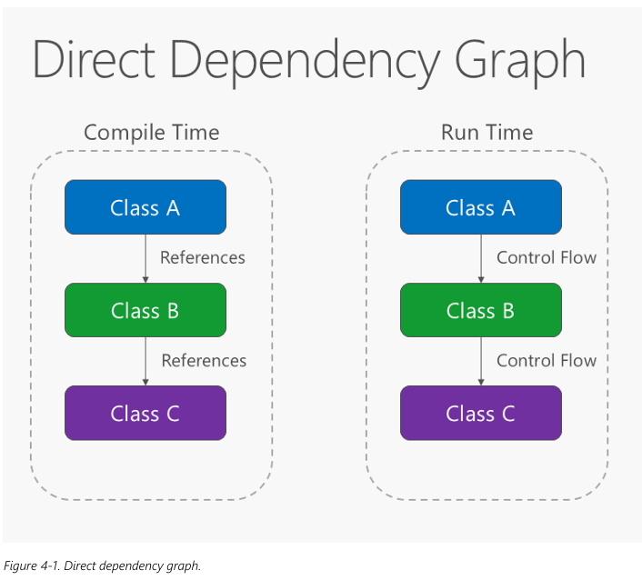
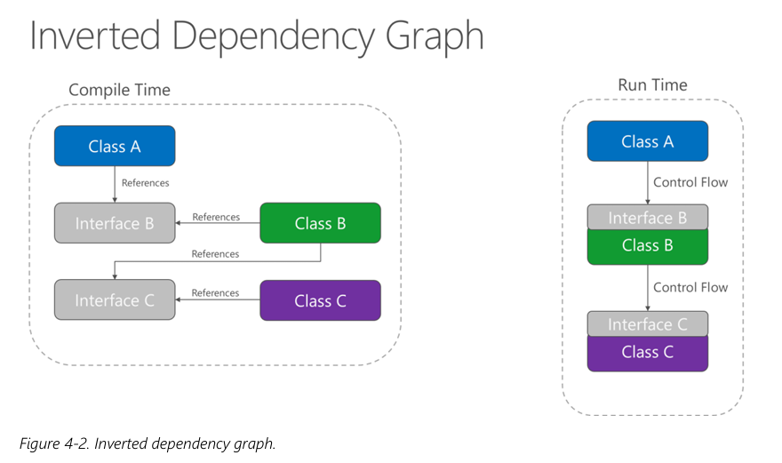
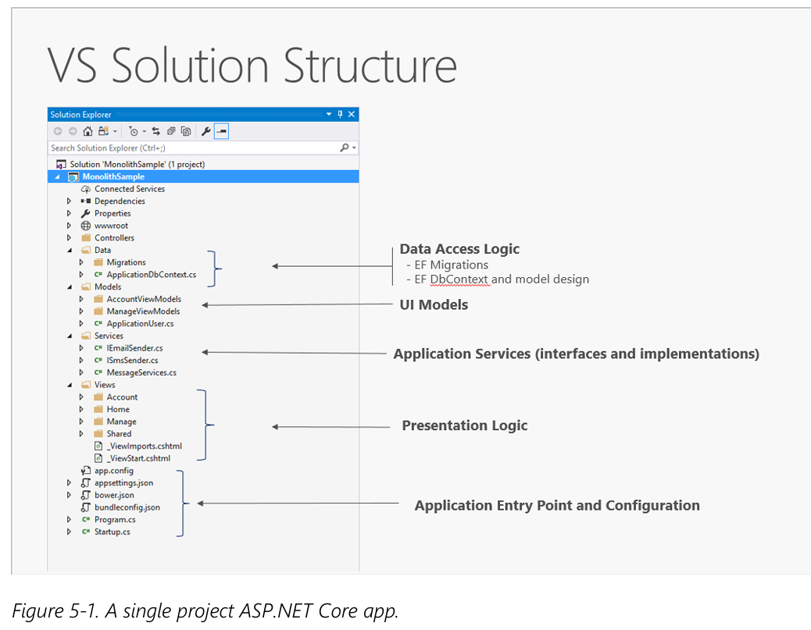
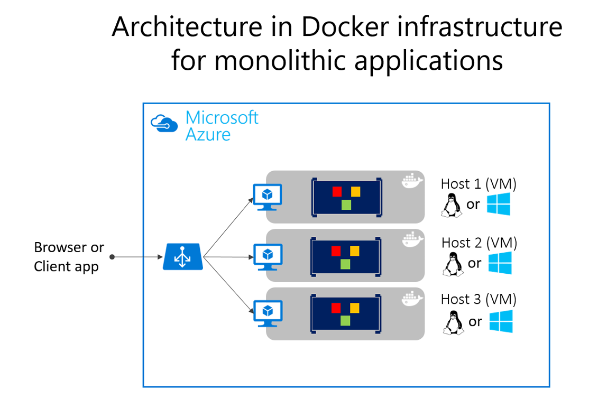
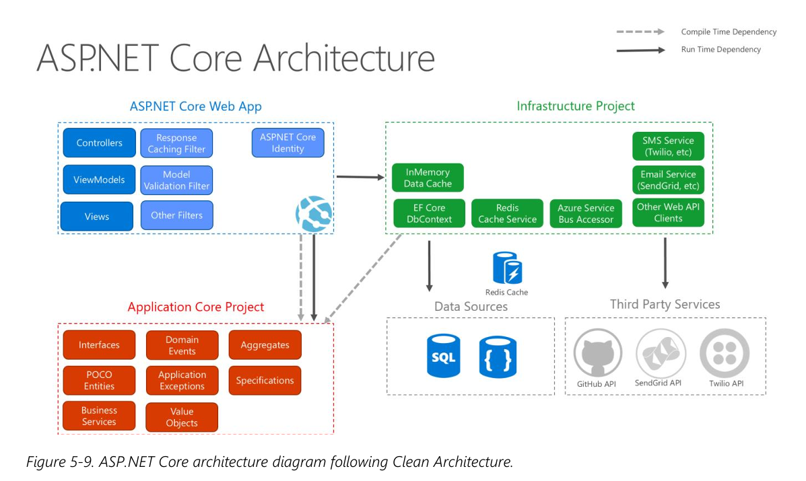
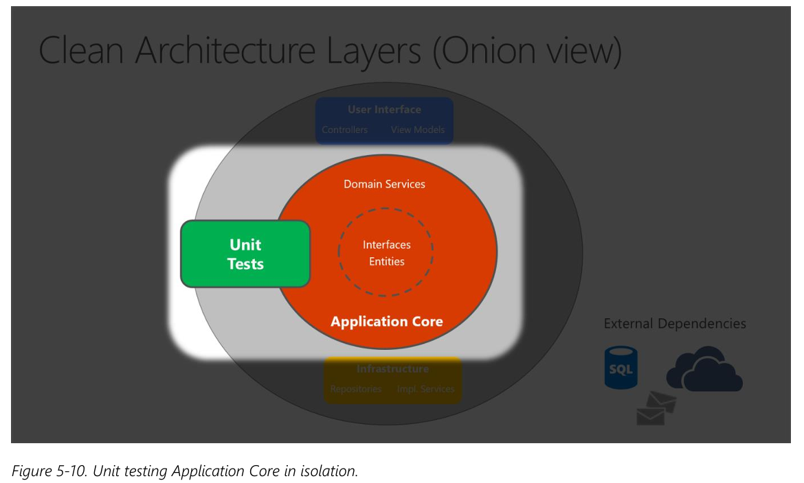
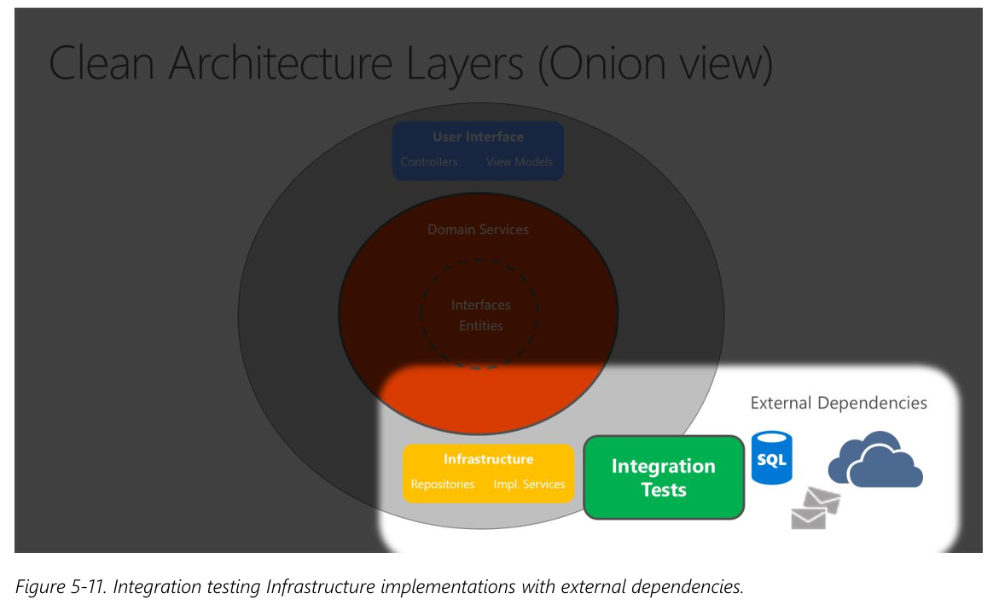
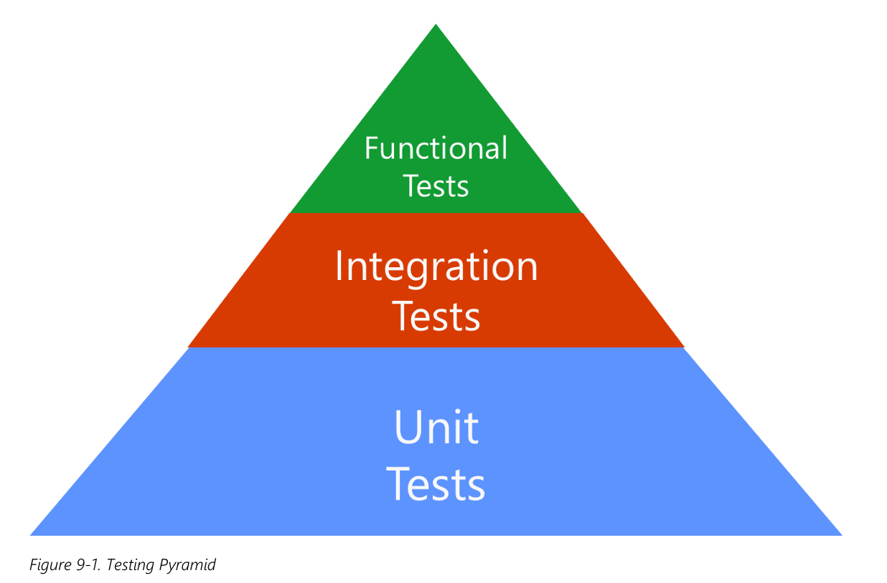

# Info
- Book: **Architecting Modern Web Applications with ASP.NET Core and Azure**
- Started Reading: **03/09/2026**
- Book cover: 
- Available for free on: [Github Repo](https://github.com/dotnet-architecture/eBooks/tree/main/current/architecting-modern-web-apps-azure)

# Table of Contents
- [Info](#info)
- [Table of Contents](#table-of-contents)
- [Ways of building web applications](#ways-of-building-web-applications)
- [Common Design Principles](#common-design-principles)
  - [1. Separation of concerns](#1-separation-of-concerns)
  - [2. Encapsulation](#2-encapsulation)
  - [3. Dependency inversion](#3-dependency-inversion)
  - [4. Explicit dependencies](#4-explicit-dependencies)
  - [5. Single responsibility](#5-single-responsibility)
  - [6. Don’t repeat yourself (DRY)](#6-dont-repeat-yourself-dry)
  - [7. Persistence ignorance (PI)](#7-persistence-ignorance-pi)
  - [8. Bounded contexts](#8-bounded-contexts)
- [Web applications architectures](#web-applications-architectures)
  - [Monolith](#monolith)
  - [N-Layer](#n-layer)
  - [Clean](#clean)
  - [Vertical Slice](#vertical-slice)
  - [Modular Monolith](#modular-monolith)
  - [Microservices](#microservices)
  - [Web-Queue-Worker](#web-queue-worker)
- [Bird eye view on architecture (deployment, structural, patterns)](#bird-eye-view-on-architecture-deployment-structural-patterns)
- [Domain-driven design](#domain-driven-design)
- [.NET Caching](#net-caching)
  - [1. Response Caching](#1-response-caching)
  - [2. Data Caching](#2-data-caching)
- [Kinds of Automated Tests](#kinds-of-automated-tests)
  - [1. Unit Tests](#1-unit-tests)
  - [2. Integration Tests](#2-integration-tests)
  - [3. Functional Tests](#3-functional-tests)
- [Conclusion: Principles Over Rules](#conclusion-principles-over-rules)

# Ways of building web applications
1. **Traditional web applications**
    - Your application’s client-side requirements are simple or even read-only. 
    - Your application needs to function in browsers without JavaScript support. 
    - Your application is public-facing and benefits from search engine discovery and referrals. 
2. **Single Page Applications (SPA)**
   - Your application must expose a rich user interface with many features
   - Your team is familiar with JavaScript, TypeScript, or Blazor WebAssembly development.
   - Your application must already expose an API for other (internal or public) clients. 

# Common Design Principles
## 1. Separation of concerns
This principle asserts that software should be separated based on the kinds of work it performs
## 2. Encapsulation
Different parts of an application should use encapsulation to insulate them from other parts of the application
## 3. Dependency inversion
The direction of dependency within the application should be in the direction of abstraction, not implementation details




- **Direct Dependency (Tight Coupling)**: A high-level module (your business logic) directly depends on a low-level module (your database or external service). The high-level code is forced to change whenever the low-level code changes.

- **Dependency Inversion (Loose Coupling)**: A high-level module defines an interface (a contract) of what it needs. The low-level module then implements that interface. Both depend on the abstraction (the interface), but crucially, the high-level module owns the interface.

## 4. Explicit dependencies
A class should publicly and clearly request (via its constructor) all the external collaborators it needs to do its job. It should never hide or "magically" create them internally.

If your class needs something to work (like a database, an email sender, or a logger), it must ask for it in the constructor. It should not go searching for it or creating it secretly inside a method

## 5. Single responsibility
An architectural principle similar to separation of concerns

It states that objects should have only one  responsibility and that they should have only one reason to change. Specifically, the only situation in which the object should change is if the manner in which it performs its one responsibility must be updated

## 6. Don’t repeat yourself (DRY)
The application should avoid specifying behavior related to a particular concept in multiple places as this practice is a frequent source of errors.

Don't write the same logic, business rule, or configuration in multiple places. Write it once, and reuse it everywhere else

## 7. Persistence ignorance (PI)
Database models `Customer` or `Order` should have absolutely no idea how they are saved to a database

1. **No Database Code**: A Customer class does not contain any SQL queries, ConnectionStrings, or Save() methods.
2. **No Special Inheritance**: It does not have to inherit from a special database base class (like DbEntity or Record).
3. **No Database Annotations**: It does not use database-specific attributes (like [Table], [Column], or [Key]).

Persistence Ignorance frees your business logic so it doesn't care if you use SQL, MongoDB, or a CSV file.

A popular term used here is `POCO` class which is a simple, plain C# (or VB.NET) class that doesn't inherit from a special framework base class, and doesn't implement heavy framework interfaces. It's just a normal class.

`POCO` stands for Plain Old CLR Object (CLR stands for Common Language Runtime, the execution engine for .NET).

## 8. Bounded contexts
Bounded contexts are a central pattern in Domain-Driven Design. They provide a way of tackling complexity in large applications or organizations by breaking it up into separate conceptual modules. 

Each conceptual module then represents a context that is separated from other contexts (hence, bounded), and can evolve independently.

Imagine a large e-commerce company.
1. **The Sales Team thinks of a Customer as**: A person with a shopping cart, shipping address, and payment method.
2. **The Support Team thinks of a Customer as**: A person with open tickets, satisfaction scores, and a loyalty tier.
3. **The Billing Team thinks of a Customer as**: A legal entity with a tax ID, invoice history, and account balance.

# Web applications architectures
> “If you think good architecture is expensive, try bad architecture.” - Brian Foote and Joseph Yoder 

Most traditional .NET applications are deployed as single units corresponding to an executable or a  single web application running within a single IIS appdomain. This approach is the simplest deployment model and serves many internal and smaller public applications very well. However, even given this single unit of deployment, most non-trivial business applications benefit from some logical separation into several layers. 

## Monolith

A monolithic application has three core characteristics:
1. **Self-contained behavior**: The core of its functionality runs within its own single process.
2. **Single deployment unit**: The entire application is compiled and deployed as one package.
3. **Horizontal scaling is "all or nothing"**: If you need to scale out, you must duplicate the entire application (UI, business logic, and data access) across multiple servers or VMs. You cannot scale individual components independently.

The smallest possible architecture is a single project.

**Definition**: All logic—Presentation (UI), Business (Domain), and Data Access (Infrastructure)—resides in one project, compiles to one assembly, and deploys as one unit.

**Default State**: When you create a new ASP.NET Core project (via Visual Studio or CLI), it starts out as exactly this type of monolith.

In a single-project app, you achieve Separation of Concerns using folders (not projects).



As the project grows in size and complexity, this simple folder-based organization causes significant problems:
1. **Uncontrolled File Growth**

    The number of files and folders balloons.

    It becomes impossible to find specific features quickly.

2. **Scattered UI Concerns**

    UI constructs are spread alphabetically across multiple folders.

    You might have Controllers, Views, ViewModels, Filters, and ModelBinders all in different top-level folders. They are not grouped by feature, making navigation tedious.

3. **Scattered Business Logic**

    Business rules are split between the Models folder and the Services folder.

    There is no explicit rule for which classes depend on which others.

4. **Spaghetti Code**

    Because the architecture lacks rigid boundaries at the project level, developers can easily create circular dependencies or mix responsibilities (e.g., putting database access logic directly inside a Controller).

    The lack of discipline leads to tightly coupled, fragile code.



## N-Layer
As applications grow, complexity becomes the biggest enemy. Layering is a strategy to manage this complexity.

The Core Idea:
You break the application into distinct parts based on their responsibilities or concerns. This follows the Separation of Concerns (SoC) principle.

- The Presentation Layer (UI) handles user interaction.
- The Business Logic Layer (BLL) handles the core rules.
- The Data Access Layer (DAL) handles database storage.

By organizing code this way, developers can quickly find where specific functionality is implemented, keeping the codebase tidy as it scales

There is a common confusion between these two terms:
| Concept | Definition                                                            | Example                                                                                                 |
| ------- | --------------------------------------------------------------------- | ------------------------------------------------------------------------------------------------------- |
| Layer   | A logical separation of code within the application.                  | UI Project, BLL Project, DAL Project (all running on the same server).                                  |
| Tier    | A physical separation of deployment (different servers or processes). | The UI runs on one server, the Business Logic runs on another server, and the Database runs on a third. |

> Note: It is perfectly possible—and very common—to have an N-Layer application that is deployed to a single Tier (everything runs on one physical box).


While this architecture is simple and intuitive, it has a significant disadvantage when implemented rigidly.

The Problem: Direction of Dependencies (Top-Down)
- The UI compiles against the BLL.
- The BLL compiles against the DAL.

Because the BLL depends on the DAL, your core business logic becomes dependent on the specific database implementation details (like Entity Framework classes or SQL connection strings).

The Consequence:
To test your business logic, you are forced to have a test database set up. This makes tests slow, brittle, and complicated to configure.

> This violates the Dependency Inversion Principle (DIP) we discussed earlier. The high-level module (BLL) is depending on the low-level module (DAL), rather than an abstraction.

(The next section of the chapter usually introduces Clean Architecture to fix this exact flaw, by making the DAL depend on the BLL via interfaces).


## Clean

**The Core Idea**:
Clean Architecture is an architectural pattern that places your business logic and application model at the very center of your application.

**What it solves**:
In traditional N-Layer architecture, the UI depends on the Business Logic, which depends on the Data Access Layer (Top-Down). Clean Architecture inverts this. Infrastructure (database, file system, external APIs) depends on the Core, not the other way around.

**Aliases (Same Concept, Different Names)**:
This architecture has been known by several names over the years, all referring to the same structural philosophy:
- Hexagonal Architecture (Alistair Cockburn)
- Ports and Adapters
- Onion Architecture (Jeffrey Palermo)
- Clean Architecture (Robert C. Martin)

> For this ebook, we refer to it as Clean Architecture.

The fundamental rule of Clean Architecture is the inversion of dependencies.
- The Traditional Way: Business Logic depends on the Database (BLL → DAL).
- The Clean Way: The Database (Infrastructure) depends on the Business Logic's interfaces (Infrastructure → IOrderRepository ← Application Core).

How it works:
1. You define abstractions (interfaces) inside the Application Core (e.g., IOrderRepository).
2. You implement these interfaces in the Infrastructure Layer (e.g., SqlOrderRepository).
3. The UI and Infrastructure reference the Application Core, but never reference each other's concrete types directly.

Visualizing the Architecture:

1. The "Onion" View (Concentric Circles)
   
    Clean Architecture is often visualized as a series of concentric circles.
    - Center (Core): Entities and Domain Interfaces. These have zero external dependencies.
    - Outer Layers: Domain Services, UI, Infrastructure.

    The Golden Rule: Dependencies flow inward toward the center. The inner circle knows nothing about the outer circles.

    

2. The Horizontal Layer View
   
   Understanding the Arrows:

   1. Solid Arrows (Compile-time): The UI references the Application Core. Infrastructure references the Application Core.

   2. Dashed Arrow (Runtime): The UI loads the Infrastructure assemblies at startup (via Dependency Injection) to fulfill the interfaces defined in the Core, but the UI code doesn't directly reference Infrastructure types in its business logic.

   

ASP.NET Core Architecture using clean architecture


Why Use Clean Architecture? (The Benefits)
1. Superior Testability (Unit Testing)

    Because the Application Core has zero dependencies on the database or external frameworks, writing automated unit tests for this layer is incredibly easy.

    You can test business logic in isolation (Figure 5-10) without mocking a database.

    

2. Easy "Swap-ability"

    Since the UI depends only on abstractions (interfaces), you can swap out Infrastructure implementations effortlessly.

    Need to change from SQL Server to CosmosDB? Create a new Infrastructure project implementing the same Core interfaces.

    This also facilitates Integration Testing (Figure 5-11), where you can swap in a Test Database or a Test API.

    

3. Framework Independence

    Your business logic isn't tied to Entity Framework, ASP.NET, or any third-party library. You could theoretically re-platform the UI (e.g., from MVC to Blazor) without touching the Core logic.

Project Breakdown: Where Does Code Live?

In a Clean Architecture solution, the code is split across (at least) three main projects. Each project has distinct responsibilities and distinct types that belong in them.

1. Application Core (The Center)
   
   **Role**: Contains the Business Model and Application Logic. Has zero external dependencies (no EF Core, no System.Configuration).

    **What goes here (Types)**:

    - **Entities**: Business model classes that are persisted (e.g., Order, Product). Must be Persistence-Ignorant POCOs.
    - **Aggregates**: Groups of related entities treated as a single unit.
    - **Interfaces**: Abstractions for infrastructure operations (e.g., IOrderRepository, IEmailSender).
    - **Domain Services**: Complex business logic that doesn't naturally - fit inside a single entity.
    - **Specifications**: Query specifications (e.g., OrdersOverdueSpec).
    **Custom Exceptions & Guard Clauses**: Domain-specific exceptions.
    - **Domain Events & Handlers**: Events triggered by business rules (e.g., OrderCreatedEvent).
    - **DTOs**: Simple Data Transfer Objects used only internally within the Core (with no UI dependencies).

2. Infrastructure (The Implementation)
   
   **Role**: Implements the interfaces defined in the Application Core. Handles all data access and external communication.

    **What goes here**:

    - **EF Core Types**: DbContext, Migration files, and Entity Configurations (Fluent API).
    - **Data Access Implementation**: Repository classes that implement IOrderRepository (using EF Core, Dapper, etc.).
    - **Infrastructure Services**: Specific external service implementations, such as FileLogger (implements ILogger), SmtpNotifier (implements INotifier), or AzureBlobStorage (implements IFileStorage).
    
    > Dependency: The Infrastructure project must reference the Application Core project.

3. UI Layer (The Entry Point)
   
   **Role**: The web application entry point. Handles HTTP requests, routing, and UI rendering. Should not contain business logic.

    **What goes here**:
    - **Controllers**: API endpoints or MVC Controllers.
    - **Custom Filters**: Action/Exception filters.
    - **Custom Middleware**: Request pipeline components.
    - **Views & ViewModels**: Razor views and Presentation-specific ViewModels.
    - **Startup / Program.cs**: The Composition Root.

    The UI Layer must reference the Application Core project.
However, it should not directly instantiate or use static calls to Infrastructure types in its Controllers or Views. Controllers should only depend on interfaces from the Application Core.

> See repo: [eShopOnWeb Github Repo](https://github.com/dotnet-architecture/eShopOnWeb/tree/main) for reference

Comparison between N-Layer and Clean
| Feature                         | N-Layer (Traditional)                                                                                                         | Clean Architecture                                                                                                                            |
| ------------------------------- | ----------------------------------------------------------------------------------------------------------------------------- | --------------------------------------------------------------------------------------------------------------------------------------------- |
| Dependency Flow                 | Top-Down: UI → BLL → DAL. High-level depends on low-level.                                                                    | Inward: UI → Core ← Infrastructure. Everything depends on the business core.                                                                  |
| Where does Business Logic live? | BLL (Business Logic Layer). It sits in the middle.                                                                            | Application Core. It sits at the very center (the "heart").                                                                                   |
| Database Coupling               | Tightly Coupled. The BLL references the DAL directly, so your business logic knows about SQL, EF Core, and tables.            | Completely Decoupled. The Core defines interfaces (e.g., IOrderRepository). It has zero knowledge of SQL or EF Core.                          |
| Project References              | UI → BLL → DAL. (DAL has no reference to UI).                                                                                 | UI → Core & Infrastructure → Core. (Infrastructure references Core; Core references nothing).                                                 |
| Testability                     | Hard / Slow. To test the BLL, you must initialize the DAL and the database, making unit tests slow and brittle.               | Easy / Fast. To test the Core, you just mock the interfaces and run pure logic. No database required.                                         |
| Swapping a Database             | Risky. Because the BLL references the DAL directly, changing from SQL to MongoDB often forces you to rewrite code in the BLL. | Simple. Create a new MongoOrderRepository that implements IOrderRepository. Swap it in the composition root (Startup). The Core doesn't care. |
| Framework Dependency            | Framework-Aware. The BLL often imports Entity Framework, Configuration, or other NuGet packages.                              | Framework-Ignorant (POCOs). The Core only uses plain C# classes and standard interfaces. It doesn't import EF, ASP.NET, or HTTP packages.     |
| Complexity                      | Low. Easy to understand and set up. Great for simple CRUD.                                                                    | High. More projects, more interfaces, and explicit dependency injection. Requires more upfront work.                                          |

> In N-Layer, your Business Logic depends on the Database.

> In Clean Architecture, the Database depends on the Business Logic.

## Vertical Slice
> Not mentioned in the book.

Vertical Slice Architecture groups code by feature or use case, not by technical class type. Instead of locating one “create order” feature across `Controllers`, `Services`, `Repositories`, and `DTOs`, keep its relevant code together.

```
Store.Api
├── Features
│   ├── Orders
│   │   ├── Create
│   │   │   ├── Endpoint.cs
│   │   │   ├── Request.cs
│   │   │   ├── Response.cs
│   │   │   ├── Command.cs
│   │   │   ├── Handler.cs
│   │   │   └── Validator.cs
│   │   ├── GetById
│   │   │   ├── Endpoint.cs
│   │   │   ├── Query.cs
│   │   │   └── Handler.cs
│   │   └── Cancel
│   └── Products
│       ├── Create
│       └── Search
├── Infrastructure
└── Program.cs
```

A vertical slice owns one complete behavior:

```
POST /orders
→ CreateOrder endpoint
→ CreateOrder command
→ CreateOrder handler
→ Validation
→ Database action
→ Response
```

This makes feature work faster because changes are local. The structure is especially useful with CQRS, which separates write operations from read operations: commands change state, while queries return information without changing state.

Commands and queries
```
Commands
├── CreateOrder
├── CancelOrder
└── ConfirmPayment

Queries
├── GetOrderById
├── SearchProducts
└── GetCustomerOrders
```

A command typically returns a small result, such as an identifier or success/failure. A query returns a read model optimized for the client.

Vertical slice architecture with different design patterns and architectures:
1. Vertical slices with Clean Architecture
   
   ```
    Store.Domain
    Store.Application
    └── Features
        └── Orders
            └── CreateOrder
    Store.Infrastructure
    Store.Api
   ```
2. Vertical slices with a mediator
   
   ```
    Endpoint → ISender.Send(command) → Handler
   ```

   A mediator helps keep endpoints thin and can centralize validation, logging, authorization, and transaction behavior. It is useful, but not mandatory: direct calls are often clearer for smaller systems.

Strengths
- High cohesion: files that change together are together.
- Easier navigation as features grow.
- Encourages small, focused handlers.
- Works naturally with CQRS and Minimal APIs.
- Reduces giant service classes.

Weaknesses
- Shared code must be carefully placed in a Common or shared-kernel area.
- Teams sometimes duplicate similar logic without recognizing a reusable domain concept.
- A feature folder alone does not guarantee good business boundaries.

> See repo: [Vertical Slice Example Github Repo](https://github.com/jeangatto/ASP.NET-Core-Vertical-Slice-Architecture/tree/main) for reference

## Modular Monolith
> Not mentioned in the book.

A modular monolith is one deployed application split internally by business capability. The difference from a normal layered monolith is that modules have deliberately enforced boundaries.

It's like Microservices architecture but deployed as a single process

```
Commerce.sln
├── Commerce.Api
├── BuildingBlocks
│   ├── SharedKernel
│   └── EventBus
├── Modules
│   ├── Identity
│   ├── Catalog
│   ├── Ordering
|   |   ├── Ordering.Domain
|   |   ├── Ordering.Application
|   │   └── Features
|   │       ├── PlaceOrder
|   │       └── CancelOrder
|   |   └── Ordering.Infrastructure
│   ├── Payments
│   └── Shipping
└── tests
```

| Characteristic         | Modular monolith                                         | Microservices                      |
| ---------------------- | -------------------------------------------------------- | ---------------------------------- |
| Deployment             | One application/container                                | One deployment per service         |
| Process                | One process                                              | Multiple processes                 |
| Scaling                | Scale the entire app                                     | Scale individual services          |
| Database               | Often one database, ideally separated schemas per module | Each service owns its database     |
| Calls between domains  | In-process method calls or in-process events             | HTTP, gRPC, queues, event broker   |
| Operational complexity | Lower                                                    | Higher                             |
| Failure boundary       | A process failure can affect all modules                 | One service can fail independently |

## Microservices
> Not mentioned in the book.

Microservices mean separately deployable services, each built around a bounded business context. Microsoft describes them as small autonomous services, each implementing one business capability within a bounded context.

```
API Gateway
├── Identity Service
├── Catalog Service
├── Ordering Service
├── Payment Service
└── Shipping Service
```

Each service owns its own:

```
Service
├── API
├── Application
├── Domain
├── Infrastructure
├── Database
├── Deployment pipeline
└── Monitoring and logs
```

Communication styles:

| Style                 | Example                               | Use it for                    |
| --------------------- | ------------------------------------- | ----------------------------- |
| Synchronous HTTP/gRPC | Ordering checks a customer account    | Immediate answer required     |
| Asynchronous event    | OrderPlaced triggers payment workflow | Decoupled workflows           |
| Queue                 | Generate a large report               | Long-running background tasks |
| Outbox pattern        | Save order and event reliably         | Preventing lost events        |

## Web-Queue-Worker
Some work should not happen during the HTTP request: sending emails, importing files, generating reports, resizing images, processing payments, or running scheduled jobs. Microsoft identifies a web-queue-worker architecture as an option for long-running, batch, or resource-intensive processes.

```
Commerce.sln
├── Commerce.Api
├── Commerce.Application
├── Commerce.Domain
├── Commerce.Infrastructure
└── Commerce.Worker
```

```
Client
→ API saves request
→ Queue
→ Background Worker processes work
→ Database / Email / External API
```

The API responds quickly, while the worker handles durable background processing.

# Bird eye view on architecture (deployment, structural, patterns)
> Not mentioned in the book.

Think in layers of concern:

1. **Deployment architecture**

   - Decides: monolith vs modular monolith vs microservices vs serverless.
   - Determines how many processes/containers you run, how they scale, and how they fail.

2. **Structural architecture (projects, layers, modules)**

   - Decides: how you split code into projects, layers (Domain/Application/Infrastructure/Api), and modules (Catalog, Ordering, etc.).
   - Determines maintainability, testability, and team boundaries.

3. **Design patterns**

   - Decides: how you implement specific responsibilities inside those layers/modules.

   - Examples: DI, Repository, Mediator, CQRS, Command, Domain Events.

You can mix and match:

- A **monolith** can use:
  - Clean Architecture layers
  - Vertical slices
  - DI, Repository, Mediator, CQRS
- A **microservice** can use:
  - The same internal layers and patterns
  - But is deployed separately and communicates over the network

Microsoft’s microservices guidance explicitly distinguishes:
  - **External architecture**: microservices, API gateways, pub/sub, resilience.
  - **Internal architecture**: DDD, CQRS, DI, layered structure inside each service.

To fully understand:
- **Deployment** = “How many running units? How are they scaled and updated?”
- **Structure** = “How are projects, layers, and modules organized in the repo?”
- **Patterns** = “Which proven designs solve specific problems inside those layers?”

# Domain-driven design
Domain-Driven Design (DDD) is an approach to building software that centers the design around the business domain rather than technology. It is most valuable for large, complex systems with rich business rules, and often overkill for simple CRUD applications

Your domain model is made of objects that represent business concepts and behavior:
1. Entities
   
   - Objects with a distinct identity (e.g., `Customer`, `Order`).
   - Typically persisted with a key (e.g., Id).
2. Aggregates
   
   - Clusters of related objects treated as a single unit for changes and persistence (e.g., `Order` + `OrderItems`).

   - One aggregate root controls access and enforces invariants.
3. Value Objects
   
   - Objects defined by their attributes, not identity (e.g., `Money`, `Address`, `DateRange`).

   - Usually immutable and compared by their property values.
4. Domain Events
   
   - Represent significant things that happened in the domain (e.g., `OrderPlaced`, `PaymentCompleted`).
   - Used to decouple reactions within or across parts of the system.

A good DDD model encapsulates behavior, not just state. Entities should have methods that enforce business rules. If your model is just properties with getters/setters, it is an anemic model, which DDD tries to avoid.

DDD typically uses several patterns to structure the domain and application layers:
1. **Repository**

    - Abstracts persistence; provides collection-like access to aggregates.
    - Keeps database details out of the domain model.
2. **Factory**

    - Encapsulates complex object or aggregate creation.

3. **Domain Services**

    - Encapsulate behavior that doesn’t naturally belong to a single entity or value object.

4. **Command**

   - Represents an intention to perform an action (e.g., CreateOrderCommand).

   - Decouples the request to do something from the execution logic.

5. **Specification**

   - Encapsulates query or business rule criteria (e.g., “active customers with overdue invoices”).

DDD also aligns well with Clean Architecture, promoting loose coupling, clear boundaries, and testability.

Traditional Implementation (Anemic Model)
```csharp
// Service layer: bloated order placement logic
public class OrderService {
    @Autowired private InventoryDAO inventoryDAO;
    @Autowired private CouponDAO couponDAO;

    public Order createOrder(Long userId, List<ItemDTO> items, Long couponId) {
        // 1. Stock validation (scattered in Service)
        for (ItemDTO item : items) {
            Integer stock = inventoryDAO.getStock(item.getSkuId());
            if (item.getQuantity() > stock) {
                throw new RuntimeException("Insufficient stock");
            }
        }

        // 2. Calculate total amount
        BigDecimal total = items.stream()
                .map(i -> i.getPrice().multiply(i.getQuantity()))
                .reduce(BigDecimal.ZERO, BigDecimal::add);

        // 3. Apply coupon (logic hidden in utility class)
        if (couponId != null) {
            Coupon coupon = couponDAO.getById(couponId);
            total = CouponUtil.applyCoupon(coupon, total); // Discount logic is in util
        }

        // 4. Save order (pure data operation)
        Order order = new Order();
        order.setUserId(userId);
        order.setTotalAmount(total);
        orderDAO.save(order);
        return order;
    }
}
```

DDD Implementation (Rich Model): Business Logic Encapsulated in Domain
```csharp
// Aggregate Root: Order (carries core logic)
public class Order {
    private List<OrderItem> items;
    private Coupon coupon;
    private Money totalAmount;

    // Business logic encapsulated in the constructor
    public Order(User user, List<OrderItem> items, Coupon coupon) {
        // 1. Stock validation (domain rule encapsulated)
        items.forEach(item -> item.checkStock());

        // 2. Calculate total amount (logic resides in value objects)
        this.totalAmount = items.stream()
                .map(OrderItem::subtotal)
                .reduce(Money.ZERO, Money::add);

        // 3. Apply coupon (rules encapsulated in entity)
        if (coupon != null) {
            validateCoupon(coupon, user); // Coupon rule encapsulated
            this.totalAmount = coupon.applyDiscount(this.totalAmount);
        }
    }

    // Coupon validation logic (clearly owned by the domain)
    private void validateCoupon(Coupon coupon, User user) {
        if (!coupon.isValid() || !coupon.isApplicable(user)) {
            throw new InvalidCouponException();
        }
    }
}

// Domain Service: orchestrates the order process
public class OrderService {
    public Order createOrder(User user, List<Item> items, Coupon coupon) {
        Order order = new Order(user, convertItems(items), coupon);
        orderRepository.save(order);
        domainEventPublisher.publish(new OrderCreatedEvent(order)); // Domain event
        return order;
    }
}
```

# .NET Caching
ASP.NET Core provides two complementary caching strategies:
   1. Response caching – cache entire HTTP responses.
   2. Data caching – cache the results of individual queries or computations.

Using them together can dramatically reduce database load and improve response times, but each has different trade-offs and use cases.

## 1. Response Caching
- **Client and Proxy Caching (HTTP Headers)**

     This level does not cache anything on the server. Instead, it adds HTTP headers that instruct browsers and intermediate proxies to cache the response.

     ```csharp
             [ResponseCache(Duration = 60)]
             public IActionResult Contact()
             {
                 ViewData["Message"] = "Your contact page.";
                 return View();
             }
     ```
     The example above adds this header to the response:
     ```text
     Cache-Control: public,max-age=60
     ```
     This tells clients and proxies they may cache the response for up to 60 seconds.

     Use this when:
     - The content is the same for many users.
     - You’re fine with clients/proxies holding a cached copy for a short time.
     - You want to reduce load without adding server-side caching complexity.
 - **Server-Side Response Caching**

     This level caches responses on the server in memory, so repeated requests can be served without re-executing the action.

     ```csharp
         builder.Services.AddResponseCaching();

         var app = builder.Build();

         app.UseResponseCaching();

         // other middleware (routing, endpoints, etc.)
     ```
     The Response Caching middleware automatically caches responses when certain conditions are met.

     By default, a response is cached only if:
     - The HTTP method is GET or HEAD.
     - The status code is 200 OK.
     - The response includes the header: `Cache-Control: public`
     - The request does not include:
         - An Authorization header.
         - A Set-Cookie header in the response.

     If any of these conditions fail, the middleware will not cache the response.

     Use server-side caching when:
     - The action is expensive to compute (database calls, external API calls, heavy processing).
     - The result is the same for many users and requests.
     - You want to reduce server load and improve response times.
## 2. Data Caching
   
Instead of caching full responses, you cache data (query results, computed values) and reuse them across requests or components.

- In-memory caching setup
    
    ```csharp
    builder.Services.AddMemoryCache();
    builder.Services.AddMvc();
    ```
- Using IMemoryCache with a cached decorator

    Example: CachedCatalogService
    ```csharp
    public class CachedCatalogService : ICatalogService
    {
        private readonly IMemoryCache _cache;
        private readonly CatalogService _catalogService;

        private static readonly string _brandsKey = "brands";
        private static readonly string _typesKey = "types";
        private static readonly TimeSpan _defaultCacheDuration = TimeSpan.FromSeconds(30);

        public CachedCatalogService(IMemoryCache cache, CatalogService catalogService)
        {
            _cache = cache;
            _catalogService = catalogService;
        }

        public async Task<List<Brand>> GetBrands()
        {
            return await _cache.GetOrCreateAsync(_brandsKey, async entry =>
            {
                entry.SlidingExpiration = _defaultCacheDuration;
                return await _catalogService.GetBrands();
            });
        }

        public async Task<CatalogItemsResult> GetCatalogItems(
            int pageIndex, int itemsPage, int? brandId, int? typeId)
        {
            var cacheKey = $"items-{pageIndex}-{itemsPage}-{brandId}-{typeId}";

            return await _cache.GetOrCreateAsync(cacheKey, async entry =>
            {
                entry.SlidingExpiration = _defaultCacheDuration;
                return await _catalogService.GetCatalogItems(pageIndex, itemsPage, brandId, typeId);
            });
        }

        public async Task<List<Type>> GetTypes()
        {
            return await _cache.GetOrCreateAsync(_typesKey, async entry =>
            {
                entry.SlidingExpiration = _defaultCacheDuration;
                return await _catalogService.GetTypes();
            });
        }
    }
    ```
    Register services
    ```csharp
    builder.Services.AddMemoryCache();
    builder.Services.AddScoped<CatalogService>();
    builder.Services.AddScoped<ICatalogService, CachedCatalogService>();
    ```

You can combine both:
   - Use **data caching** inside services to reduce database load.
   - Use r**esponse caching** on top of endpoints that return cached data, to avoid re-executing even the service layer for repeated identical requests.

```
Request
→ Response cache (if hit: return cached HTTP response)
→ Controller
→ Cached service (if hit: return cached data)
→ Database / external system
```

# Kinds of Automated Tests
## 1. Unit Tests
A unit test verifies a single, isolated piece of application logic.

Characteristics:
- Tests only your code, not dependencies or infrastructure.
- Does not test the framework (assume ASP.NET Core, EF Core, etc. work; if not, file a bug and work around it).
- Runs fully in memory and in process.
- No file system, network, or database access.
- Extremely fast: hundreds of tests should run in seconds.

Use unit tests to verify:
- Business rules.
- Conditional logic (if/else, switch).
- Edge cases and error handling in pure logic.

Run them:
- Frequently, ideally before every push.
- On every automated build.

## 2. Integration Tests

Integration tests verify that components work correctly together, especially with real or realistic infrastructure.

Characteristics:
- Test code that interacts with databases, file systems, external services, or other infrastructure.
- Verify that layers interact correctly when dependencies are fully resolved.
- Slower and more complex to set up than unit tests.
- Often require setup/teardown (e.g., resetting a test database to a known state).

Guidelines:
- If a scenario can be tested with a unit test, prefer a unit test.
- Use integration tests when you must involve external dependencies.
- In large systems, run full integration suites on a build server rather than on every developer machine.

## 3. Functional Tests

Functional tests verify the system from the user’s perspective, based on requirements.

Analogy:
- Unit tests ≈ building inspector checking foundation, wiring, plumbing (internal correctness).
- Functional tests ≈ homeowner checking if the house fits their needs, looks right, rooms are comfortable (external behavior).
  > “As developers, we fail in two ways: we build the thing wrong, or we build the wrong thing. Unit tests ensure you are building the thing right; functional tests ensure you are building the right thing.”

Characteristics:
- Operate at the system level.
- May involve UI automation or HTTP requests against a test host.
- Slower and more brittle than unit and integration tests.
- Should be kept to the minimum set needed to be confident the system behaves as users expect.



Common starting points on what to test:
- Conditional logic:
Any method with behavior that changes based on conditions (if/else, switch) should have tests for different branches.
- Happy path and sad path:
  - At least one test for normal, successful flow.
  - At least one test for error conditions or atypical results.
- Focus on what can fail:
Prioritize complex, business-critical methods over trivial code.
Code coverage metrics are useful, but don’t write tests just to increase coverage; write tests where failures matter.

# Conclusion: Principles Over Rules

Architecture is not about following a rigid set of rules; it is about making intentional trade-offs to manage complexity. This guide is based on the core principles of Architecting Modern Web Applications with ASP.NET Core and Azure, but it has been extended with additional practical patterns to create a more complete reference. As you apply the concepts in this guide, keep these core principles in mind:

1. **Start Simple**: Begin with a well-structured modular monolith. Do not introduce the complexity of microservices until you have a proven need for independent scaling or deployment.
2. **Protect the Domain**: Your business logic is the most valuable part of your application. Keep it pure, testable, and free from dependencies on frameworks, databases, or UI concerns.
3. **Embrace Evolution**: Architecture is iterative. Refactor when you feel pain, when tests become brittle, or when a module clearly needs to be split.
4. **Test for Confidence**: Use the testing pyramid to build a safety net. Fast unit tests for logic, integration tests for boundaries, and functional tests for critical user journeys.
5. **Measure Before Optimizing**: Whether it is caching, scaling, or complex patterns, measure performance and complexity first. Optimize only where it provides tangible value.

The goal of architecture is not perfection; it is sustainability. Build a system that is easy to change, easy to understand, and easy to deploy.