# Info
- Book: **Designing Data-Intensive Applications**
- Started Reading: **05/10/2025**
- Book cover:
  
  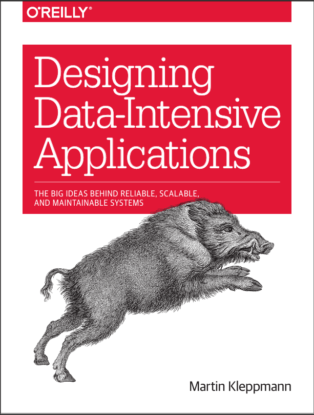

# Table of Contents
- [Info](#info)
- [Table of Contents](#table-of-contents)
- [Back Matter](#back-matter)
- [Objectives](#objectives)
- [People thoughts on the book](#people-thoughts-on-the-book)
  - [Jay Kreps - Creator of Apache Kafka and CEO of Confluent](#jay-kreps---creator-of-apache-kafka-and-ceo-of-confluent)
  - [Kevin Scott - CTO at Microsoft](#kevin-scott---cto-at-microsoft)
- [Preface](#preface)
- [Part 1: Foundations of Data Systems](#part-1-foundations-of-data-systems)
  - [Chapter 1: Reliable, Scalable, and Maintainable Applications](#chapter-1-reliable-scalable-and-maintainable-applications)
    - [Reliability](#reliability)
    - [Scalability](#scalability)
    - [Maintainability](#maintainability)
    - [Summary](#summary)
  - [Chapter 2: Data Models and Query Languages](#chapter-2-data-models-and-query-languages)
    - [Types of data models discussed:](#types-of-data-models-discussed)
    - [Relational Model](#relational-model)
    - [Document model](#document-model)
    - [Relational vs Document model (SQL vs NoSQL)](#relational-vs-document-model-sql-vs-nosql)
    - [The network model](#the-network-model)
    - [Query languages for data](#query-languages-for-data)
    - [Graph model](#graph-model)
    - [Difference between Graph and Network models](#difference-between-graph-and-network-models)
    - [Summary](#summary-1)
    - [Takeway](#takeway)
  - [Chapter 3: Storage and Retrieval](#chapter-3-storage-and-retrieval)
    - [Two types of database workloads](#two-types-of-database-workloads)
    - [How OLTP Databases Store Data](#how-oltp-databases-store-data)
      - [Index](#index)
      - [Hash Index](#hash-index)
      - [Clustered and non-clustered indexes](#clustered-and-non-clustered-indexes)
      - [Segments](#segments)
      - [Compaction](#compaction)
      - [SSTables (Sorted string table)](#sstables-sorted-string-table)
      - [Memtables](#memtables)
      - [LSM Trees (Log Structured Merge Trees)](#lsm-trees-log-structured-merge-trees)
      - [B-Trees (Balanced Trees)](#b-trees-balanced-trees)
      - [Secondary Indexes](#secondary-indexes)
      - [In-Memory Databases](#in-memory-databases)
    - [How OLAP Databases Store Data](#how-olap-databases-store-data)
      - [Data Warehouses](#data-warehouses)
      - [ETL](#etl)
      - [The Mental Model](#the-mental-model)
      - [Star Schema](#star-schema)
      - [Materialized View and Data Cubes](#materialized-view-and-data-cubes)
    - [Summary](#summary-2)
  - [Chapter 4: Encoding and Evolution](#chapter-4-encoding-and-evolution)
    - [The inevitability of Change and the Two Types of Compatibility](#the-inevitability-of-change-and-the-two-types-of-compatibility)
    - [The Three Generations of Encoding Formats (and their Fatal Flaws)](#the-three-generations-of-encoding-formats-and-their-fatal-flaws)
    - [The Technical Deep-Dive (Thrift/Protobuf vs. Avro)](#the-technical-deep-dive-thriftprotobuf-vs-avro)
    - [The Schema Registry and the "Data Contract"](#the-schema-registry-and-the-data-contract)
    - [Where Data Flows (The Three Architectures)](#where-data-flows-the-three-architectures)
- [Part 2: Distributed Data](#part-2-distributed-data)
  - [Chapter 5: Replication](#chapter-5-replication)
    - [Single Leader Replication](#single-leader-replication)
      - [Synchronous vs. Asynchronous](#synchronous-vs-asynchronous)
      - [Setting Up New Followers](#setting-up-new-followers)
      - [Handling Node Outages](#handling-node-outages)
      - [Implementation of Replication Logs](#implementation-of-replication-logs)
      - [Problems with Replication Lag](#problems-with-replication-lag)
    - [Multi-Leader Replication](#multi-leader-replication)
    - [Leaderless Replication](#leaderless-replication)
  - [Chapter 6: Partitioning](#chapter-6-partitioning)
    - [Why Partitioning is Essential](#why-partitioning-is-essential)
    - [Two Main Approaches to Partitioning](#two-main-approaches-to-partitioning)
    - [The Challenge of Secondary Indexes](#the-challenge-of-secondary-indexes)
    - [Rebalancing Partitions](#rebalancing-partitions)
    - [Request Routing](#request-routing)
  - [Chapter 7: Transactions](#chapter-7-transactions)
    - [The Problem Transactions Solve](#the-problem-transactions-solve)
    - [The ACID Guarantees](#the-acid-guarantees)
      - [Atomicity (Abortability)](#atomicity-abortability)
      - [Consistency (Application-Defined rules)](#consistency-application-defined-rules)
      - [Isolation (Concurrency Control)](#isolation-concurrency-control)
      - [Durability (Persistence)](#durability-persistence)
    - [Concurrency Problems and Weak Isolation Levels](#concurrency-problems-and-weak-isolation-levels)
      - [Dirty Reads](#dirty-reads)
      - [Dirty Writes](#dirty-writes)
      - [Lost Updates](#lost-updates)
      - [Read Skew (Non-Repeatable Reads)](#read-skew-non-repeatable-reads)
      - [Write Skew](#write-skew)
      - [Phantoms](#phantoms)
    - [Achieving Strong Isolation (Serializability)](#achieving-strong-isolation-serializability)
      - [Two-Phase Locking (2PL)](#two-phase-locking-2pl)
      - [Serializable Snapshot Isolation (SSI)](#serializable-snapshot-isolation-ssi)
    - [Stored Procedures and Transactions](#stored-procedures-and-transactions)
  - [Chapter 8: The Trouble with Distributed Systems](#chapter-8-the-trouble-with-distributed-systems)
    - [Faults and Partial Failures](#faults-and-partial-failures)
    - [Unreliable Networks](#unreliable-networks)
    - [Unreliable Clocks](#unreliable-clocks)
    - [Process Pauses](#process-pauses)
    - [Knowledge, Truth, and Lies](#knowledge-truth-and-lies)
    - [System Models and Reality](#system-models-and-reality)
  - [Chapter 9: Consistency and Consensus](#chapter-9-consistency-and-consensus)
    - [Consistency Guarantees](#consistency-guarantees)
    - [Linearizability (Strong Consistency)](#linearizability-strong-consistency)
    - [The Cost of Linearizability](#the-cost-of-linearizability)
    - [Ordering and Causality](#ordering-and-causality)
    - [Distributed Transactions and Consensus](#distributed-transactions-and-consensus)
- [Part 3: Derived Data](#part-3-derived-data)
  - [Chapter 10: Batch Processing](#chapter-10-batch-processing)
    - [Batch Processing vs. Online Systems](#batch-processing-vs-online-systems)
    - [The Unix Philosophy: An Analog for Batch](#the-unix-philosophy-an-analog-for-batch)
    - [MapReduce and Distributed Filesystems](#mapreduce-and-distributed-filesystems)
    - [Beyond MapReduce: Dataflow Engines](#beyond-mapreduce-dataflow-engines)
    - [Graph and Iterative Processing with Pregel](#graph-and-iterative-processing-with-pregel)
    - [High-Level APIs and Languages](#high-level-apis-and-languages)
    - [Summary](#summary-3)
  - [Chapter 11: Stream Processing](#chapter-11-stream-processing)
    - [Transmitting Event Streams](#transmitting-event-streams)
      - [The Problem with Polling](#the-problem-with-polling)
      - [Messaging Systems](#messaging-systems)
    - [Databases and Streams](#databases-and-streams)
      - [The Problem of Dual Writes](#the-problem-of-dual-writes)
      - [Change Data Capture (CDC)](#change-data-capture-cdc)
      - [Event Sourcing](#event-sourcing)
    - [Processing Streams](#processing-streams)
    - [Summary](#summary-4)
  - [Chapter 12: The Future of Data Systems](#chapter-12-the-future-of-data-systems)
    - [Data Integration: Composing Specialized Tools](#data-integration-composing-specialized-tools)
    - [Unbundling Databases: From Monolith to Components](#unbundling-databases-from-monolith-to-components)
    - [Designing Around Dataflow: A New Paradigm](#designing-around-dataflow-a-new-paradigm)
    - [Correctness and Integrity: Beyond Traditional Transactions](#correctness-and-integrity-beyond-traditional-transactions)
    - [Ethical Considerations: The Human Impact of Data](#ethical-considerations-the-human-impact-of-data)
- [Key outcomes from the book](#key-outcomes-from-the-book)
  - [There Is No "Perfect" Database—Only Trade-offs](#there-is-no-perfect-databaseonly-trade-offs)
  - [The Log is the Heart of the System](#the-log-is-the-heart-of-the-system)
  - [Schema Evolution is Inevitable—Plan for It](#schema-evolution-is-inevitableplan-for-it)
  - [The Network is a Chaotic Demon—Design for Chaos](#the-network-is-a-chaotic-demondesign-for-chaos)
  - [Weak Isolation Will Break Your Data (Unless You Understand It)](#weak-isolation-will-break-your-data-unless-you-understand-it)
  - [Consensus is Hard, But It's the Only Way to Get Strong Consistency](#consensus-is-hard-but-its-the-only-way-to-get-strong-consistency)
  - [The Future is "Unbundled" and Dataflow-Centric](#the-future-is-unbundled-and-dataflow-centric)
  - [Correctness is an Application Concern, Not Just Infrastructure](#correctness-is-an-application-concern-not-just-infrastructure)
  - [Time is a First-Class Problem in Stream Processing](#time-is-a-first-class-problem-in-stream-processing)
  - [Ethics and Transparency are Non-Negotiable](#ethics-and-transparency-are-non-negotiable)
- [One-Sentence Summary](#one-sentence-summary)


# Back Matter
Data is at the center of many challanges in system design today. Difficult issues need to be figured out, such as scalability, consistency, reliability, efficiency, and maintainability. In addition, we have an overwhelming variety of tools. including relational databases, NoSQL datastores, stream or batch processors, and message brokers. 
> What are the right choices for your application?

> How do you make sense of all these buzzwords.

In this practical and comprehensive guide, author Martin Kleppmann helps you navigate this diverse landscape by examining the pros and cons of various technologies for processing and storing data. Software keeps changing, but the fundamental principles remain the same. With this book, **software engineers** and **architects** will learn how to apply those ideas in practice, and how to make full use of data in modern applications.

# Objectives
- Peer under the hood of the systems you already use, and learn how to use and operate them more effectively
- Make informed decisions by identifying the strengths and weaknesses of different tools
- Navigate the trade-offs around consistency, scalability, fault tolerance, and complexity
- Understand the distributed systems research upon which modern databases are built
- Peek behind the scenes of major online services, and learn from their architectures.

# People thoughts on the book
## Jay Kreps - Creator of Apache Kafka and CEO of Confluent
   > "This book is awesome. it bridges the huge gap between distributed systems theory and practical engineering. I wish it had existed a decade ago, so I could have read it then and saved myself all the mistakes along the way."
## Kevin Scott - CTO at Microsoft
> "This book should be required reading for software engineers. Designing Data-Intensive Applications is a rare resource that connects theory and practice to help developers make smart decisions as they design and implement data infrastructure and systems"

# Preface
- We can call an application **data-intensive** if data is its primary challenge:
  - The quantity of data
  - The complexity of data
  - The speed at which its is changing
  
  as opposed to **compute-intensive**, where CPU cycles are the bottleneck.
- Book's purpose: Behind the rapid changes in technology, there are enduring principles that remain true, no matter which version of a particular tool you are using. If you understand those principles, you're in a position to see where each tool fits in, how to make good use of it, and how to avoid its pitfalls. That's where this book comes in.
- Goal: is to help you navigate the diverse and fast-changing landscape of technologies for processing and storing data.
- Outcome:
  - You will be in a great position to decide which kind of technology is appropriate for which purpose
  - To understand how tools can be combined to form the foundation of a good application architecture
  - Develop a good intuition for what your systems are doing under the hood so that you can reason about their behavior
- Audience: If any of the following are true for you, you'll find this book valuable
  - You want to learn how to make data systems scalable, for example, to support web or mobile apps with millions of users.
  - You need to make applications highly available (minimizing downtime) and operationally robust
  - You are looking for ways of making systems easier to maintain in the long run, even as they grow and as requirements and technologies change.
  - You have a natural curiousty  for the way things work and want to know what goes on inside major websites and online services. This book breaks down the internals of various databases and data processing systems, and it's great fun to explore the bright thinking that went into their design.

# Part 1: Foundations of Data Systems
The first four chapters go through the fundamental ideas that apply to all data systems, weather running on a single machine or distributed across a cluster of machines:
1. Chapter 1 introduces the terminology and approach that  we're going to use throughout this book. It examines what we actually mean by works like reliability, scalability, and maintainability, and how we can try to achieve these goals.
2. Chapter2 compares several different data models and query languages -- the most visible distinguishing factor between databases from a developer's point of view. We will see how different models are appropriate to different situations.
3. Chapter3 turns to the internals of storage engines and looks at how databases lay out data on disk. Different storage engines are optimized for different workloads, and choosing the right one can have a huge effect on performance.
4. Chapter 4 compares various formats for data encoding (serialization) and especially examines how they fare in an environment where application requirements change and schemas need to adapt over time

Later, PART 2 will turn to the particular issues of distributed data systems.

## Chapter 1: Reliable, Scalable, and Maintainable Applications
A data-intensive application is typically built from standard building blocks that provide commonly needed functionality. For example, many application need to:
- Store data so that they, or another application, can find it again later (databases)
- Remember the result of an expensive operation, to speed up reads (caches)
- Allow users to search data by keywords or filter it in various ways (search indexes)
- Send a message to another process, to be handled asynchronously (stream processing)
- Periodically crunch a large amount of accumulated data (batch processing)

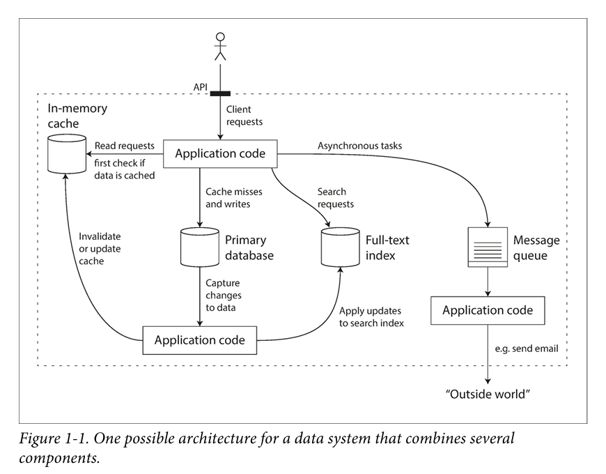

If you are designing a data system or service, a lot of tricky questions arise.
- How do you ensure that the data remains correct and complete, even when things go wrong internally?
- How do you provide consistently good performance to the clients, even when parts of your systems are degraded?
- How do you scale to handle an increase in load?
- What does a good API for the service look like?

### Reliability
Typical expectations include:
- The application performs the function that the user expected.
- It can tolerate the user making mistakes or using the software in unexpected ways.
- Its performance is good enough for the required use case, under the expected load and data volume.
- The system prevents any unauthorized access and abuse

If all those things together mean "working correctly", then we can understand reliability as meaning, roughly, "continuing to work correctly, even when things go wrong"

The things that can go wrong are called **faults**, and systems that anticipate faults and can cope with them are called fault-tolerant or resilient. It only makes sense to talk about tolerating certain types of faults.

A **fault** is usually defined as one component of the system deviating from its spec, whereas a **failure** is when the system as a whole stops.

One study of large internet services found that configuration errors by operators were the leading cause of outages, whereas hardware faults (servers or network) played a role in only 10-25% of outages

How important Is Reliability?

Bugs in business applications cause lost productivity, legal risks, and lost revenue.

Consider a parent who stores all their pictures and videos of their children in your photo application. How would they feel if that database was suddenly corrupted? Would they know how to restore if from a backup?

There are situations in which we may choose to sacrifice reliability in order to reduce development cost (e.g., when developing a prototype product for an unproven market) or operational cost (e.g., for a service with a very narrow profit margin) -- but we should be very conscious of when we are cutting corners.

### Scalability

Scalability means considering questions like
- If the system grows in a particular way, what are out options for coping with the growth?
- How can we add computing resources to handle the additional load?

Load can be described with a few numbers which we call load parameters. The best choice of parameters depends on the architecture of your system: it may be:
- requests per second to a web server
- the ratio of reads to writes in a database
- the number of simultaneously active users in a chat room
- the hit rate on a cache

To make this idea more concrete, let's consider Twitter as an example, using data published in November 2012. Two of the twitter's main operations are:
- Post tweet
  
  A user can publish a new message to their follower (4.6k requests/sec on average, over 12k requests/sec at peak).
- Home timeline
  
  A user can view tweets posted by the people they follow (300k requests/sec)

Simply handling 12k write per second (the peak rate for posting tweets) would be fairly easy. However, Twitter's scaling challenge is not primarily due to tweet volume, but due to fan-out (each user follows many people, and each user is followed by many people)

There are broadly two ways of implementing these two operations:

1. Posting a tweet simply inserts the new tweet into a global collection of tweets. When a user requests their home timeline, look up all the people they follow, find all the tweets for each of those users, and merge them (sorted by time). In a relational database like in the following image, you could write a query such as:

```sql
SELECT tweets.*, users.* FROM tweets
    JOIN users ON tweets.sender_id = users.id
    JOIN follows ON follow.followee_id = users_id
    WHERE follow.follower_id = current_user
```

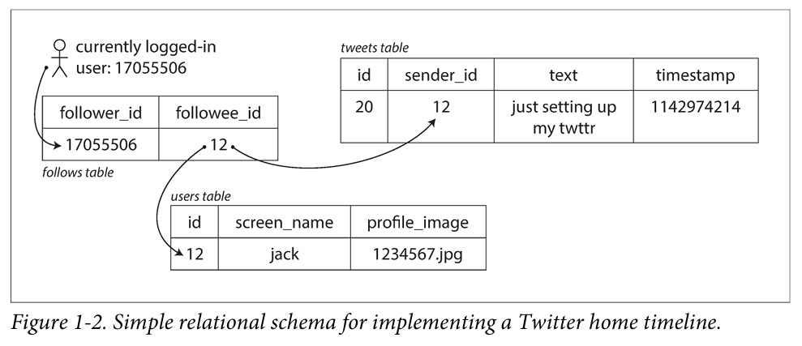

2. Matintain a cache for each user's home timeline -- like a mailbox of tweets for each recipient user. When a user posts a tweet, look up all the people who follow that user, and insert the new tweet into each of their home timeline caches. The request to read the home timeline is then cheap, because its result has been computed ahead of time.

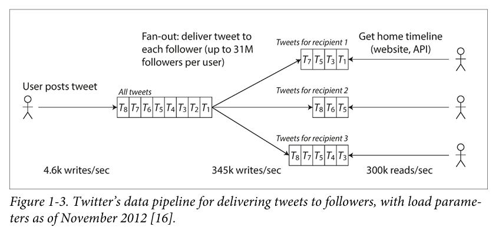

The first version of Twitter used approach 1, but the systems struggled to keep up the the load of home timeline queries, so the company switched to approach 2. This works better because the average rate of published tweets is almost two orders of magnitude lower than the trate of home timeline reads, and so in this case it's preferable to do more work at write time and less at read time.

However, the downside of approach 2 is that posting a tweet now requires a lot of extra work. On average, a tweet is delivered to about 75 follower, so 4.7k tweets per second becomes 345k writes per second to the home time caches. But this average hides the fact that the number of followers per user varies wildly, and some user have over 30 million followers. This means that a single tweet may result in over 30 million writes to home timelines! Doing this in a timely manner -- Twitter tries to deliver tweets to followers within five seconds -- is a significant challenge.

In the example of Twitter, the distribution of followers per user (maybe weighted by how often those users tweet) is a key load parameter for discussing scalability, since it determines the fan-out load. Your application may have very different characteristics, but you can apply similar principles to reasoning about its load.

The final twist of the Twitter anecdote: now that approach 2 is robustly implemented, Twitter is moving to a hybrid of both approaches. Most users' tweets continue to be fanned out to home timelines at the time when they are posted, but a small number of users with a very large number of followers (i.e., celebrities) are excepted from this fan-out. Tweets from any celebrities that a user may follow are fetches separately and merged the user's home timeline when it's read. like in approach 1 (imo, to not have big uptime for celebrities and not to decrease customer satisfaction).

This hybrid approach is able to deliver consistently good performance. We will revisit this in chapter 12 after we have covered some more technical ground.

When you increase a load parameter and keep the system resources (CPU, memory, network bandwidth, etc.) unchanged, how is the performance of your system affected?

When you increase a load parameter, how much do you need to increase the resources if you want to keep performance unchanged?

Both questions require performance numbers, so let's look briefly at describing the performance of a system

The response time is what the client sees: besides the actual time to process the request (the service time), it includes network delays and queueing delays.

Latency is the duration that a request is waiting to be handled

High percentiles of response times, also known as tail latencies, are important because they directly affect users' experience of the service.
For example, Amazon describes response time requirements for internal services in the terms of the 99.9th percentile, even though it only affects 1 in 1,000 requests.

This is because the customers with the slowest requests are often those who have the most data on their accounts because they have made many purchases - that is, they're the most valuable customers.
It's important to keep those customers happy by ensuring the website is fast for them: Amazon has also observed that 100 ms increase in response time reduces sales by 1%, and others report that a 1-second slowdown reduces a customer satisfaction metric by 16%

On the other hand, optimizing the 99.99th percentile (the slowest 1 in 10,00 requests) was deemed too expensive and to not yield enough benefit for Amazon's purposes.

Reducing response times at very hight percentiles is difficult because they are easily affected by random events outside of your control, and the benefits are diminishing.
For example, percentiles are often used in service level objectives (SLOs) and service level agreements (SLAs) contracts that define the expected performance and availability of a service.

An SLA may state that the service is considered to be up if it has a median response time of less than 200 ms and a 99th percentile under 1 s(if the response time is longer, it might as well be down), and the service may be required to be up at least 99.9% of the time.

These metrics set expectations for clients of the service and allow customers to demand a refund if the SLA is not met.

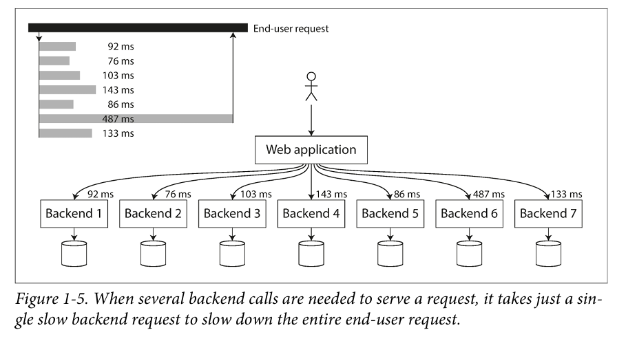

Some systems are elastic, meaning that they can automatically add computing resources when they detect a load increase, whereas other systems are scaled manually (a human analyzes the capacity and decides to add more machines to the system).

An elastic system can be useful if load is highly unpredictable, but manually scaled systems are simple and may have fewer operational surprises.

Common wisdom until recently was to keep your database on a single node (scale up) until scaling cost or high availability requirements forced you to make it distributed.

The architecture of systems that operate at large scale is usually highly specific to the application - there is no such thing as generic, one size-fits-all scalable architecture (informally known as magic scaling sauce). The problem may be the volume of reads, the volume of writes, the volume of data to store, the complexity of the data, the response time requirements, the access patterns, or (usually) some mixture of all of these plus many more issues.

For example, a system that is designed to handle 100,000 requests per second, each 1 kB in size, looks very different from a system that is designed for 3 requests per minute, each 2 GB in size - even though the two systems have the same data throughput

### Maintainability

It's well known that the majority of the cost of software is not in its initial development, but in its ongoing maintenance - fixing bugs, keeping its systems operational, investigating failures, adapting it to new platforms, modifying it for new use cases, repaying technical debt , and adding new features.

We can and should design software in such a way that is hopefully minimize pain during maintenance, and thus avoid creating legacy software ourselves.

To this end, we will pay particular attention to three design principles for software systems:

1. Operability

   Make it easy for operations teams to keep the system running smoothly

2. Simplicity
   
   Make it easy for new engineers to understand the system, by removing as much complexity as possible from the system. (not this is not the same as simplicity of the user interface.)

3. Evolvability

   Make it easy for engineers to make changes to the system in the future, adapting it for unanticipated use cases as requirements change. Also known as extensibility, modifiability, or plasticity.

Good operability means making routine tasks easy.

Most discussions of these Agile techniques focus on a fairly small, local scale (a couple of source code files within the same application). 

In this book, we search for ways
of increasing agility on the level of a larger data system, perhaps consisting of several different applications or services with different characteristics. 

For example, howwould you “refactor” Twitter’s architecture for assembling home timelines (“Describ
ing Load” on page 11) from approach 1 to approach 2?

### Summary

In this chapter, we have explored some fundamental ways of thinking about data intensive applications. 

These principles will guide us through the rest of the book,
where we dive into deep technical detail.

An application has to meet various requirements in order to be useful. There are functional requirements (what it should do, such as allowing data to be stored, retrieved, searched, and processed in various ways), and some nonfunctional requirements (general properties like security, reliability, compliance, scalability, compatibility, and maintainability). In this chapter we discussed reliability, scalability, and maintainability in detail.

- Reliability means making systems work correctly, even when faults occur. Faults can be in hardware (typically random and uncorrelated), software (bugs are typically systematic and hard to deal with), and humans (who inevitably make mistakes from time to time). Fault-tolerance techniques can hide certain types of faults from the end user.

- Scalability means having strategies for keeping performance good, even when load increases. In order to discuss scalability, we first need ways of describing load and performance quantitatively. We briefly looked at Twitter’s home timelines as an example of describing load, and response time percentiles as a way of measuring performance. In a scalable system, you can add processing capacity in order to remain reliable under high load.
  
- Maintainability has many facets, but in essence it’s about making life better for the engineering and operations teams who need to work with the system. Good abstrac tions can help reduce complexity and make the system easier to modify and adapt for new use cases. Good operability means having good visibility into the system’s health, and having effective ways of managing it.

There is unfortunately no easy fix for making applications reliable, scalable, or maintainable. However, there are certain patterns and techniques that keep reappearing in different kinds of applications. 

In the next few chapters we will take a look at some examples of data systems and analyze how they work toward those goals.

## Chapter 2: Data Models and Query Languages
How storage engines work; thatis, how these data models are actually implemented.

### Types of data models discussed:
1. Hierarchical model
2. Network model
3. Relational model
4. Document model
5. Graph model
6. Others mentioned e.g. Vector model

### Relational Model
Query language: SQL

Over the years, there have been many competing approaches to data storage and querying. In the 1970s and early 1980s, the **network** model and the **hierarchical** model were the main alternatives, but the relational model came to dominate them. Object databases came and went again in the late 1980s and early 1990s. XML databases appeared in the early 2000s, but have only seen niche adoption. Each competitor to the relational model generated a lot of hype in its time, but it never lasted.

As computer became vastly more powerful and networked, they started being used for increasingly diverse purposes. And remarkably, relational databases turned out to generalize very well, beyond their original scope of business data processing, to a broad variety of use cases. Much of what you see on the web today is still powered by relational databases, be it online publishing, discussion, social networking, e-commerce games, software-as-a-service productivity applications, or much more.

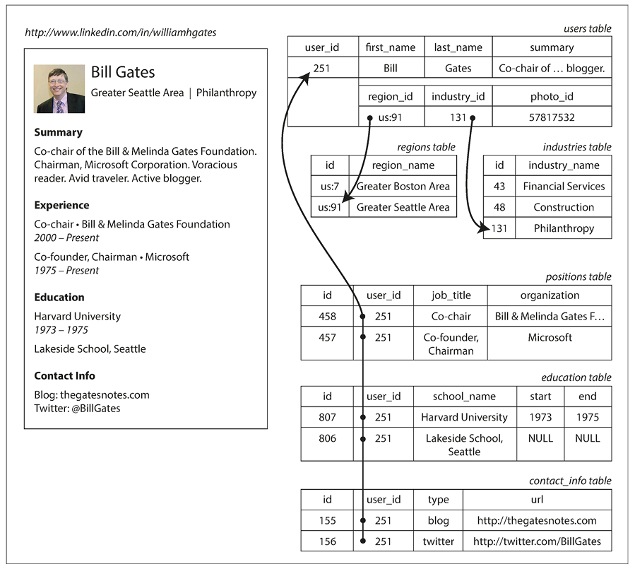

### Document model
Query language: MQL (MongoDB Query Language) or MapReduce

Now, in the 2010s, NoSQL is the latest attempt to overthrow the relational model’s dominance. The name “NoSQL” is unfortunate, since it doesn’t actually refer to any particular technology—it was originally intended simply as a catchy Twitter hashtag for a meetup on open source, distributed, nonrelational databases in 2009. 

Nevertheless, the term struck a nerve and quickly spread through the web startup community and beyond. A number of interesting database systems are now associated withthe #NoSQL hashtag, and it has been retroactively reinterpreted as Not Only SQL.

There are several driving forces behind the adoption of NoSQL databases, including:

- A need for greater scalability than relational databases can easily achieve, includ
ing very large datasets or very high write throughput
- A widespread preference for free and open source software over commercial
database products
- Specialized query operations that are not well supported by the relational model
- Frustration with the restrictiveness of relational schemas, and a desire for a more dynamic and expressive data model
  
Different applications have different requirements, and the best choice of technology
for one use case may well be different from the best choice for another use case. It
therefore seems likely that in the foreseeable future, relational databases will continue
to be used alongside a broad variety of nonrelational datastores—an idea that is
sometimes called polyglot persistence.

__Document model representation__
```json
{
  "user_id":     251,
  "first_name":  "Bill",
  "last_name":   "Gates",
  "summary":     "Co-chair of the Bill & Melinda Gates... Active blogger.",
  "region_id":   "us:91",
  "industry_id": 131,
  "photo_url":   "/p/7/000/253/05b/308dd6e.jpg",
  "positions": [
    {"job_title": "Co-chair", "organization": "Bill & Melinda Gates Foundation"},
    {"job_title": "Co-founder, Chairman", "organization": "Microsoft"}
  ],
  "education": [
    {"school_name": "Harvard University",       
    "start": 1973, "end": 1975},
    {"school_name": "Lakeside School, Seattle", "start": null, "end": null}
  ],
  "contact_info": {
    "blog":    
    "http://thegatesnotes.com",
    "twitter": "http://twitter.com/BillGates"
  }
}
```

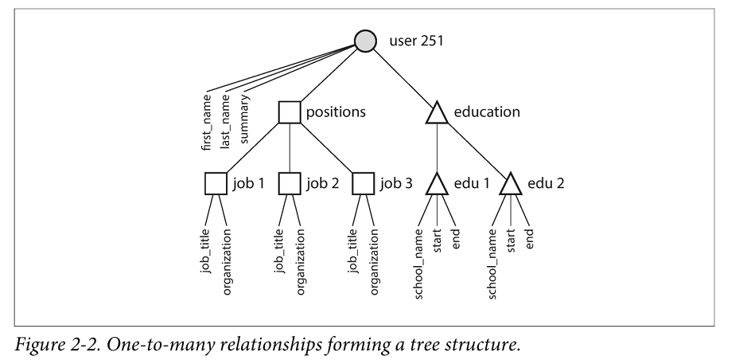

Some developers feel that the JSON model reduces the impedance mismatch between the application code and the storage layer. However, as we shall see in Chapter 4, there are also problems with JSON as a data encoding format. The lack of a schema is often cited as an advantage; we will discuss this in “Schema flexibility in the document model” on page 39.

The JSON representation has better locality than the multi-table schema in Figure 2-1. If you want to fetch a profile in the relational example, you need to either perform multiple queries (query each table by user_id) or perform a messy multi way join between the users table and its subordinate tables. In the JSON representation, all the relevant information is in one place, and one query is sufficient.

The one-to-many relationships from the user profile to the user’s positions, educational history, and contact information imply a tree structure in the data, and the JSON representation makes this tree structure explicit (see Figure 2-2).

> Normalization is they idea of removing duplication, and using GUID is a way to achieve that.

In document databases, joins are not needed for one-to-many tree structures, and support for joins is often weak.

> the lists of regions and industries are probably small and slow-changing enough that the application can simply keep them in memory.

> **Data integrity** means that data should remain accurate, consistent, valid, and trustworthy through it's cycle

It's often described as schemaless, but that's misleading as the that reads the data usually assumes some kind of structure, ther is an implict schema, but its not enforced by the database. A more accurate term is schema-on-read

- Implicit is schema-on-read similar to dynamic runtime
- Explicit is schema-on-write similar to compile time

### Relational vs Document model (SQL vs NoSQL)
Which data model leads to simpler application code?

- If the data in your application has a document-like structure (i.e., a tree of one-to-many relationships, where typically the entire tree is loaded at once), then it’s probably a good idea to use a document model. The relational technique of shredding—splitting a document-like structure into multiple tables (like positions, education, and contact_info in Figure 2-1)—can lead to cumbersome schemas and unnecessarily complicated application code.
- The document model has limitations: for example, you cannot refer directly to a nested item within a document, but instead you need to say something like “the second item in the list of positions for user 251” (much like an access path in the hierarchical model). However, as long as documents are not too deeply nested, that is not usually a problem.
- The poor support for joins in document databases may or may not be a problem, depending on the application. For example, many-to-many relationships may never be needed in an analytics application that uses a document database to record which events occurred at which time
- However, if your application does use many-to-many relationships, the document model becomes less appealing. It’s possible to reduce the need for joins by denormalizing, but then the application code needs to do additional work to keep the denormalized data consistent. Joins can be emulated in application code by making multiple requests to the database, but that also moves complexity into the application and is usually slower than a join performed by specialized code inside the database. In such cases, using a document model can lead to significantly more complex application code and worse performance
- It’s not possible to say in general which data model leads to simpler application code; it depends on the kinds of relationships that exist between data items. For highly interconnected data, the document model is awkward, the relational model is acceptable, and graph models (see “Graph-Like Data Models” on page 49) are the most natural.

The difference between the approaches is particularly noticeable in situations where an application wants to change the format of its data. 

For example, say you are currently storing each user’s full name in one field, and you instead want to store the first name and last name separately [23]. In a document database, you would just start writing new documents with the new fields and have code in the application that handles the case when old documents are read. For example:

```json
  if (user && user.name && !user.first_name) {
  // Documents written before Dec 8, 2013 don't have first_name
    user.first_name = user.name.split(" ")[0];
  }
```

On the other hand, in a “statically typed” database schema, you would typically per form a migration along the lines of:

```SQL
  ALTER TABLE users ADD COLUMN first_name text;
  UPDATE users SET first_name = split_part(name, ' ', 1);      
  UPDATE users SET first_name = substring_index(name, ' ', 1);      -- PostgreSQL-- MySQL
```

### The network model
Query language: You tell the database the exact path (Access paths)

Document model is great for schemaless models but can only have one parent therefore, graph model was introduced, and the network model is an early version of it.

A record can have multiple parents.

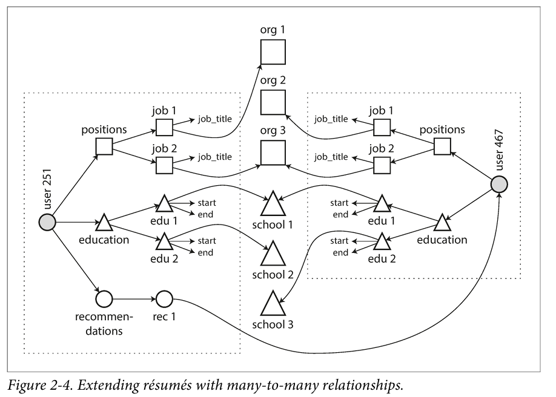

### Query languages for data

1. Imperative
    1. Mostly used in programming languages
         ```javascript
           function getSharks() {
             var sharks = [];
             for (var i = 0; i < animals.length; i++) {
               if (animals[i].family === "Sharks") {
                 sharks.push(animals[i]);
               }
             }
             return sharks;
           }
         ```
    2. It's about how to achieve the goal
2. Declarative
    1. Like SQL or CSS
        ```SQL
          SELECT * FROM animals where family = 'Sharks';
        ```
        ```CSS
          li.selected > p {
            background-color: blue;
          }
        ```
        whereas in javascript, if I want to do the same CSS in Javascript, it would be like that:
        ```javascript
        var liElements = document.getElementsByTagName("li");
        for (var i = 0; i < liElements.length; i++) {
          if (liElements[i].className === "selected") {
            var children = liElements[i].childNodes;
            for (var j = 0; j < children.length; j++) {
              var child = children[j];
              if (child.nodeType === Node.ELEMENT_NODE && child.tagName === "P") {
                child.setAttribute("style", "background-color: blue");
              }
            }
          }
        }
        ```
        in a web browser, using declarative CSS styling is much better than manipulating styles imperatively in JavaScript. Similarly, in databases, declarative query languages like SQL turned out to be much better than imperative query APIs.
    2. You specify the pattern of the data you want - what conditions the results must meet, and how you want the data to be transformed (e.g. sorted, grouped, and aggregated - but not how to achieve that goal).
    3. It's up to the database system's **query optimizer** to decide which indexes and which join methods to use, and in which order to execute various parts of the query
    4. The fact that SQL is more limited in functionality gives the database much more room for automatic optimizations

### Graph model
Query language: Cypher, SparQL, and Datalog

- We saw earlier that many-to-many relationships are an important distinguishing feature between different data models. If your application has mostly one-to-many relationships (tree-structured data) or no relationships between records, the document model is appropriate.
- But what if many-to-many relationships are very common in your data? The relational model can handle simple cases of many-to-many relationships, but as the connections within your data become more complex, it becomes more natural to start modeling your data as a graph.
- A graph consists of two kinds of objects: vertices (also known as nodes or entities) and edges (also known as relationships or arcs). Many kinds of data can be modeled as a graph. Typical examples include:
  - **Social graphs**: Vertices are people, and edges indicate which people know each other.
  - **The web graph**: Vertices are web pages, and edges indicate HTML links to other pages.
  - **Road or rail networks**: Vertices are junctions, and edges represent the roads or railway lines between them.
- Well-known algorithms can operate on these graphs: for example, car navigation systems search for the shortest path between two points in a road network, and PageRank can be used on the web graph to determine the popularity of a web page and thus its ranking in search results.

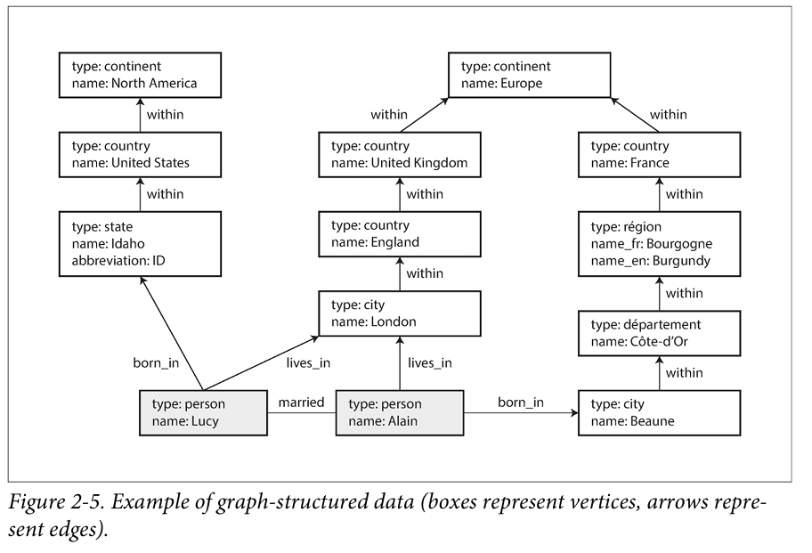

Two ways of structuring graph models:
  - Property graph
    - implemented by Neo4j, Titan, and InfiniteGraph
  - Triple-store graph
    - implemented by Datomic, AllegroGraph, and others

### Difference between Graph and Network models
Think of Network Model as the old-generation graph database and Graph Model as the modern version

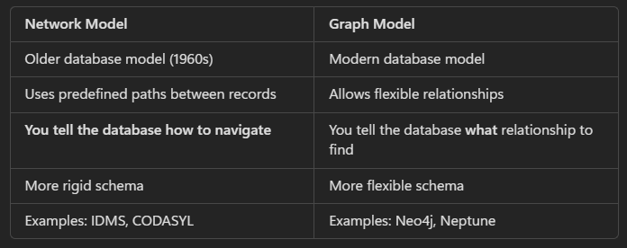

Example: suppose you want to find Ali's friends
- Network Model:
  - Find Ali -> Follow Friend Link -> Get Friend Records
- Graph Model:
  - ```graph
    MATCH (a:Person {name:"Ali"})-[:FRIEND]->(f) 
    RETURN f
    ```
You specify the relationship pattern, and the database finds the path.

- Network Model = "How do I traverse?"
- Graph Model = "What relationships am I looking for?

Basically graph is schema-less and declarative

### Summary
- Data models are a huge subject, and in this chapter we have taken a quick look at a broad variety of different models. We didn’t have space to go into all the details of each model, but hopefully the overview has been enough to whet your appetite to find out more about the model that best fits your application’s requirements.
- Historically, data started out being represented as one big tree (the hierarchical model), but that wasn’t good for representing many-to-many relationships, so the relational model was invented to solve that problem. More recently, developers found that some applications don’t fit well in the relational model either. New nonrelational “NoSQL” datastores have diverged in two main directions:
  - Document databases target use cases where data comes in self-contained docu
ments and relationships between one document and another are rare.
  - Graph databases go in the opposite direction, targeting use cases where anything is potentially related to everything.
- All three models (document, relational, and graph) are widely used today, and each is good in its respective domain. One model can be emulated in terms of another model. for example, graph data can be represented in a relational database—but the result is often awkward. That’s why we have different systems for different purposes, not a single one-size-fits-all solution.
- One thing that document and graph databases have in common is that they typically don’t enforce a schema for the data they store, which can make it easier to adapt applications to changing requirements. However, your application most likely still assumes that data has a certain structure; it’s just a question of whether the schema is explicit (enforced on write) or implicit (handled on read).
- Each data model comes with its own query language or framework, and we discussed several examples: SQL, MapReduce, MongoDB’s aggregation pipeline, Cypher, SPARQL, and Datalog. We also touched on CSS and XSL/XPath, which aren’t data base query languages but have interesting parallels.
- Although we have covered a lot of ground, there are still many data models left
unmentioned. To give just a few brief examples:
  - Specialized sequence databases (bioinformatics databases)
  - Specialized scientific/big-data processing systems
  - Information retrieval / **search index model** will be covered later.....

### Takeway
- Relational databases are best when data is highly interconnected and requires joins.
- Document databases are best when data naturally forms self-contained hierarchical aggregates. 
- Graph databases are best when relationships themselves are the primary focus.
- Relational → Tables
- Document   → JSON Trees
- Hierarchical → Trees
- Network → Pointer Graphs
- Graph → Flexible Relationship Graphs

## Chapter 3: Storage and Retrieval
This chapter explains how databases store and retrieve data

### Two types of database workloads
- OLTP (Online Transaction Processing) - The "Doing" System
  - What it does: Handles day-to-day, real-time operations. It processes thousands of tiny, fast transactions simultaneously.
  - Common actions: INSERT, UPDATE, and DELETE (creating a new order, updating a customer's address, refunding a purchase).
  - Who uses it: Cashiers, bank tellers, customer service reps, and end-users on apps/websites.
  - Data focus: Current, granular data (right now, this second).
  - Database design: Highly normalized (many linked tables) to avoid duplicate data and ensure speed.
  - **Example**: When you buy a coffee using an app, the OLTP system instantly deducts your balance, logs the order, and updates the store's inventory.
- OLAP (Online Analytical Processing) - The "Thinking" System
  - What it does: Analyzes massive amounts of historical data to find trends, patterns, and insights for business decisions.
  - Common actions: SELECT and AGGREGATE (running complex queries like SUM, AVG, and GROUP BY over millions of rows).
  - Who uses it: Data analysts, business intelligence teams, and executives.
  - Data focus: Historical, aggregated data (what happened last month, last year, or over 5 years).
  - Database design: Denormalized (flat, wide tables with duplicate data, often structured as a "Star Schema") to make complex queries run faster.
  - **Example**: The coffee chain's VP uses an OLAP system to see that iced coffee sales increased by 15% in the summer across all stores in Texas, so they decide to order more ice machines.

Why this matters?

Because one database architecture is rarely optimal for both, The chapter then asks:
- "How should we store data for OLTP?" 
- "How should we store data for OLAP?"

### How OLTP Databases Store Data
Suppose we build our own simple database

```On every write -> append to file```

example:

```
user1 -> Ahmed
user2 -> Sara
user1 -> Ahmed Ali
```

The database is just a log with a couple of appends, very simple.

Disk likes sequential writes (to write at end) and is very fast doing so, but appending may be bad when finding data enquires

We would need to scan entire file, and that would be O(N) which becomes impossible at scale

Here is where Indexes come to place.

#### Index

To solve retrieval speed we create **INDEX** which is similar to a table of contents for a book, and is simply data about the data.

```
Indexes speed up reads
Indexes slow down writes
```

Every storage engine is balancing this tradeoff

#### Hash Index

First storage engine idea is to keep ```Key -> Disk Position```

Example:

```
user1 -> byte 100
user2 -> byte 400
user3 -> byte 900
```

stored in a hash map, and on lookup it's something like this:

```
user2 -> byte 400 -> read value
```

Nearly O(1)

The downside is that hashing destroys ordering e.g. ```Find users 100-1000```

if user 100 is stored on byte xxx then user 101 is stored on byte yyy, then the hard disk would need to spin a lot to get the users.

- user1 might hash to byte 100.
- user2 might hash to byte 9,000,000,000 (because hashes are random-looking).

Today, we use Solid State Drives (SSDs), which have no moving parts like Hard Disks. There is no "head" and no "spinning." Accessing byte 100 and byte 9 billion takes the exact same electrical time (microseconds).

Because of SSDs, random access is no longer a big deal. But here is the trap:
- The concept of "hashing destroys ordering" is still 100% correct—even on SSDs!
- Why? Because even on an SSD, if your hash index scatters data randomly, the database still has to make millions of separate tiny read requests to the SSD to collect 1,000 scattered users.
- If the data were stored in order (sorted by user ID), the database could send one single sequential read request saying "give me bytes 100 to 1000" and the SSD streams it back in one go, which is vastly faster than 1,000 tiny random reads.

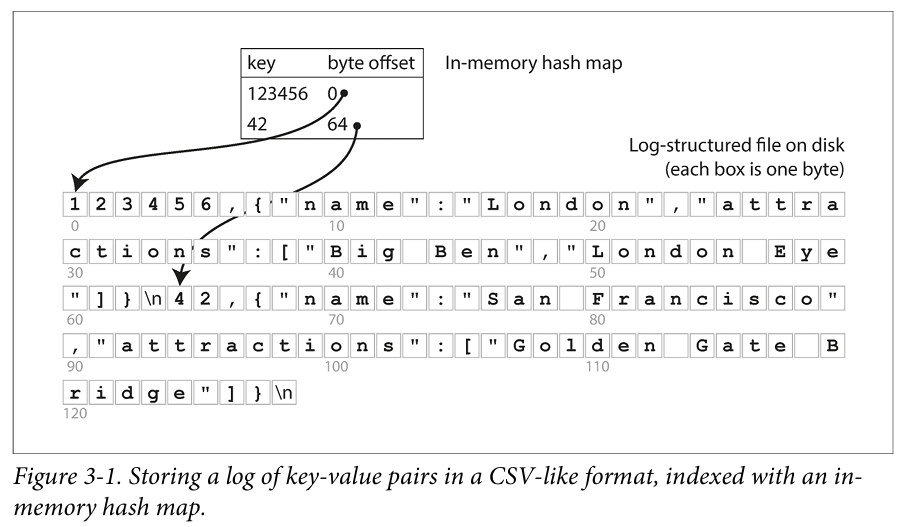

#### Clustered and non-clustered indexes
Clustered Index: Determines the physical order of data on disk—like a dictionary where words and definitions sit together. You get only one per table because rows can only be sorted one way. Lookups and range queries (BETWEEN) are extremely fast, but inserting random values in the middle is slow (page splits). Best practice: use an auto-incrementing ID so new rows go at the end. In MySQL InnoDB, the primary key is the clustered index.

Non-Clustered Index: A separate B-Tree that stores only the indexed key and a pointer to the full row—like a textbook index that says "see page 412." You can have many per table. Lookups require two steps (find pointer, then fetch row), making them slightly slower. However, they don't affect physical row order, so inserts are faster regardless of key value. Used for foreign keys, emails, or search columns.


#### Segments
Logs can grow forever, segmenting is about splitting those logs into a smaller segments

```
segment1
segment2
segment3
```

When one become large, close the segment and open another

#### Compaction
Over time this can happen:

```
user1 -> Ahmed

user1 -> Ahmed Ali

user1 -> Ahmed A.
```

Older versions become useless

Compaction removes obsolete entries, so the result will be only ```user1 -> Ahmed A```

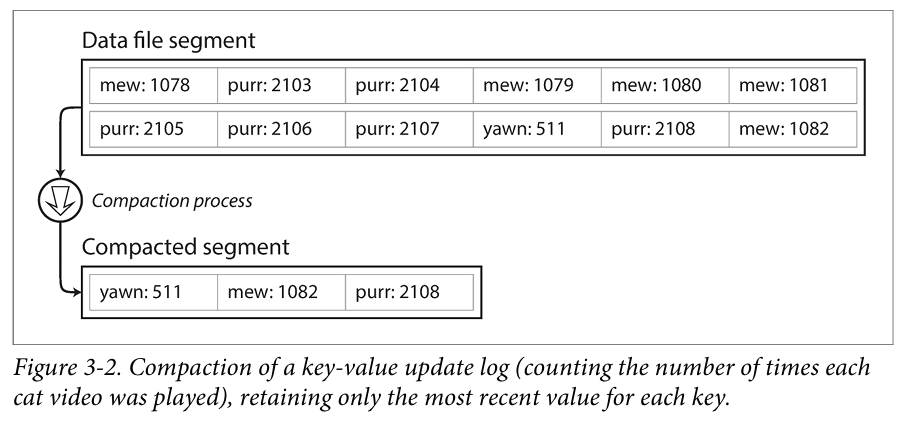

#### SSTables (Sorted string table)
What if segment was sorted? then it's a SSTable

instead of:
```
D
A
C
B
```

Store:
```
A
B
C
D
```

Benefits:
- Binary search: sorted data is easier to locate
- Efficient Range queries e.g. 100-1000 becomes easy.
- Sparse Indexes: Need far fewer index entries, since:
  ```
  100 -> offset
  200 -> offset
  300 -> offset
  ```
  instead of every key

#### Memtables
How do we contiguously write into a sorted file? We don't because writing directly to disk is slow. Even with SSDs, it takes thousands of times longer to write to disk than to write to RAM (memory).

The Memtable is an in-memory data structure (usually a balanced binary tree like a Red-Black Tree or a Skip List) that holds your most recent writes.

Here is exactly how it works in real-time:
1. User writes data: You update your profile picture.
2. Stored in RAM: The database instantly inserts this update into the Memtable (sorted by your User ID). This takes less than 1 millisecond.
3. Ack to User: The database sends back a 200 OK response to your app saying "Update successful!"
4. Memtable grows: Over the next few minutes, thousands of other users write data, and all of it piles up in this Memtable in RAM.

when the Memtable reaches a certain size (say, 128 MB), the database does a Flush
1. It freezes the current Memtable (stops accepting new writes to it).
2. It instantly creates a brand-new, empty Memtable in RAM for new incoming writes (so your app never experiences downtime).
3. Meanwhile, in the background, it takes that frozen Memtable (which is already perfectly sorted in memory) and writes it to disk as an SSTable.
4. Once the SSTable is safely saved, the database deletes the frozen Memtable from RAM to free up space.

The full lifecycle of it:
1. User writes ```user5 -> "Alice"```.
2. Database writes ```user5 -> "Alice"``` to the Write-Ahead Log (for crash safety).
3. Database inserts ```user5 -> "Alice"``` into the Memtable in RAM.
4. User gets a "Success!" message.
5. Memtable fills up with millions of writes.
6. Background process flushes the Memtable to disk as an SSTable.
7. Memtable is cleared to make room for new data.

So when it fills, it flushes to a disk and create a new `SSTable`.

#### LSM Trees (Log Structured Merge Trees)
Now combine everything:
```
Memtables + SSTables + Compaction
```

This becomes LSM Tree (Log structured Merge tree)

Flow:
```
Write -> Memtable -> Flush -> SSTable -> Compaction -> Merged SSTables
```
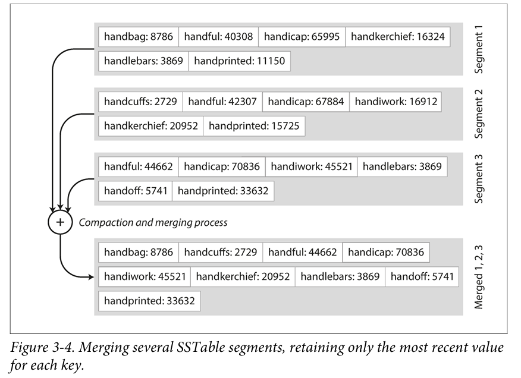

The Complete Lookup Flowchart:
```
Query: Find "user150"
  │
  ▼
Check Memtable (RAM) ────► Found? ──► YES ──► Return instantly!
  │ (Not found)
  ▼
Check Bloom Filter of SSTable #5 (newest) ──► "NO" ──► Skip it!
  │
  ▼
Check Bloom Filter of SSTable #4 ──► "MAYBE" ──► Open this file.
  │
  ▼
Look at Sparse Index of SSTable #4 ──► "user150 is in Block 2"
  │
  ▼
Read Block 2 from disk into memory.
  │
  ▼
Binary Search Block 2 for "user150" ──► Found! Return the value.
  (Stop; ignore older SSTables #3, #2, #1)
```
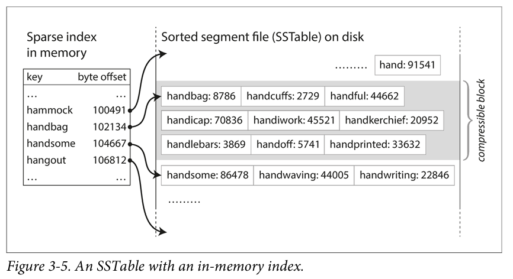

Advantage is that it has excellent writes because it uses memory-first

Problems:
- A read may require checking MemTable, SSTable A, SSTable B, SSTable C
- Compactions are also expensive

Databases using LSM Ideas:
- Cassandra
- HBase
- LevelDB
- RocksDB

#### B-Trees (Balanced Trees)
The second major storage-engine family says that instead of "Write first, organize later", it says ```"Keep data organized at all times"```

it keeps all the data in ONE single, massive, perfectly organized file, so you can find any piece of data in exactly 3 or 4 disk reads.

A B-Tree is a hierarchical index that looks exactly like an upside-down tree. It consists of two types of "pages" (blocks of fixed size, say 4KB) stored on disk:
- Root Page (The top of the tree).
- Branch Pages (The middle levels).
- Leaf Pages (The very bottom, where the actual data lives).

How it works:
Let's say you have a B-Tree index on user_id, and you are looking for user150. Here is the journey:

1. The Root Page: The database reads the very first page of the file (the Root) into memory. It contains a sorted list of "ranges":
   ```
    [user1 - user100] -> Go to Page 2
    [user101 - user200] -> Go to Page 3
    [user201 - user300] -> Go to Page 4
   ```
    The database looks at user150 and says: "That falls in the 101-200 range. I need to go to Page 3." (1 disk read so far).
2. The Branch Page: The database reads Page 3 (a Branch page) from disk. It has a more detailed list:
   ```
    [user101 - user120] -> Go to Page 7
    [user121 - user140] -> Go to Page 8
    [user141 - user160] -> Go to Page 9
   ```
    It finds user150 in the 141-160 range and says: "I need to go to Page 9." (2 disk reads so far).
3. The Leaf Page: The database reads Page 9 (a Leaf page) from disk. This page contains the actual rows of data:
   ```
    user141: "Alice"
    user142: "Bob"
    ...
    user150: "Charlie"   <--- FOUND IT!
    ...
    user160: "Zara"
   ```
    The database reads the row and returns it. (3 disk reads total).

B-Trees use a Write-Ahead Log (WAL) just like LSM Trees. Before touching any page on disk, the database writes the intended change to a log. If it crashes, it replays the log to recover.

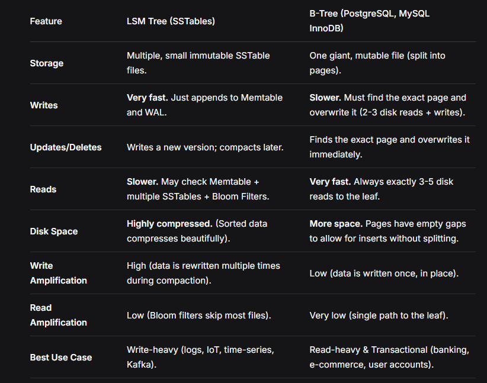

B-Trees keep empty space inside each page (say, 50% full) so that when you insert user155, there is room to put it without having to split the page immediately. Over time, as you delete data, pages become half-empty. This is called **fragmentation**, and the B-Tree needs periodic maintenance (VACUUM in PostgreSQL or OPTIMIZE in MySQL) to shrink it back down. LSM Trees don't have this problem because compaction cleans everything up perfectly.

#### Secondary Indexes
Until now we have discussed primary-key indexes e.g. user_id but users search by many attributes (email, country, name ,age)

These  are secondary indexes, a separate index for fields other than the primary key.

#### In-Memory Databases
Some systems keep most data in RAM e.g. Redis, Memcached

Benefits is that its a very low latency, but tradeoff is that RAM is expensive

### How OLAP Databases Store Data
OLTP stores data in a "Row-Oriented" way  e.g.
```
[1, Alice, Shirt, $20, Texas, Jan 1] [2, Bob, Hat, $15, Texas, Jan 1] [3, ...]
```

whereas OLAP stores data in a "Column-Oriented" way e.g.
```
File 1 (user_id):    [1, 2, 3, 4, 5, ...... 1,000,000,000]
File 2 (name):       [Alice, Bob, Charlie, ...... ]
File 3 (product):    [Shirt, Hat, Shoes, ...... ]
File 4 (price):      [$20, $15, $30, ...... ]
File 5 (store):      [Texas, Texas, California, ...... ]
File 6 (date):       [Jan 1, Jan 1, Jan 2, ...... ]
```
Now, when you ask: "What is the AVERAGE price?"

The database ignores all the other files, opens only the `price` file, and scans just that one column from start to finish. It reads 1 billion numbers (4 GB of data) instead of 1 billion rows (40 GB of data). That is 10x less disk I/O right out of the gate!

#### Data Warehouses
Data Warehouuses is often created from production OLTP database using ETL for the purpose of doing analytical work

```
Production Database (OLTP)
        |
        |
       ETL
        |
        V
 Data Warehouse (OLAP)
```

#### ETL
ETL stands for "Extract", "Transform", and "Load"

1. Extract: read production data
   - Orders
   - Customers
   - Products
2. Transform: clean and reshape
   - Remove duplicates
   - Convert currencies
   - Fix formats
3. Load: put results into the warehouse

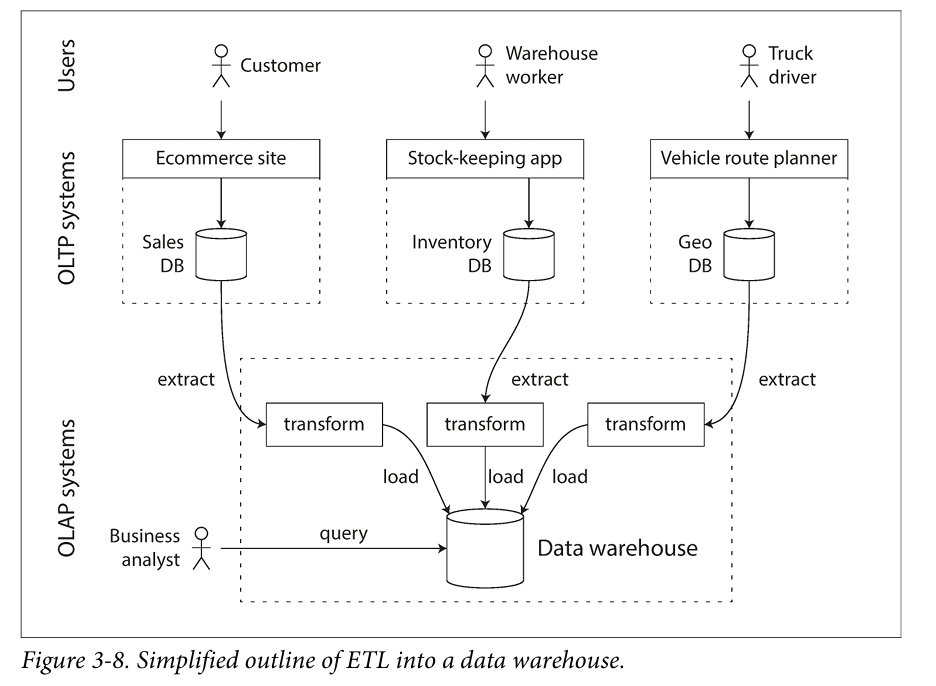

#### The Mental Model
Think of a hospital
1. OLTP is doctors treating patients (real-time work)
2. Date Warehouse is records archive of historical data
3. OLAP is researchers asking
   1. How many patients had disease X?
   2. What is the survival rate?
   3. Which treatments worked best?

Analytics happen on the achieve, not while doctors are performing surgery.


#### Star Schema
A Star Schema has only two types of tables:
- Fact Table: The measurements or events (numbers you want to add up). One row = one event.
  - e.g. Every single sales transaction.
- Dimension Tables: The descriptions or context (the "who, what, where, when").
  - e.g. Customers, Products, Stores, Dates.

```

         Customer
             |
Product ---Sales--- Store
             |
           Time
```

Then the `Snowflake Schema` is simply a Star Schema that has been "normalized."


#### Materialized View and Data Cubes
A materialized view is a query result that is precomputed and stored on disk. Instead of recalculating an expensive aggregation every time (e.g., revenue by country), the database reads the stored result directly. This makes analytical queries much faster but requires extra storage and maintenance whenever underlying data changes.

A data cube extends the idea of materialized views by storing many precomputed aggregations across multiple dimensions such as product, country, and year. It enables extremely fast OLAP queries because results are already calculated. The tradeoff is higher storage cost and reduced flexibility for unexpected analytical questions.


### Summary
- In this chapter we tried to get to the bottom of how databases handle storage and retrieval. What happens when you store data in a database, and what does the data base do when you query for the data again later?
-  On a high level, we saw that storage engines fall into two broad categories: those optimized for transaction processing (OLTP), and those optimized for analytics (OLAP). There are big differences between the access patterns in those use cases:
   -  OLTP systems are typically user-facing, which means that they may see a huge volume of requests. In order to handle the load, applications usually only touch a small number of records in each query. The application requests records using some kind of key, and the storage engine uses an index to find the data for the requested key. Disk seek time is often the bottleneck here.
   -  Data warehouses and similar analytic systems are less well known, because they are primarily used by business analysts, not by end users. They handle a much lower volume of queries than OLTP systems, but each query is typically very demanding, requiring many millions of records to be scanned in a short time. Disk bandwidth (not seek time) is often the bottleneck here, and column oriented storage is an increasingly popular solution for this kind of workload.
- On the OLTP side, we saw storage engines from two main schools of thought:
  - The log-structured school, which only permits appending to files and deleting obsolete files, but never updates a file that has been written. Bitcask, SSTables, LSM-trees, LevelDB, Cassandra, HBase, Lucene, and others belong to this group.
  - The update-in-place school, which treats the disk as a set of fixed-size pages that can be overwritten. B-trees are the biggest example of this philosophy, being used in all major relational databases and also many nonrelational ones.

Log-structured storage engines are a comparatively recent development. Their key
idea is that they systematically turn random-access writes into sequential writes on
disk, which enables higher write throughput due to the performance characteristics
of hard drives and SSDs.

## Chapter 4: Encoding and Evolution
Applications inevitably change over time. Features are added or modified as new products are launched, user requirements become better understood, or business circumstances change

### The inevitability of Change and the Two Types of Compatibility
Kleppmann starts with a harsh reality: Server-side applications are rarely ever completely stopped, upgraded, and restarted all at once. We use rolling upgrades (phased rollouts) to reduce risk.

Because of this, when you change your data format (your schema), old code and new code will run simultaneously. This forces you to bake compatibility into your encoding from Day 1.

1. **Backward Compatibility** (The Non-Negotiable): 
   - Newer code must be able to read data that was written by older code. If you add a new field to your schema, older code didn't know about it. To be backward compatible, the encoding must allow the new reader to supply a default value for that missing field. This protects your database: you can update your app, but it must still read the old rows sitting in your storage.
2. **Forward Compatibility** (The Harder One): 
   - Older code must be able to read data that was written by newer code. This is much harder. If a new version adds a field, the old reader must ignore that field and still process the rest of the record without crashing. This protects your consumers: your old, cached batch-job might still be running when a producer publishes a new data format.

The Golden Rule: If you want to be able to roll back a deployment quickly, you must support both directions simultaneously.

### The Three Generations of Encoding Formats (and their Fatal Flaws)
Kleppmann divides encoding into three eras. Understanding the flaws of the early eras explains why we tolerate the complexity of binary schemas.

1. **Generation 1: Language-Specific Formats** (Java Serialization, Python Pickle, Ruby Marshal)
   - The Trap: They are convenient for the programmer because you just call `object.writeToFile()`.
   - The Flaws: 
     - They break forward/backward compatibility catastrophically. 
     - They expose the internal memory layout of the object (class names, method signatures). 
     - If you rename a variable, old code cannot read it. 
     - Worse, they are notoriously security holes (deserialization attacks where a malicious byte-stream executes arbitrary code) and are completely useless if your Java service talks to a Python service.
2. **Generation 2: Textual Formats** (JSON, XML, CSV)
   - The Pro: 
     - Human-readable. 
     - Great for public-facing APIs where a developer on the frontend needs to debug.
   - The Flaws:
     - Ambiguity: JSON doesn't know the difference between an integer and a floating-point number.
     - Binary Bloat: To send the string {"user_id": 123}, you send the bytes for the keys ("user_id") over the network every single time. This wastes massive bandwidth at scale.
     - The CSV Disaster: CSV doesn't even have a schema. If a new version adds a column in the middle, old code will parse the columns completely wrong without throwing an error—it just maps the wrong data to the wrong variable. This is a silent data corruption bug.
   - Technology: API Gateway
3. **Generation 3: Binary Schema-Driven Formats** (Thrift, Protobuf, Avro)
   - These exist to solve the bloat, ambiguity, and compatibility of textual formats while remaining language-agnostic.
   - Technology: Azure Service Bus

### The Technical Deep-Dive (Thrift/Protobuf vs. Avro)
1. Thrift & Protocol Buffers (The "Tagged" Approach)
   - The schema assigns a fixed numeric field tag to every field (e.g., `user_id = 1`, `name = 2`).
   - The binary data is a sequence of `[Tag, Type, Length, Value]`.
   - How compatibility works: If a new reader gets a tag it doesn't recognize (e.g., Tag 5), it simply skips those bytes. If an old reader reads data with a new Tag 5, it also skips it.
   - The Critical Catch (The "Reserved" Keyword): If you remove a field, you must permanently mark that tag as reserved. Why? Because a new version of your code might write data using Tag 1 for a completely different meaning. If you reuse Tag 1, an old reader expecting the old field will decode the data using the wrong type, resulting in corrupted, unreadable data. Reserved tags last forever.
   - 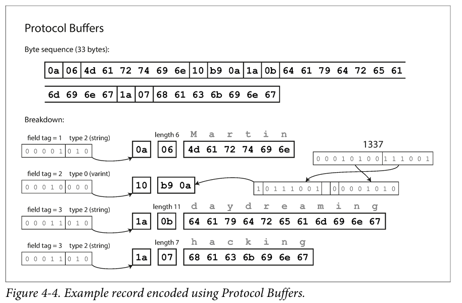
2. Apache Avro (The "Schema Resolution" Approach - The Game Changer)
   - Avro does not use numeric tags. It has no integers attached to the fields.
   - The binary data contains only the values separated by delimiters. It does not contain the field names or types in the data itself.
   - How compatibility works: The reader has its own schema. The writer embeds the writer's schema ID. The reader fetches the writer's schema, compares it to its own, and performs a schema resolution by matching field names. If a field is missing, it uses a default value defined in the reader's schema.
   - The Superpower of Avro: Because there are no tags, field order does not matter. The binary byte-stream just expects values in the order of the writer's schema; the reader reorders them based on name matching. Also, you can freely add or remove fields without tracking a numeric database of tags. This makes Avro ideal for heterogeneous data pipelines (like Kafka) where thousands of different applications produce data, and you don't want to maintain a global registry of tag numbers.
   - 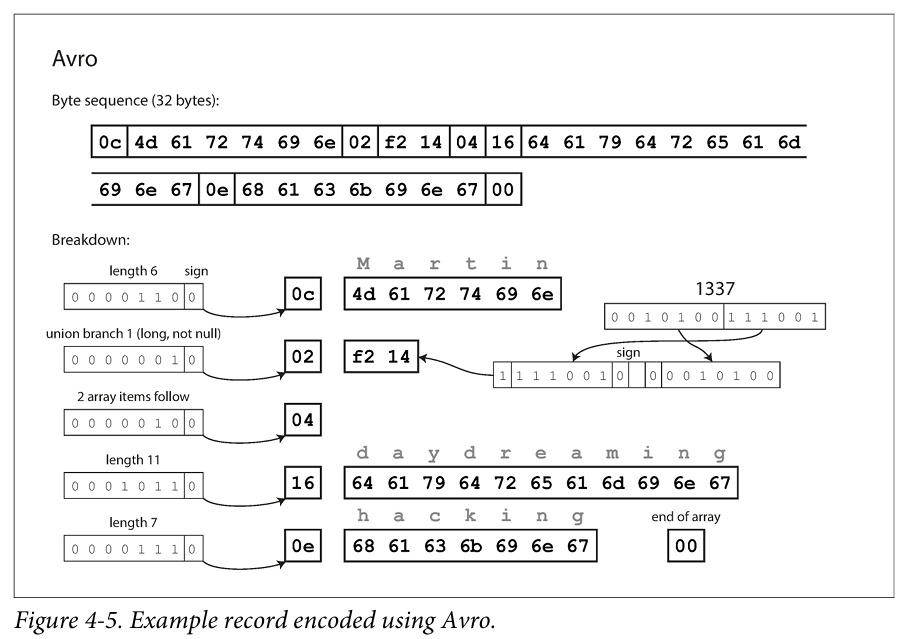
   - 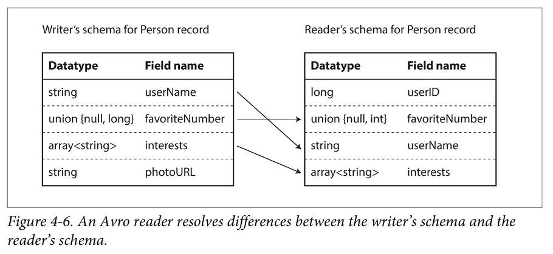

### The Schema Registry and the "Data Contract"

A common misconception is that Avro doesn't send the schema across the wire. It doesn't, but both sides must have the schema. How?

- Before deploying a producer, you upload your schema to a Schema Registry (a centralized server).
- The producer gets a unique Schema ID (e.g., `123`).
- When the producer serializes a record, it prepends the binary payload with `[Schema ID 123][Binary Data]`.
- When the consumer receives the data, it extracts ID `123`, downloads that specific schema version from the Registry, and runs the resolution algorithm against its own local schema.

Why this matters for Evolution:
This creates a **Data Contract**. You aren't just sending bytes; you are explicitly stating which version of the contract you used to write the data. This allows you to run a rolling upgrade safely:
1. Update the consumer to use Schema v2. It can still read v1 (Backward).
2. Update the producer to write Schema v2. Consumers still running v1 ignore new fields (Forward).
3. If the producer upgrade fails and rolls back to v1, the new consumers already running v2 can still read the old v1 data (Backward again).

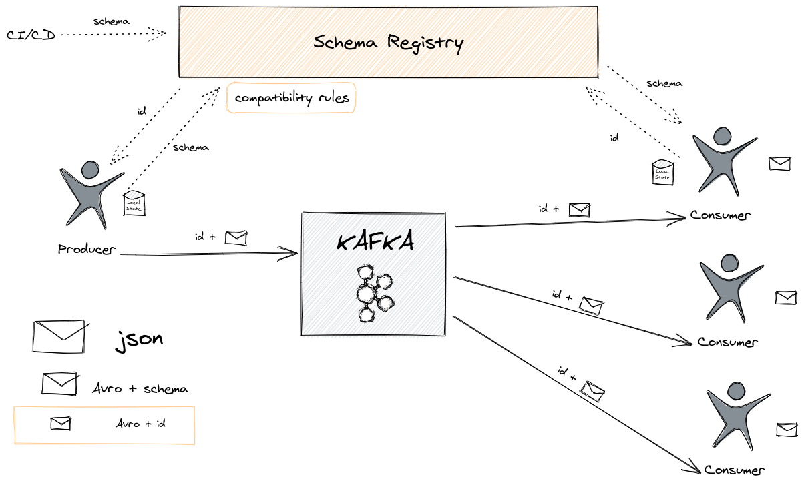

Kleppmann includes a subtle but devastating detail regarding nullability.

When adding a new, required field to a schema, you break backward compatibility because old data doesn't have that field.
To add a field safely, you must:

1. Define it with a default value in the schema (e.g., "default": 0 or "default": null).
2. Deploy the code that knows about this default.
3. Only after that code is running and handling the default correctly, can you change the application logic to stop treating it as a default and start using real data.

If you skip step 1 and just add a field without a default, your database becomes unreadable during a rolling upgrade, causing a full-site outage.

### Where Data Flows (The Three Architectures)
Encoding is meaningless without context. Kleppmann distinguishes where the data goes, because each architecture prioritizes compatibility differently

1. Architecture 1: **Dataflow via Databases**
    - In a database, the data outlives your application code. A row written 5 years ago might be read by today's freshly deployed code.
    - The Priority: Backward Compatibility is mandatory. Your new code must know how to read old data. If your code can't supply a default value for a missing old field, you cannot deploy.
    - The Rewrite Problem: If you change your Avro schema drastically, you might need to run a database rewrite (migration) where you read all old data and write it back in the new format. Until that migration is complete, your code must handle both.
2. Architecture 2: **Dataflow via Services** (REST/RPC)
    - Network requests are dynamic. The client initiates a request, the server processes it, and returns a response.
    - The REST (JSON) dynamic: REST APIs often don't enforce schemas strictly, which means compatibility is ad-hoc (documentation-based). If you change a JSON field, you usually just version the entire API endpoint (e.g., /v2/getUser).
    - The gRPC (Protobuf) dynamic: Since it uses tagged fields, old clients and new servers can communicate seamlessly as long as the tags remain stable. Here, Forward and Backward compatibility are achieved by the server ignoring unknown request fields from a new client, and the client ignoring unknown response fields from a new server.
3. Architecture 3: **Dataflow via Asynchronous Messaging** (Kafka / Azure Service Bus)
    - This is the most extreme case. The producer sends a message to the broker, and the consumer might not read it for hours, days, or weeks (e.g., an overnight analytics job).
    - Because the producer and consumer are completely decoupled in time, you cannot use REST-style versioning (you can't ask the producer to re-send the message in a different format).
    - The Priority: Forward Compatibility is absolutely critical here. The consumer that runs tonight might be an old version, but the producer ran this morning with a new schema. The old consumer must survive. This is exactly why Kafka and Confluent heavily push Avro with Schema Registry. It guarantees that even if a producer dies after sending its new format, the sleeping consumer will wake up and resolve the schema differences.

# Part 2: Distributed Data
In Part I of this book, we discussed aspects of data systems that apply when data is stored on a single machine. Now, in Part II, we move up a level and ask: what happens if multiple machines are involved in storage and retrieval of data?

There are various reasons why you might want to distribute a database across multiple machines:
1. **Scalability**:
If your data volume, read load, or write load grows bigger than a single machine can handle, you can potentially spread the load across multiple machines. 
2. **Fault tolerance/high availability**:
If your application needs to continue working even if one machine (or several machines, or the network, or an entire datacenter) goes down, you can use multiple machines to give you redundancy. When one fails, another one can take over.
3. **Latency**:
If you have users around the world, you might want to have servers at various locations worldwide so that each user can be served from a datacenter that is geographically close to them. That avoids the users having to wait for network packets to travel halfway around the world.

Types of scaling an application:
1. Vertical scaling (scaling up): adding more power to the machine e.g. CPU / RAM etc..
2. Shared-memory: system where multiple processors or cores access the same pool of memory
3. Shared-disk architecture: several machines with shared disk
4. Shared-nothing (horizontal scaling or scaling out): Several machines separated and have nothing shared in between

Two ways data is distributed across multiple nodes (machines):
1. Replication
   - Keeping a copy of the same data on several different nodes, potentially in different locations. Replication provides redundancy: if some nodes are unavailable, the data can still be served from the remaining nodes. Replication can also help improve performance. We discuss replication in Chapter 5.
2. Partitioning
   - Splitting a big database into smaller subsets called partitions so that different partitions can be assigned to different nodes (also known as sharding). We discuss partitioning in Chapter 6.

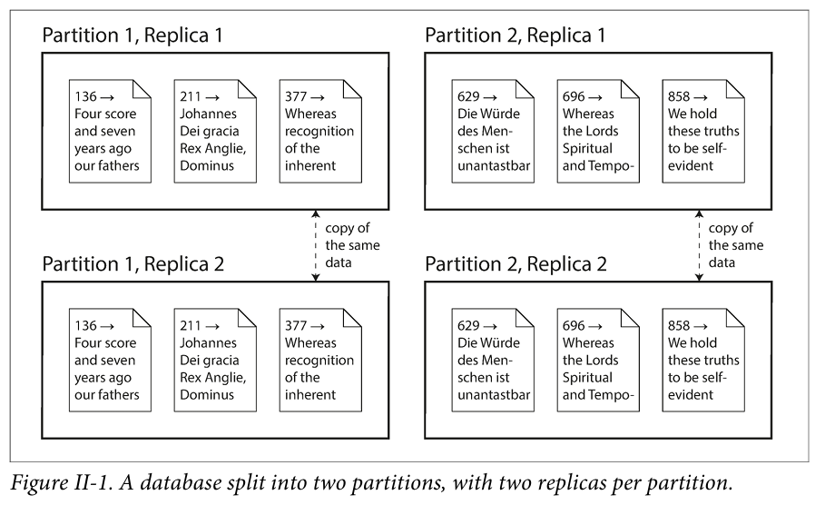

## Chapter 5: Replication
The goal of replication is to keep a copy of the same data on multiple machines . This is done to achieve a few critical goals:
1. Reduce Latency: Keep data geographically close to your users.
2. Increase Availability: The system can continue to work even if some parts fail.
3. Increase Read Throughput: Spread the load of read queries across many replicas.

The chapter explores three main algorithms for replicating changes: single-leader, multi-leader, and leaderless replication

### Single Leader Replication
This is the most common solution, also known as master-slave or primary-secondary replication.
- **How it works**: One node is designated the leader. All write requests must go to it. The leader writes the new data to its local storage and also sends the data change to all followers in a replication log or change stream .
- **Reads**: Clients can read data from either the leader or any of the followers. This is a key advantage, as it allows the system to scale out to handle a high volume of read requests

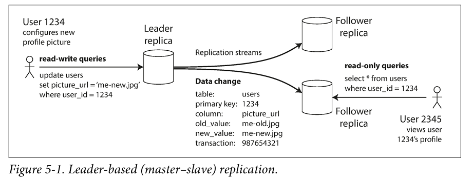

#### Synchronous vs. Asynchronous
1. **Synchronous**: The leader waits for a follower to confirm it has received the write before reporting success to the user. 
     - The advantage is that the follower is guaranteed to have an up-to-date copy. 
     - The disadvantage is that if the synchronous follower fails, the write cannot be processed.
2. **Semi-synchronous**: A practical middle-ground. One follower is synchronous, and the others are asynchronous
    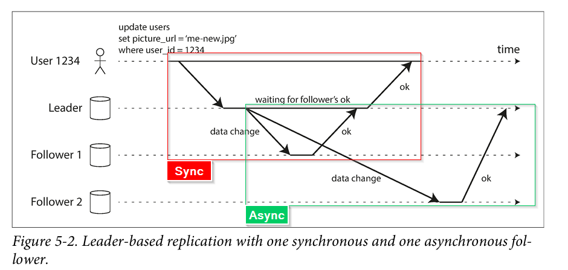
3. **Asynchronous**: The leader sends the write to the follower but does not wait for a response. 
     - The advantage is that the leader can continue processing writes even if all followers have fallen behind. 
     - The disadvantage is that if the leader fails, any writes that haven't been replicated are lost

#### Setting Up New Followers
Adding a new follower can be done without downtime by taking a consistent snapshot of the leader's database and copying it to the new follower. The new follower then connects to the leader and requests all changes that happened since the snapshot.

#### Handling Node Outages
1. **Follower Failure**: Follower can easily recover by looking at its log to find the last transaction it processed before the fault and requesting the data changes it missed
2. **Leader Failure**: This is a tricky process called failover. It involves determining the leader has failed, choosing a new leader (usually the follower with the most up-to-date data), and reconfiguring the system
     - **Split Brain**: A dangerous scenario where two nodes believe they are the leader. This can lead to data loss or corruption if both accept writes

#### Implementation of Replication Logs
How does the leader send data changes to its followers? The chapter discusses several methods:
1. **Statement-based Replication**: The leader logs every write request (e.g., INSERT, UPDATE, DELETE) and sends that statement log to its followers . This is generally not used today as it has problems with non-deterministic functions like NOW() or RAND().
2. **Write-Ahead Log (WAL) Shipping**: The leader sends the exact same low-level WAL (the log of byte changes to the storage engine) to its followers. This couples the leader and follower to the same storage engine and database version.
3. **Logical (Row-Based) Log Replication**: This decouples the replication log from the storage engine. It sends a sequence of records describing writes at the row level (e.g., "insert a row with these values"). This is more flexible and can allow the leader and follower to use different storage engines or database versions.
4. **Trigger-based Replication**: A trigger lets you register custom application code that automatically executes when a data change occurs.

#### Problems with Replication Lag
The delays in asynchronous replication create a "replication lag," leading to several consistency anomalies.
1. **Reading Your Own Writes**: A user might write data to the leader, but when they immediately query a follower (which is lagging), they won't see their own update . This is also called read-after-write consistency.
   - Solution: For data the user has modified, read it from the leader instead of a follower.
   - 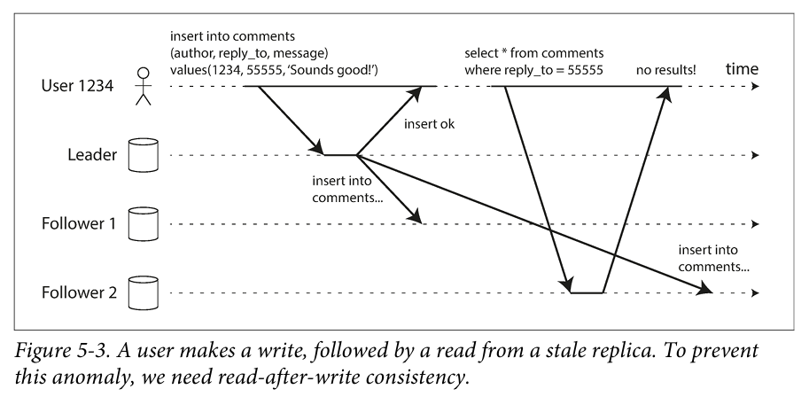
2. **Monotonic Reads**: A user might make multiple reads, and because they are routed to different followers with different lag, the data appears to go "back in time".
   - Solution: Ensure a user always reads from the same replica (e.g., by hashing the user ID).
   - 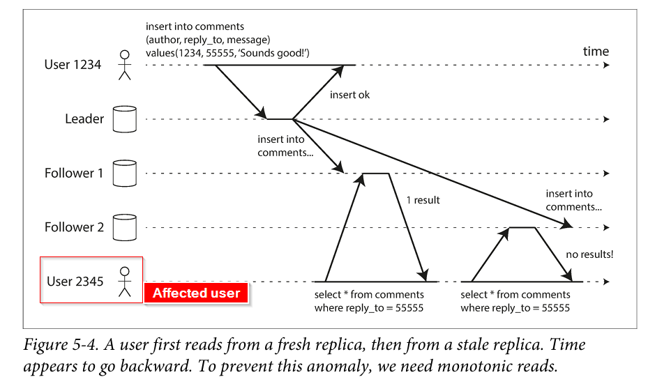
3. **Consistent Prefix Reads**: If a series of writes are causally dependent, a follower might process them in the wrong order.
   - Solution: Ensure that any writes with a causal relationship are written to the same partition.
   - 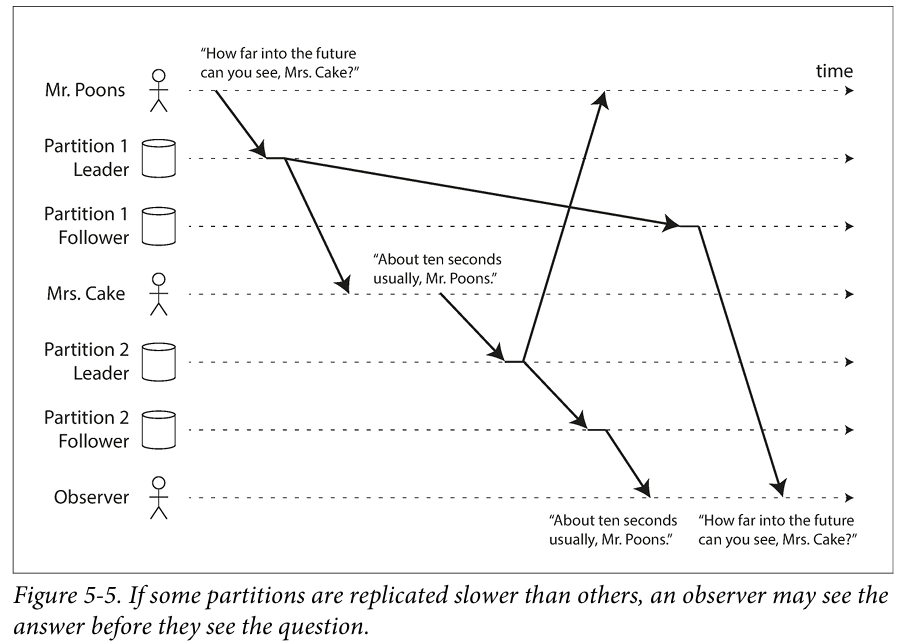

### Multi-Leader Replication
This is a natural solution for systems that span multiple datacenters, where single-leader would introduce high latency for writes.
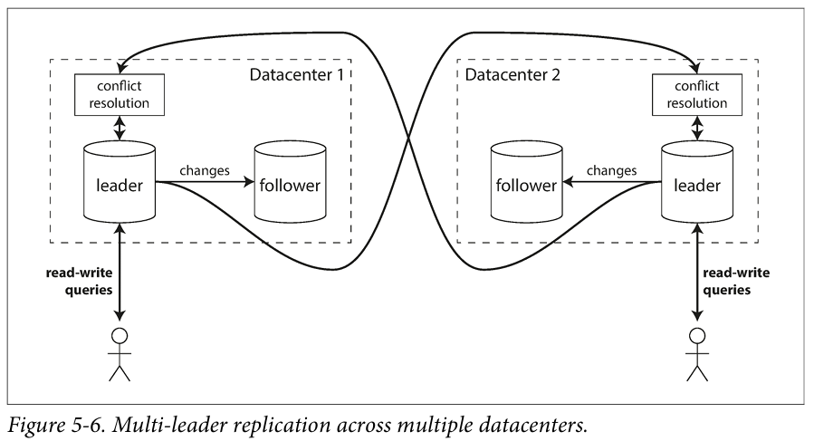
1. **Advantages**: Better performance (writes can be handled locally), higher tolerance for datacenter outages, and tolerance for network problems between datacenters
2. **Biggest Challenge: Write Conflicts** If two users modify the same data in different datacenters concurrently, a conflict occurs
   - **Conflict Avoidance**: The simplest strategy. Ensure that all writes for a particular record always go through the same leader (e.g., routing a user's requests to their "home" datacenter)
   - **Conflict Resolution**: When conflicts happen, they must be resolved. Common strategies include "Last Write Wins" (LWW, which is simple but can cause data loss), merging values, or using custom application logic to resolve the conflict
3. **Replication Topologies**: Multi-leader systems can have various topologies (communication paths)
   - The most general is all-to-all, where every leader sends its writes to every other leader
   - MySQL uses a circular topology.
   - There is also a star topology
   - 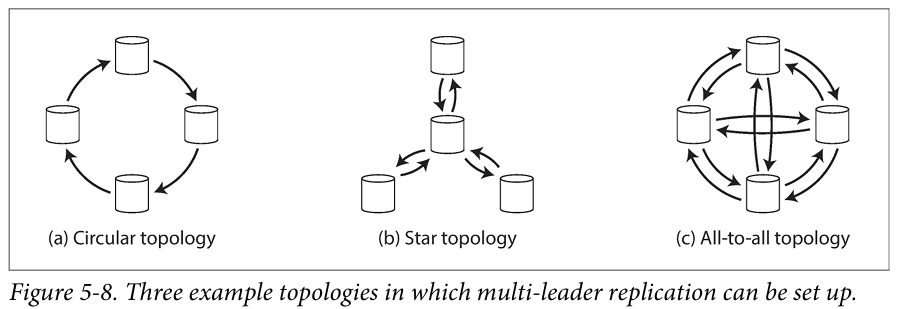

### Leaderless Replication
In this approach, any replica can directly accept writes from clients . This is used in systems like Cassandra and Amazon Dynamo therefore called Dynamo-style
   - **Writing**: Clients send writes to several nodes in parallel. A write is considered successful if confirmed by a certain number (w) of nodes.
   - **Reading**: Clients also read from several nodes in parallel. A read is considered successful if responded to by a certain number (r) of nodes. If `w + r > n` (the total number of replicas), the read set will overlap with the write set, ensuring you get the latest version.
     - 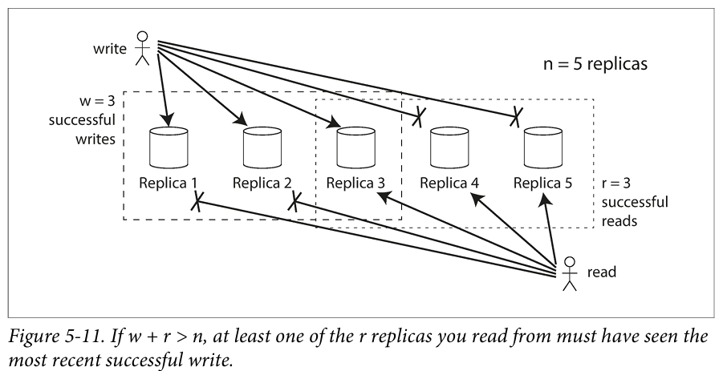
   - **Handling Stale Data**:
     - **Read Repair**: When a client reads from multiple nodes, it can detect stale replicas and send a request to write the new value to them
       - 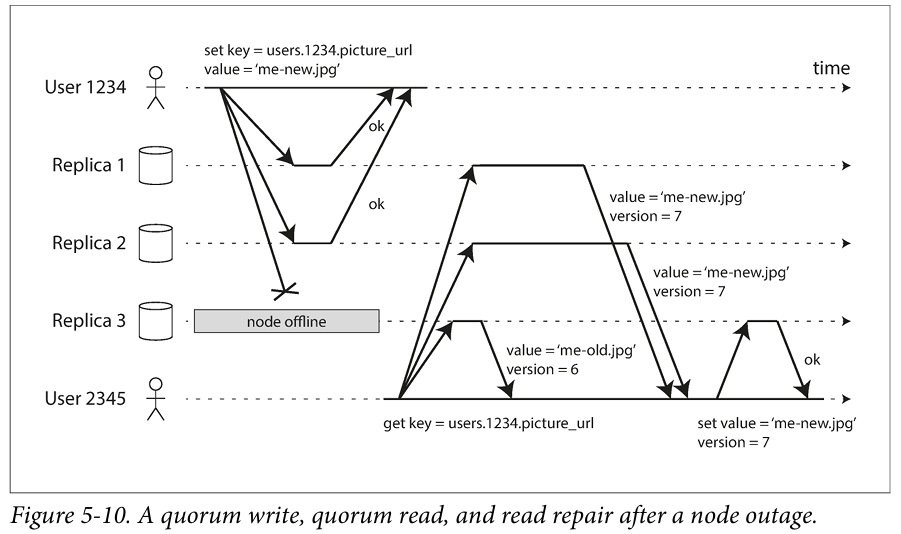
     - **Anti-Entropy**: A background process that constantly looks for and repairs differences in data between replicas
   - **Detecting Concurrent Writes**: This is where the concept of a `version vector` comes in. It's a collection of version numbers from all replicas that allows the system to distinguish between overwrites and concurrent writes
     - 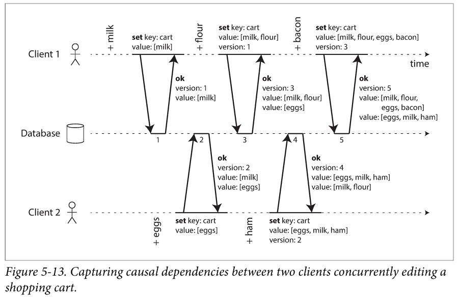
     - 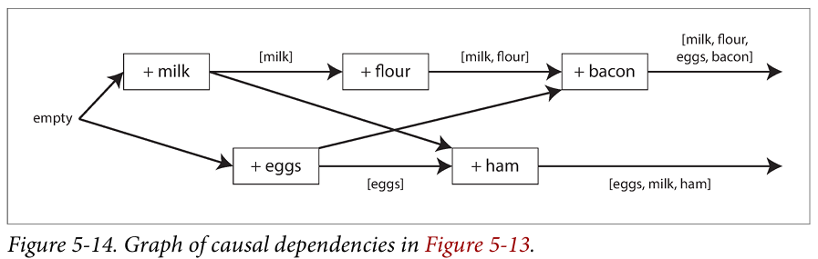

## Chapter 6: Partitioning
Partitioning (also known as sharding), addresses a core challenge of distributed systems: what happens when your data is too large for a single machine? The solution is to break it into smaller, manageable pieces and distribute them across many nodes

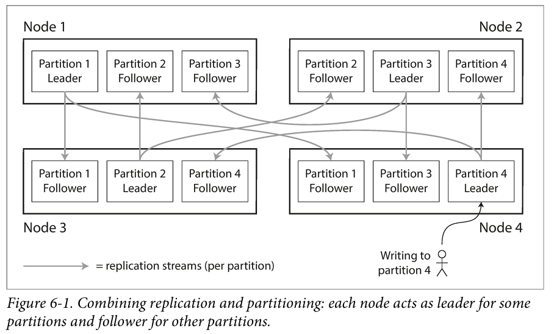

### Why Partitioning is Essential
The primary goal of partitioning is scalability. By splitting a dataset, we can:
1. Distribute storage: No single machine needs to hold the entire dataset.
2. Parallelize processing: Queries and writes can be handled by many nodes simultaneously, increasing throughput.

This is often combined with replication (from Chapter 5), where each partition's data is copied across multiple nodes for fault tolerance.

### Two Main Approaches to Partitioning
The book presents two primary strategies for partitioning key-value data, each with distinct trade-offs

| Strategy                    | Description                                                                                        | Pros                                                                          | Cons                                                                                                 | Examples                                     |
| --------------------------- | -------------------------------------------------------------------------------------------------- | ----------------------------------------------------------------------------- | ---------------------------------------------------------------------------------------------------- | -------------------------------------------- |
| Partitioning by Key Range   | Assigns a continuous range of keys to each partition (like an encyclopedia's volumes)              | Enables efficient range scans (e.g., querying keys between A and B)           | Prone to hot spots if the data distribution is uneven (e.g., all writes target the latest range)     | Bigtable, HBase, RethinkDB                   |
| Partitioning by Hash of Key | Uses a hash function to deterministically map each key to a partition. This spreads data uniformly | Balances the load effectively, avoiding skew and hot spots for most use cases | Breaks range queries because keys that are near each other are scattered across different partitions | Cassandra, MongoDB (hash sharding), DynamoDB |

Even with hashing, a skewed workload (where a single key is extremely popular, like a celebrity's profile on social media) can create a hot spot. One strategy to mitigate this is to add a random suffix to the key, splitting the load for that key across multiple partitions

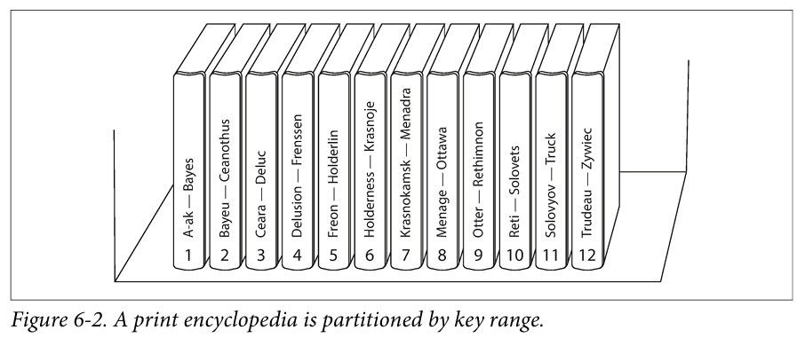
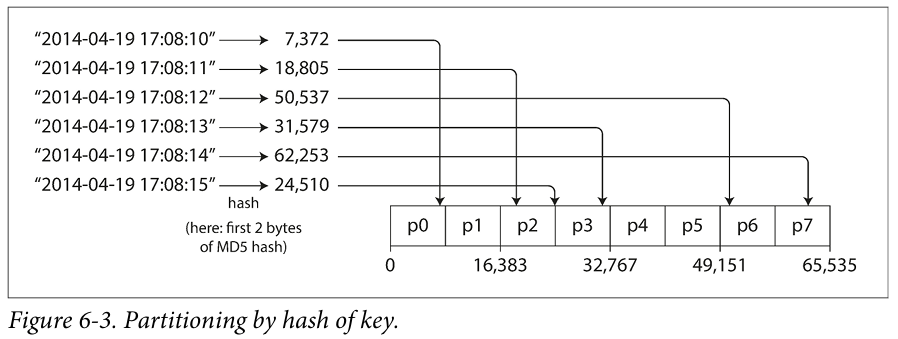

### The Challenge of Secondary Indexes
A significant complexity arises with secondary indexes (indexes on non-primary-key fields)

| Index Type                                 | Description                                                                                              | Pros                                                                           | Cons                                                                                                                                           |
| ------------------------------------------ | -------------------------------------------------------------------------------------------------------- | ------------------------------------------------------------------------------ | ---------------------------------------------------------------------------------------------------------------------------------------------- |
| Document-partitioned Indexes (Local Index) | Each data partition maintains its own separate secondary index, covering only the data in that partition | Simple to maintain and update, as data and index are on the same node          | Reads can be slow and expensive, often requiring a scatter/gather request to query all partitions                                              |
| Term-partitioned Indexes (Global Index)    | Builds a single, global secondary index that is partitioned separately from the primary data             | More efficient reads, as the index can route the query to a specific partition | Complicates writes, as a single data update may require updating multiple index partitions, often needing asynchronous updates for performance |

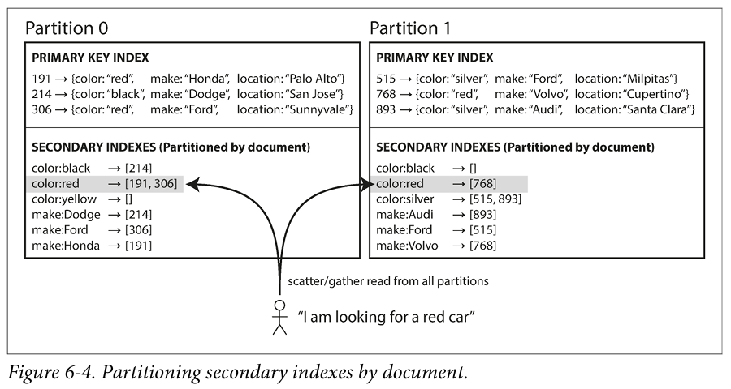
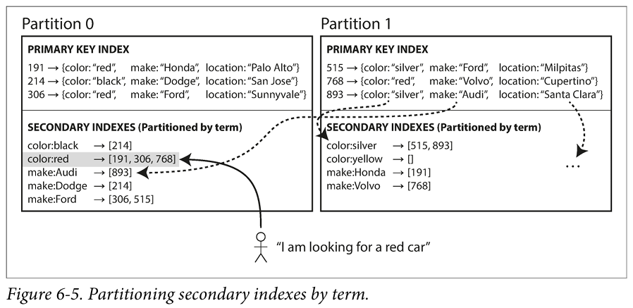

### Rebalancing Partitions
When the number of nodes in a cluster changes (to handle more load or replace a failed machine), partitions must be rebalanced—moved between nodes to restore balance. Good rebalancing should distribute the load fairly, minimize data movement, and not disrupt normal operations

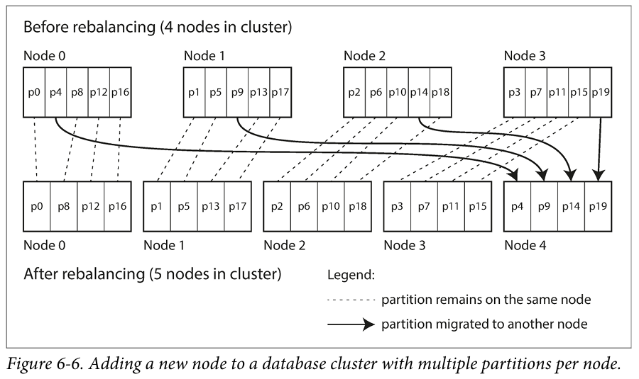

The book details several strategies:
1. **Fixed Number of Partitions**: 
     - Create many more partitions than nodes upfront, then distribute them across the cluster. When a new node joins, it can "steal" a few partitions from existing nodes. This strategy is simple but has a pre-determined upper limit
2. **Dynamic Partitioning**:
     - Partitions are automatically split and merged as the data grows or shrinks (common with key-range partitioning). It's more flexible but complex to implement. A key piece of advice: avoid naive hashing like `hash(key) mod N`, as adding or removing a node changes the hash for almost all keys, leading to massive data migration

### Request Routing
Finally, once data is partitioned across many nodes, the system needs to know how to route a client's request to the correct partition. This is a service discovery problem. 

Common approaches include:
- Forwarding Requests: Clients can contact any node, which will forward the request to the right one.
- Routing Tier: A dedicated layer acts as a partition-aware load balancer.
- Direct Client Connection: Clients are aware of the partition scheme and connect directly.

Systems often use a coordination service like ZooKeeper to maintain the authoritative mapping of partitions to nodes, which is then used by routing tiers or clients.

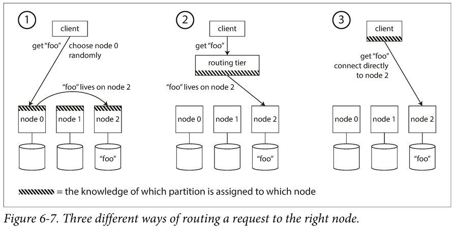
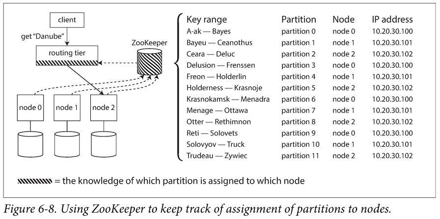

## Chapter 7: Transactions

### The Problem Transactions Solve
**The Core Problem**: In any data system, things go wrong. Hardware fails, networks drop, software crashes, and multiple users access the same data simultaneously. Without a structured way to handle these failures, your application can end up with corrupted, inconsistent, or partially updated data.

**The Solution (Transactions)**: A transaction is a way for an application to group several reads and writes into a single logical unit of work. The database provides a crucial guarantee: either all operations in the transaction are completed successfully, or none of them are.

Kleppmann emphasizes a key point: "Transactions are not a law of nature. They were created with a purpose: to simplify the programming model for applications." Without transactions, application developers would need to implement complex error-handling logic to check for every possible race condition, partial failure, and concurrency anomaly.

### The ACID Guarantees
ACID stands for Atomicity, Consistency, Isolation, and Durability. But Kleppmann warns us: these terms are often misunderstood and oversold.

#### Atomicity (Abortability)
**Definition**: Atomicity ensures that a transaction is treated as a single, indivisible unit. If any operation within the transaction fails, the entire transaction is aborted, and all changes made so far are rolled back.

**The Reality**: Kleppmann suggests that "abortability" is a better name than "atomicity." It doesn't mean the transaction is somehow "indivisible" in a physics sense; it means that if something goes wrong, the database aborts the transaction and undoes everything it did.

Example: Money Transfer
```SQL
-- Transaction: Transfer $100 from Alice to Bob
BEGIN;
UPDATE accounts SET balance = balance - 100 WHERE user = 'Alice';
UPDATE accounts SET balance = balance + 100 WHERE user = 'Bob';
COMMIT;
```

What Happens If Something Fails:
| Scenario                                                                               | Atomicity Guarantee                                                      |
| -------------------------------------------------------------------------------------- | ------------------------------------------------------------------------ |
| The first `UPDATE` succeeds, but the second fails (e.g., Bob's account doesn't exist). | The database rolls back Alice's debit. Neither account is changed.       |
| The database crashes after the first `UPDATE` but before the second.                   | When the database restarts, it rolls back Alice's debit (using the WAL). |
| Everything succeeds                                                                    | Both updates are committed atomically.                                   |

**Without Atomicity**: If the second UPDATE fails, Alice loses $100 and Bob gains nothing. The system is in an inconsistent state, and the user has no easy way to recover.

How Atomicity Works Under the Hood:
1. Before making any changes, the database writes the "before" state to the Write-Ahead Log (WAL).
2. On commit, the database writes a "commit" record to the WAL.
3. If a crash occurs before the commit record is written, the database can use the WAL to roll back (undo) the incomplete changes during crash recovery.

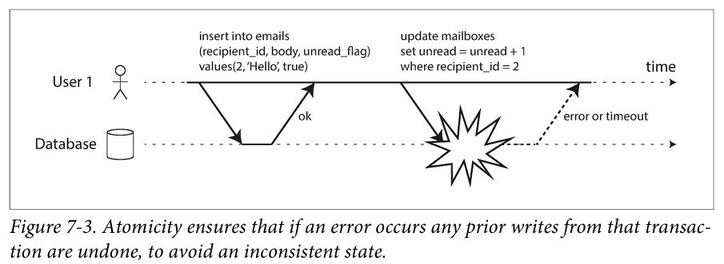

#### Consistency (Application-Defined rules)
**Definition**: Consistency is a property that ensures that your data respects certain invariants (rules) defined by your application.

**The Reality**: Kleppmann makes a crucial distinction: "Consistency is not a property of the database alone; it's a property of the application." The database can only enforce some consistency rules (like foreign key constraints, uniqueness, and check constraints). For complex business rules, the application must uphold consistency itself.

Example: The "On-Call Doctor" Invariant
```SQL
-- Business rule: At least one doctor must be on call at all times
-- This is NOT a constraint the database can enforce directly
-- (You can't write a CHECK constraint that ensures COUNT >= 1 across rows)
```

Types of Consistency:
| Type                  | Example                                         | Who Enforces It?                             |
| --------------------- | ----------------------------------------------- | -------------------------------------------- |
| Referential Integrity | A `user_id` in `orders` must exist in `users`   | Database (foreign key constraint)            |
| Uniqueness            | Two users can't have the same `email`           | Database (unique constraint)                 |
| Business Logic        | "At least one doctor must be on call"           | Application (with serializable transactions) |
| Causal Consistency    | If I reply to a comment, the comment must exist | Database (with proper ordering)              |

**The CAP Confusion**: Kleppmann notes that the "C" in ACID has nothing to do with the "C" in CAP (Consistency in the sense of linearizability). They are historically unrelated terms that happen to share the same name.

#### Isolation (Concurrency Control)
**Definition**: Isolation is about what happens when multiple transactions execute at the same time and access the same data. The goal is to make concurrent transactions appear as if they were running one after another (serially).

**The Ideal**: Serializable Isolation means that the result of executing concurrent transactions is the same as if they were executed serially (one after another) in some order.

**The Reality**: Full serializability is expensive. Databases offer weaker isolation levels as a performance trade-off, but these come with risks.

Example: The Race Condition
```SQL
-- Two users try to book the last seat on a flight
-- Transaction A
BEGIN;
SELECT COUNT(*) FROM seats WHERE flight_id = 123 AND booked = false; -- returns 1
UPDATE seats SET booked = true WHERE flight_id = 123 AND seat_number = '12A';
COMMIT;

-- Transaction B (concurrent)
BEGIN;
SELECT COUNT(*) FROM seats WHERE flight_id = 123 AND booked = false; -- returns 1
UPDATE seats SET booked = true WHERE flight_id = 123 AND seat_number = '12A';
COMMIT;
```
**The Problem**: Both transactions see the seat as available and both book it. The seat is double-booked.

The Fix (Isolation):
- Without Isolation: The last transaction overwrites the first (Lost Update).
- With Isolation: The second transaction waits or aborts.

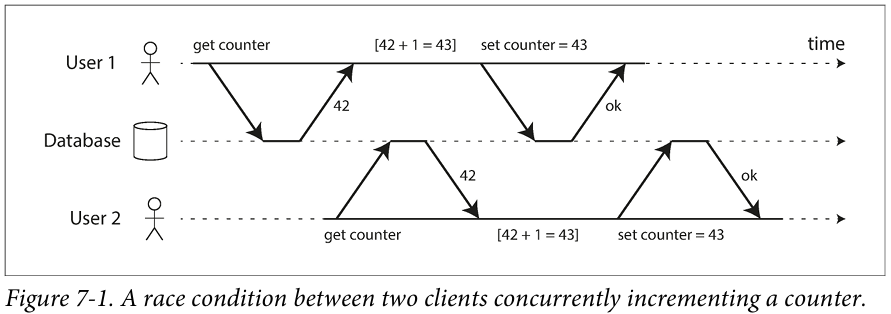

#### Durability (Persistence)
**Definition**: Durability is the promise that once a transaction has committed, its data will not be lost, even in the event of a power outage, crash, or hardware failure.

How It Works (Under the Hood):
1. **Write-Ahead Log (WAL)**: Before any change is written to the database, it's first written to the WAL (a sequential log on disk).
2. **Flushing to Disk**: When the transaction commits, the database waits for the WAL to be safely written to disk (fsync).
3. **Lazy Writes**: The actual data pages on disk may be updated later (lazily), but the WAL ensures that even if the database crashes, it can replay the WAL to recover committed changes.

The Catch (Replication): With asynchronous replication, durability is weaker because writes may be lost if the leader crashes before replicating to followers.

### Concurrency Problems and Weak Isolation Levels

#### Dirty Reads
Definition: A dirty read occurs when one transaction reads data that has been written by another transaction that has not yet committed.

```SQL
-- Transaction A (updates Alice's balance)
BEGIN;
UPDATE accounts SET balance = balance - 100 WHERE user = 'Alice';
-- Transaction A doesn't commit yet

-- Transaction B (reads Alice's balance)
BEGIN;
SELECT balance FROM accounts WHERE user = 'Alice'; -- Reads the updated balance ($900)
-- Transaction B uses this balance for something...
COMMIT;

-- Transaction A (rolls back)
ROLLBACK; -- Balance returns to $1000
```

Why Dirty Reads Are Bad:
| Problem           | Explanation                                                                                                                                                                            |
| ----------------- | -------------------------------------------------------------------------------------------------------------------------------------------------------------------------------------- |
| Invalid Decisions | Transaction B made a decision based on data that was never committed. If Transaction B used that balance to approve a loan or make a trade, it would be acting on invalid information. |
| Cascading Aborts  | If Transaction A aborts, Transaction B's decision might need to be undone as well. This creates a cascading effect that's hard to manage.                                              |

Prevention: Read Committed

The Read Committed isolation level (the default in many databases) prevents dirty reads. It ensures that a transaction can only read data that has been committed. Under the hood, this is often implemented by:
- **Row-Level Locks (Pessimistic)**: Writers hold an exclusive lock on the row until commit, preventing readers from seeing uncommitted data.
- **Multi-Version Concurrency Control (MVCC)**: The database maintains multiple versions of the row. Readers see the version that was committed before the transaction began.

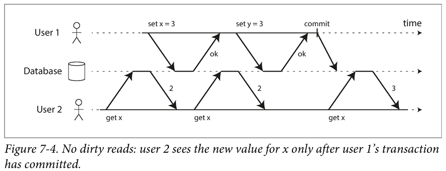

#### Dirty Writes
**Definition**: A dirty write occurs when one transaction overwrites data that another transaction has written but not yet committed.

```SQL
-- Transaction A (updates Alice's balance)
BEGIN;
UPDATE accounts SET balance = 1000 WHERE user = 'Alice'; -- Sets balance to $1000

-- Transaction B (updates Alice's balance)
BEGIN;
UPDATE accounts SET balance = 2000 WHERE user = 'Alice'; -- Overwrites A's write!
COMMIT;

-- Transaction A (rolls back)
ROLLBACK; -- Now balance is rolled back to what? 
-- The database must undo A's changes, but B already overwrote them.
-- Without dirty write prevention, this is ambiguous and can lead to corruption.
```

Why Dirty Writes Are Bad:
- Lost Updates: The first write is lost because the second overwrites it.
- Ambiguous Rollback: If Transaction A rolls back, the database doesn't know what the "correct" state is. It can't simply revert to A's previous value because B's write is now the current state.

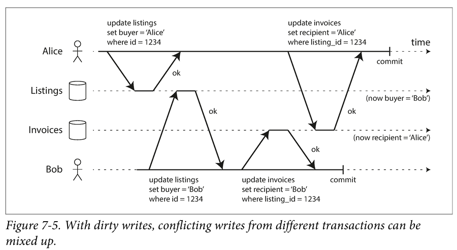

Prevention: Dirty Writes Are Almost Always Prevented

Dirty writes are so dangerous that almost all databases prevent them, even at the weakest isolation levels. They do this using:
- Row-Level Locks: Writers hold an exclusive lock on the row until commit. Other transactions that want to write the same row must wait.

#### Lost Updates
**Definition**: A lost update occurs when two transactions read a value, modify it, and write it back. The second write overwrites the first, losing the first transaction's change.

```SQL
-- Scenario: Two users simultaneously increment a view counter

-- Transaction A
BEGIN;
SELECT views FROM page WHERE id = 1; -- views = 10
-- (Application calculates: 10 + 1 = 11)
UPDATE page SET views = 11 WHERE id = 1;
COMMIT;

-- Transaction B (concurrent)
BEGIN;
SELECT views FROM page WHERE id = 1; -- views = 10 (A hasn't committed yet)
-- (Application calculates: 10 + 1 = 12)
UPDATE page SET views = 12 WHERE id = 1; -- Overwrites A's update!
COMMIT;
```

Result: The counter should be 11, but it's 12. Transaction A's increment is lost.

Why Lost Updates Happen:
- The transactions don't conflict on writes (they write the same row, but not at the exact same time).
- They conflict on the read-modify-write cycle.
- Without coordination, the second transaction's write overwrites the first.

Prevention:
| Strategy            | How It Works                                                                                 | Example                                                                         |
| ------------------- | -------------------------------------------------------------------------------------------- | ------------------------------------------------------------------------------- |
| Atomic Operations   | The database handles the read-modify-write as a single, indivisible operation.               | `UPDATE page SET views = views + 1 WHERE id = 1;`                               |
| Explicit Locking    | Application locks the row before reading.                                                    | `SELECT views FROM page WHERE id = 1 FOR UPDATE;`                               |
| Optimistic Locking  | Use a version number to detect conflicts.                                                    | UPDATE page SET views = 11, version = version + 1 WHERE id = 1 AND version = 5; |
| Automatic Detection | Some implementations of Snapshot Isolation automatically detect lost updates at commit time. | PostgreSQL's `REPEATABLE READ` with `SERIALIZABLE` setting.                     |

#### Read Skew (Non-Repeatable Reads)
**Definition**: A read skew occurs when a transaction reads the same object at different points in time and gets different values because another transaction has committed changes in between.

```SQL
-- Transaction A (Generating a report)
BEGIN;
SELECT SUM(balance) FROM accounts WHERE type = 'checking'; -- Reads $10,000
-- [Another transaction commits: A transfer of $500 from checking to savings]
SELECT SUM(balance) FROM accounts WHERE type = 'savings'; -- Reads $10,000
COMMIT;

-- Transaction B (Transfer money)
BEGIN;
UPDATE accounts SET balance = balance - 500 WHERE id = 'checking_1';
UPDATE accounts SET balance = balance + 500 WHERE id = 'savings_1';
COMMIT;
```

The Problem:
- The first `SUM` reads the checking balance before the transfer ($10,000).
- The second `SUM` reads the savings balance after the transfer ($10,000).
- The report shows the total balance as $20,000, but it should be $19,500 ($10,000 + $9,500).

Why This is Bad:
- The report is **inconsistent**—it's neither a snapshot of the state before the transfer (should be $10,000 + $10,000 = $20,000) nor after the transfer (should be $9,500 + $10,500 = $20,000).
- This is a temporary inconsistency, but if the report is used for decision-making, it can lead to errors.

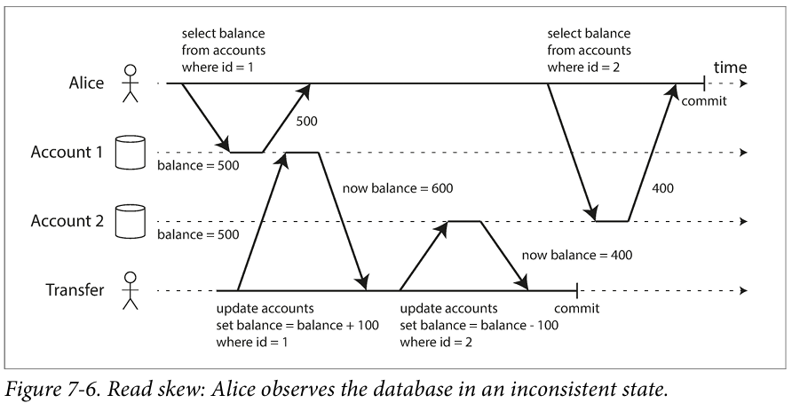

Prevention: Snapshot Isolation

**Snapshot Isolation** provides a consistent snapshot of the database as of the time the transaction began. This is implemented using **Multi-Version Concurrency Control (MVCC)**.

How MVCC Works:
1. Each transaction sees a consistent snapshot of the database at its start time.
2. Writes create new versions of rows (not in-place updates).
3. Readers read the version that was current when the transaction began.
4. This prevents non-repeatable reads because the same query always returns the same data.

Example in PostgresSQL:

```SQL
-- PostgreSQL's REPEATABLE READ provides Snapshot Isolation
-- Transaction A
BEGIN ISOLATION LEVEL REPEATABLE READ;
SELECT SUM(balance) FROM accounts WHERE type = 'checking'; -- Returns $10,000
-- Transaction B commits a transfer (doesn't affect A)
SELECT SUM(balance) FROM accounts WHERE type = 'savings'; -- Still returns $10,000 (as it was at the start)
COMMIT;
```

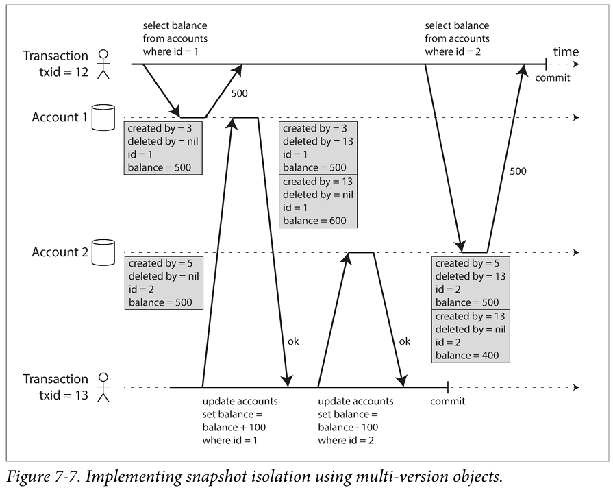

#### Write Skew
**Definition**: Write skew occurs when a transaction reads a set of objects, makes a decision based on that read, and writes a change. The premise of the decision becomes false due to a concurrent transaction's actions, even though no single object is overwritten.

Why It's Sneaky:
- It doesn't violate lower isolation levels (no dirty reads, no lost updates, no non-repeatable reads).
- It only appears if you understand the business logic constraints.
- It's a logical corruption, not a technical one.

The Classic Example: On-Call Doctors

```SQL
-- Business rule: At least one doctor must be on call for each shift.
-- There are 2 doctors assigned to night shift.
-- Two doctors decide to take a break at the same time.

-- Transaction A (Doctor A takes a break)
BEGIN;
SELECT COUNT(*) FROM doctors 
WHERE on_call = true AND shift = 'night'; -- Returns 2 (A and B are on call)
-- Decides: "I can go off call because there are 2 doctors on call"
UPDATE doctors SET on_call = false WHERE id = 'A';
COMMIT;

-- Transaction B (Doctor B takes a break) - CONCURRENT
BEGIN;
SELECT COUNT(*) FROM doctors 
WHERE on_call = true AND shift = 'night'; -- Returns 2 (A and B are on call)
-- Decides: "I can go off call because there are 2 doctors on call"
UPDATE doctors SET on_call = false WHERE id = 'B';
COMMIT;
```

The Result:
- Both transactions see 2 doctors on call.
- Both decide they can go off call.
- After both commit, no doctors are on call for night shift.
- Business rule broken (and the hospital is left with no night coverage!).

Why It's Not Prevented by Lower Isolation Levels:
| Anomaly              | Does it happen? | Why?                                                                                    |
| -------------------- | --------------- | --------------------------------------------------------------------------------------- |
| Dirty Reads          | No              | Both transactions read committed data.                                                  |
| Lost Updates         | No              | They updated Different rows (A and B)                                                   |
| Non-Repeatable Reads | No              | The count didn't change during each transaction (it only changed after both committed). |
| Phantoms             | No              | No new rows were inserted; rows were updated.                                           |

The Fix: Serializable Isolation

Only **Serializable Isolation** (either 2PL or SSI) can prevent write skew. The database detects that Transaction A's read of the count is stale because Transaction B's write affects the same condition (`on_call=true AND shift='night'`).

#### Phantoms
**Definition**: A phantom occurs when a transaction reads objects that match a search condition, and another transaction inserts, updates, or deletes objects that would change the result of that search.

Example: Booking a Meeting Room
```SQL
-- Business rule: A meeting room can only be booked once per time slot.
-- Transaction A (Book room 123 for July 21, 2026)
BEGIN;
SELECT COUNT(*) FROM bookings 
WHERE room_id = 123 AND date = '2026-07-21'; -- Returns 0 (room is free)
-- Decides: "Room is free, I'll book it"
INSERT INTO bookings (room_id, date, user_id) VALUES (123, '2026-07-21', 456);
COMMIT;

-- Transaction B (Concurrent booking for the same room/date)
BEGIN;
SELECT COUNT(*) FROM bookings 
WHERE room_id = 123 AND date = '2026-07-21'; -- Returns 0 (A hasn't committed yet)
-- Decides: "Room is free, I'll book it"
INSERT INTO bookings (room_id, date, user_id) VALUES (123, '2026-07-21', 789);
COMMIT;
```

The Result: Two bookings for the same room on the same date. Double-booking!

Why Phantoms Are Different:

The `SELECT` query didn't find any rows to lock. There were no rows matching the condition (`room_id=123 AND date='2026-07-21'`) at the time of the read. Row-level locks are useless here because there are no rows to lock.

Preventing Phantoms:
| Strategy                              | How It Works                                                                                                                                                                                        |
| ------------------------------------- | --------------------------------------------------------------------------------------------------------------------------------------------------------------------------------------------------- |
| Range Locks (Predicate Locks)         | Lock the condition itself (e.g., `room_id=123 AND date='2026-07-21'`), even if no rows currently match it. Any INSERT that matches the condition must wait.                                         |
| Index-Range Locks                     | Lock the range of rows in an index that would contain the matching rows. For example, if there's an index on `(room_id, date)`, lock all rows with `room_id=123` and the next possible date values. |
| Serializable Snapshot Isolation (SSI) | SSI detects phantoms by tracking read dependencies. If a transaction reads a condition, and another transaction commits an insert that matches that condition, the first transaction is aborted.    |

### Achieving Strong Isolation (Serializability)
Serializability guarantees that the result of concurrent transactions is the same as if they were executed serially, one after another.

#### Two-Phase Locking (2PL)
**The Core Idea**: Use locks to prevent conflicts. Any transaction that reads an object acquires a shared lock (multiple readers allowed). Any transaction that writes an object acquires an exclusive lock (only one writer allowed).

The "Two Phase" Rule:
1. Growing Phase: A transaction can acquire locks but cannot release any.
2. Shrinking Phase: A transaction can release locks but cannot acquire any new ones.

In practice, most databases hold locks until the transaction commits or aborts (strict 2PL).

Example (Serializable Transaction with 2PL):
```SQL
-- Transaction A (Doctor A takes a break)
BEGIN ISOLATION LEVEL SERIALIZABLE;
SELECT COUNT(*) FROM doctors 
WHERE on_call = true AND shift = 'night' LOCK IN SHARE MODE; -- Acquires shared lock on the range
-- Acquires shared lock on all rows that match the condition
UPDATE doctors SET on_call = false WHERE id = 'A'; -- Tries to acquire exclusive lock on row A
-- If row A already has a shared lock (from another reader), Transaction A waits.
COMMIT; -- Releases all locks

-- Transaction B (Doctor B takes a break) - CONCURRENT
BEGIN ISOLATION LEVEL SERIALIZABLE;
SELECT COUNT(*) FROM doctors 
WHERE on_call = true AND shift = 'night' LOCK IN SHARE MODE; -- Acquires shared lock on the range
-- Acquires shared lock on all rows that match the condition
UPDATE doctors SET on_call = false WHERE id = 'B'; -- Tries to acquire exclusive lock on row B
-- If row B already has a shared lock, Transaction B waits.
COMMIT; -- Releases all locks
```
1. How 2PL Prevents Write Skew:
2. Transaction A acquires a shared lock on the range of `on_call=true AND shift='night'`.
3. Transaction B acquires a shared lock on the same range.
4. Transaction A tries to acquire an exclusive lock on row A. It must wait because Transaction B holds a shared lock on the range.
5. Transaction B tries to acquire an exclusive lock on row B. It must wait because Transaction A holds a shared lock on the range.
6. Deadlock! The database detects the deadlock and aborts one transaction.
7. The surviving transaction commits, and the aborted transaction retries.

The Cost of 2PL:
- **Performance**: Locking reduces concurrency. Transactions wait for locks, leading to higher latency and lower throughput.
- **Deadlocks**: Transactions can deadlock, requiring retry logic in the application.
- **Complexity**: The lock manager must track all locks, which adds overhead.

When to Use 2PL:
- When conflicts are frequent (retries would be expensive anyway).
- When you need guaranteed safety with no retries (e.g., banking).
- When you can afford the performance cost.

#### Serializable Snapshot Isolation (SSI)
**The Core Idea**: SSI is an optimistic approach. Transactions run on Snapshot Isolation (reading a consistent snapshot) but at commit time, the database checks if any concurrent transactions would cause a serialization conflict. If so, the transaction is aborted and must be retried.

The Innovation: SSI was considered impossible for a long time. In 2008, researchers (Cahill et al.) showed that SSI could be implemented with good performance by tracking read and write dependencies.

How SSI Works (Under the Hood):
1. **Read-Write Dependency**: Transaction A reads an object that Transaction B later writes.
   - Why it matters: If Transaction A reads a value that becomes stale because B changes it, A's decision might be based on outdated information.
   - Detection: A keeps track of which rows it read. At commit time, SSI checks if any of those rows have been modified by a committed transaction after A started.
2. **Write-Read Dependency**: Transaction A writes an object that Transaction B later reads.
   - Why it matters: If A writes a value that B reads, the order matters (A should happen before B).
   - Detection: SSI tracks which rows were written and checks if they were read by a transaction that started after the write.
3. Write-Write Dependency: Transaction A writes an object that Transaction B also writes.
   - Why it matters: Lost updates.
   - Detection: Snapshot Isolation automatically detects this (lost update prevention).

The SSI Algorithm (Simplified):
```
Transaction T starts:
  - Assign a timestamp T_start
  - Create a snapshot of the database as of T_start

During Transaction T:
  - For each READ R of object X:
    * Track this read dependency: R -> X
  - For each WRITE W of object X:
    * Track this write dependency: X -> W

At Commit Time:
  - For each read dependency R:
    * Check if any transaction U (with T_start < U_start < T_commit) has modified X and committed
    * If yes: ABORT T (Read-Write conflict)
  - For each write dependency W:
    * Check if any transaction U (with T_start < U_start < T_commit) has read X and committed
    * If yes: ABORT T (Write-Read conflict)
  - For each write dependency W:
    * Check if any transaction U (with T_start < U_start < T_commit) has written X and committed
    * If yes: ABORT T (Write-Write conflict)
  - If no conflicts: COMMIT T
```

Example: Preventing Write Skew with SSI

```SQL
-- Transaction A (Doctor A takes a break)
BEGIN ISOLATION LEVEL SERIALIZABLE; -- PostgreSQL's SERIALIZABLE uses SSI
SELECT COUNT(*) FROM doctors 
WHERE on_call = true AND shift = 'night'; -- Returns 2
-- SSI tracks: Transaction A READs rows matching condition
UPDATE doctors SET on_call = false WHERE id = 'A';
COMMIT; -- Checks conflicts...

-- Transaction B (Doctor B takes a break) - CONCURRENT
BEGIN ISOLATION LEVEL SERIALIZABLE;
SELECT COUNT(*) FROM doctors 
WHERE on_call = true AND shift = 'night'; -- Returns 2
-- SSI tracks: Transaction B READs rows matching condition
UPDATE doctors SET on_call = false WHERE id = 'B';
COMMIT; -- Checks conflicts...
```

At Commit Time for Transaction A:
- SSI checks: Did any concurrent transaction modify rows that A read?
- Transaction B modified row B (which was in A's read set).
- Conflict detected! Transaction A is aborted.

At Commit Time for Transaction B:
- Transaction B sees a conflict (Transaction A modified row A, which was in B's read set).
- Conflict detected! Transaction B is aborted.

Result: One transaction aborts, the other commits. The business rule is preserved.

The Cost of SSI:
- **Aborts**: If conflicts are frequent, many transactions will be aborted and retried, hurting performance.
- **False Positives**: SSI may abort transactions that wouldn't actually cause a serialization violation in practice.
- **Complexity**: The conflict detection logic adds overhead.

When to Use SSI:
- When conflicts are rare (the default assumption for most web applications).
- When you need high concurrency with strong consistency.
- When you can handle retries in your application code.

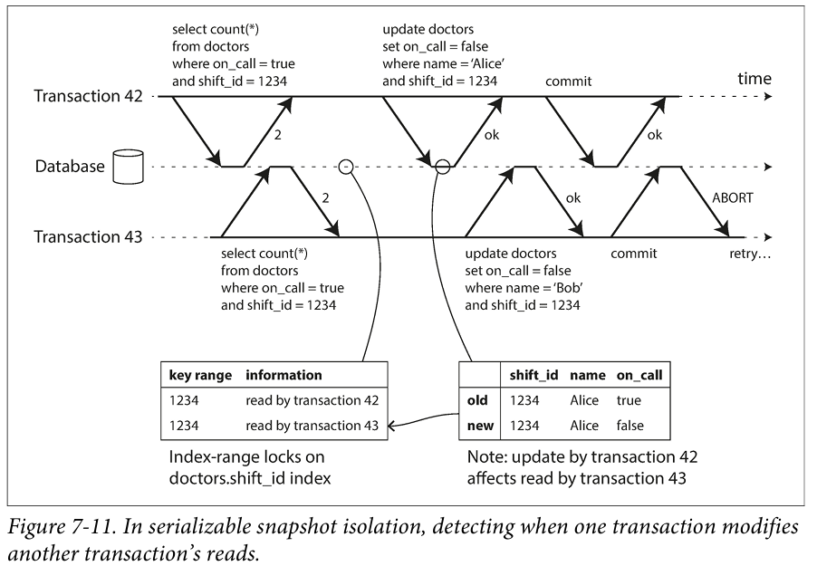

Comparison: 2PL vs. SSI
| Aspect      | Two-Phase Locking (2PL)                  | Serializable Snapshot Isolation (SSI)           |
| ----------- | ---------------------------------------- | ----------------------------------------------- |
| Philosophy  | Pessimistic (prevent conflicts)          | Optimistic (detect conflicts at commit)         |
| Locking     | Uses locks; transactions block           | No locking; transactions proceed                |
| Deadlocks   | Can occur                                | Impossible (no locks)                           |
| Aborts      | Rare (due to deadlocks)                  | Common (due to conflicts)                       |
| Performance | Drops under high contention              | Drops under high contention (aborts)            |
| Retry Logic | Needed for deadlocks                     | Required for aborts                             |
| Complexity  | Lock manager complexity                  | Dependency tracking complexity                  |
| Best For    | Frequent conflicts, low retry tolerance  | Rare conflicts, high concurrency needs          |
| Examples    | MySQL (with SERIALIZABLE), MS SQL Server | PostgreSQL (SERIALIZABLE), CockroachDB, Spanner |

### Stored Procedures and Transactions
a stored procedure is a powerful tool for executing a transaction entirely on the database server. Instead of an application making multiple round-trips to the database to perform a series of operations, it can send a single command that executes a complete, predefined "unit of work"

The key relationship lies in how stored procedures handle transaction control. They are naturally suited to encapsulate complex business logic that must be atomic . For instance, a stored procedure can manage a money transfer by:
1. Starting a transaction.
2. Debiting one account.
3. Crediting another account.
4. Committing the transaction only if both steps succeed.

By managing the `BEGIN TRANSACTION` and `COMMIT` or `ROLLBACK` logic itself, the stored procedure ensures that all operations are treated as a single, atomic unit. This removes the responsibility from the application code and helps guarantee data integrity

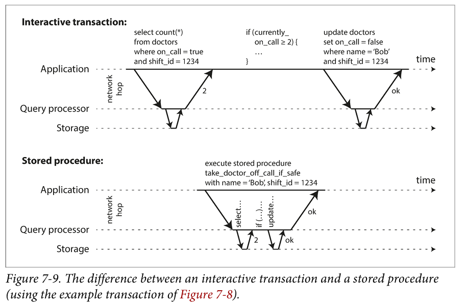

They are often chosen for transaction-heavy applications for several reasons:
1. **Performance**: Stored procedures are precompiled, and their execution plan is cached, which can lead to faster execution than sending ad-hoc SQL queries from an application. This is especially beneficial for reducing network traffic, as only the procedure name and parameters are sent across the network .
2. **Encapsulation**: They provide an abstraction layer, hiding the underlying table schemas from the application. This means business logic can be modified within the procedure without requiring changes to the application code, making maintenance easier .
3. **Security**: Access to tables can be restricted, and permissions to execute specific stored procedures can be granted instead. This provides a more controlled and secure interface to the data.

Despite their benefits, there are significant drawbacks that align with the modern, distributed application design principles discussed in the book:
1. **Database Tie-in**: They are written in a database-specific procedural language (e.g., PL/SQL, T-SQL), which tightly couples your business logic to a particular database vendor. Migrating to a different database becomes incredibly difficult .
2. **Scaling Challenges**: Database servers are often the most difficult and expensive part of a system to scale. Placing heavy business logic in stored procedures shifts the processing load to the database tier, which can create a bottleneck. Modern "shared-nothing" architectures prefer to keep the application tier stateless and scale that horizontally .
3. **Maintainability**: Versioning, testing, and debugging stored procedures is often more challenging than managing application code. This can lead to slower development cycles and increased operational complexity over time.

## Chapter 8: The Trouble with Distributed Systems
We now face the messy physical world. The core message is that in a distributed system, anything that can go wrong, will go wrong, and we must build systems that tolerate this chaos

### Faults and Partial Failures
On a single computer, things are usually predictable: it either works, or it crashes completely. In a distributed system, we face partial failures—where some parts break unpredictably while others keep working. This non-determinism is the defining challenge . In a cloud environment with thousands of nodes, it is reasonable to assume that something is always broken, requiring us to build fault-tolerance into our software from the start

### Unreliable Networks
The network is the primary communication channel in a shared-nothing system. It is an asynchronous packet network where messages can be lost, delayed, duplicated, or arrive out of order. When you send a request and get no response, you can't tell why:

| Possible Issue   | Description                                                                                 |
| ---------------- | ------------------------------------------------------------------------------------------- |
| Request Lost     | The message never reached the recipient (e.g., a network cable was unplugged).              |
| Node Dead        | The remote node has crashed or is powered off.                                              |
| Node Paused      | The remote node is temporarily unresponsive (e.g., due to a long garbage collection pause). |
| Response Lost    | The remote node processed the request, but the reply was lost on the network.               |
| Response Delayed | The remote node processed the request, but the response is stuck in a queue.                |

The only reliable way to deal with this uncertainty is **timeouts**. The key challenge is choosing the right timeout duration. A timeout that is too short can cause a node to be falsely declared dead, which may lead to work being performed twice or, during high load, a cascading failure as the failed node's responsibilities are transferred elsewhere

### Unreliable Clocks
We assume clocks are accurate, but in distributed systems, they are notoriously unreliable. Computers have two types of clocks:
1. **Time-of-Day Clock**: Returns the current wall-clock time. It can be reset backwards if it's out of sync with an NTP server, making it dangerous for measuring elapsed time.
2. **Monotonic Clock**: Always moves forward. It's suitable for measuring time intervals (e.g., timeouts), but its absolute value is meaningless.

Even with NTP, clock synchronization is tricky. Clocks can drift, and leaps like leap seconds can cause issues. For ordering events, logical clocks (based on counters) are safer than physical time-of-day clocks. Last Write Wins (LWW) conflict resolution, which relies on timestamps, is fundamentally flawed with inaccurate clocks . For example, a node with a lagging clock cannot overwrite a value from a node with a fast clock until the skew between them has elapsed.

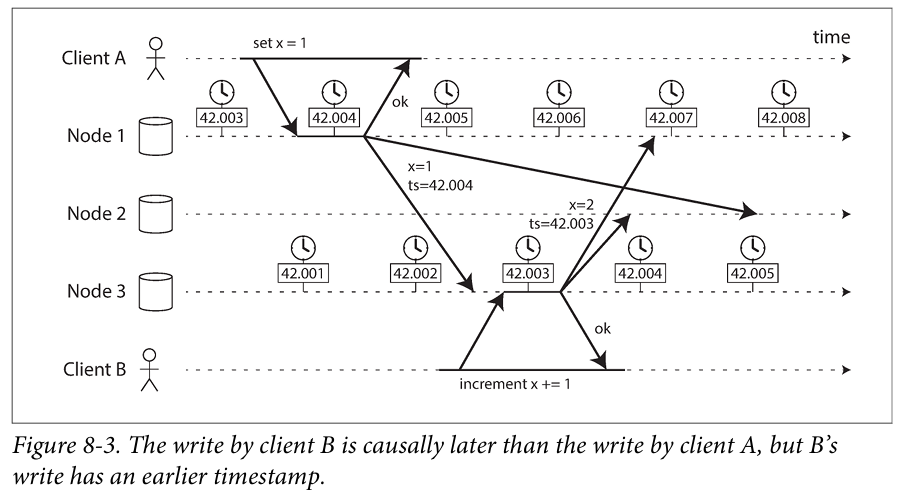

Google Spanner tackles this with its TrueTime API, which returns a confidence interval for timestamps. To ensure consistency, Spanner waits for the uncertainty of this interval to pass before committing a read-write transaction . This is the only practical way to use physical clocks for global ordering, and it requires atomic clocks or GPS receivers in each data center

### Process Pauses
A process can be paused for many reasons: a **garbage collection** (GC) stop-the-world event, waiting for I/O, or a virtual machine being paused during a live migration . From the perspective of other nodes, a paused node may appear dead. If the paused node is a leader, its leadership lease might expire, causing another node to be elected. When the paused node resumes, it might incorrectly believe it is still the leader, leading to split brain and severe data corruption.

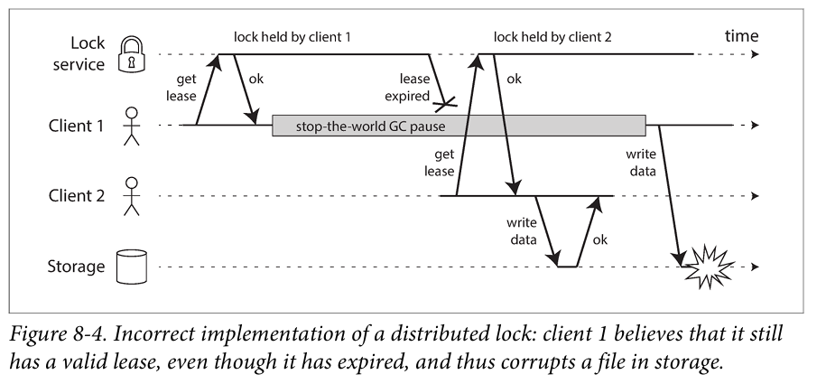

A common solution is fencing, where the old leader must obtain a "fencing token" (e.g., an incrementing number) to perform actions. If another node now holds a higher-numbered token, the old leader's requests with a lower token can be rejected

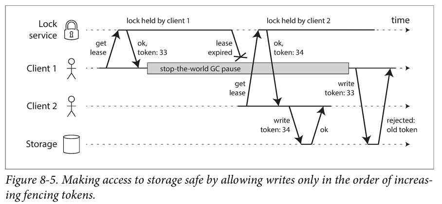

### Knowledge, Truth, and Lies
A node cannot simply trust its own judgment about the system's state. The network is unreliable, and clocks can be wrong. We need algorithms to determine the truth. In a distributed system, truth is defined by a **majority** (quorum). If a majority of nodes agree on a value, that becomes the truth.

This leads to the concept of **Byzantine faults**, where nodes may act maliciously or arbitrarily, possibly to deceive others. Most systems assume that nodes are honest but faulty, and thus don't handle Byzantine faults.

### System Models and Reality
Algorithms make assumptions, but reality often breaks those assumptions.
1. **The Synchronous Model** (The Dream)
   - **The Assumption**: The system is predictable. It assumes that the network delay, process pauses, and clock drift are all bounded (have a fixed maximum). For example, it assumes that a message sent from Node A to Node B will definitely arrive in less than 5 seconds.
   - **The Reality**: This is completely unrealistic. On the real internet, a network cable can be accidentally cut, a router can get overloaded, or a server can freeze for 30 seconds due to garbage collection. You cannot guarantee a strict maximum delay in a global system.
   - **Why we mention it**: We only bring it up to say "This doesn't exist in practice." If you build a system assuming fixed time bounds, it will fail spectacularly under real-world network spikes.
2. **The Asynchronous Model** (The Nightmare)
   - **The Assumption**: The system is completely chaotic. It assumes no time bounds at all. A message might take 1 millisecond, 1 hour, or never arrive. Clocks might be completely out of sync. You cannot use timeouts to determine if a node is dead because a node might just be incredibly slow.
   - **The Reality**: This is how the internet actually works in theory. You cannot mathematically guarantee a maximum delay.
   - **The Terrible Catch (FLP Result)**: Kleppmann mentions a famous computer science proof called the **FLP result**. It proves that in a purely asynchronous system where even a single node can crash, it is mathematically impossible to achieve consensus (getting all nodes to agree on a value). If you cannot trust timeouts, you can never know if a node is dead or just slow, so you can never safely elect a leader or commit a transaction across nodes.
3. **The Partially Synchronous Model** (The Real World)
   - **The Assumption**: This is the practical, realistic model. It assumes that the system behaves synchronously (within bounds) most of the time, but sometimes it behaves asynchronously (goes out of bounds) during network hiccups, clock skew, or pauses.
   - **The Reality**: This perfectly matches the real world. 99.9% of the time, your network messages arrive within 100ms. But 0.1% of the time, a network partition happens and messages take 10 seconds.
   - **Why this is the "Goldilocks" model**: We can build algorithms (like Raft or Paxos, covered in Chapter 9) that work assuming partial synchrony.
     - They run fast and assume things are synchronous.
     - When a timeout occurs (because reality broke the bounds), they just wait, retry, or trigger a leader election.
     - Crucially, they don't rely on a fixed time limit to be correct; they only rely on timeouts to trigger an action.

Besides timing, we also have to model how nodes break. This is called the "Fault Model":

| Fault Model      | What it assumes                                                                                     | Example                                                                                  |
| ---------------- | --------------------------------------------------------------------------------------------------- | ---------------------------------------------------------------------------------------- |
| Crash-Stop       | A node simply stops working and never comes back.                                                   | A server catches fire and burns down.                                                    |
| Crash-Recovery   | A node crashes, but eventually reboots and recovers its state from disk.                            | A server runs out of memory, restarts in 2 minutes, and reads the WAL (Write-Ahead Log). |
| Byzantine Faults | A node does anything maliciously, randomly, or incorrectly—even lying to other nodes to trick them. | A hacked server sends false "I am the leader" messages to confuse the system.            |

Most real-world distributed databases (like PostgreSQL, Kafka, MongoDB) assume Crash-Recovery. They assume nodes are honest (they don't lie) but flaky (they might turn off). They explicitly do not handle Byzantine faults. If a hacker compromises a node, the whole system is at risk. (Systems like blockchain or military-grade aerospace software handle Byzantine faults, but that is extremely rare and slow).

## Chapter 9: Consistency and Consensus
The core mission of this chapter is to find a way for multiple nodes in a system to agree on something, even when things are going wrong. This is the consensus problem, and it's the foundation for building fault-tolerant systems

### Consistency Guarantees
The chapter opens by revisiting the idea of eventual consistency, where replicas will converge to the same state if you stop writing to them. Kleppmann points out that this is a very weak guarantee because it doesn't specify when the system will converge. For many applications, this unpredictability makes it hard to write correct code

To address this, he introduces stronger consistency models that come with better performance and fault-tolerance trade-offs. The most important of these is Linearizability.

### Linearizability (Strong Consistency)
Linearizability is the strongest consistency model. It makes a replicated system act as if there's only a single copy of the data, and every operation on it is atomic. It is a "recency guarantee": once a write completes, any subsequent read (from any client) must return that new value.

To understand its importance, consider a classic example: a sports website. If Alice sees the final score and tells Bob, Bob then refreshes his own screen. In a linearizable system, Bob's refresh must show the final score Alice just saw. If it shows an old score (because it read from a stale replica), the system is not linearizable.

This distinction is crucial:

- **Linearizability** is a recency guarantee on reads and writes of a single object (like a key-value register).
- **Serializability** is an isolation property for transactions that ensures a set of reads and writes happen as if in a serial order. It does not guarantee that the order corresponds to real-world time.

A system can be both, which is known as strict serializability.

The chapter explains that linearizability is critical for features like distributed locking and leader election, and for enforcing uniqueness constraints . Systems like Apache ZooKeeper and etcd, which are often used for these purposes, are linearizable.

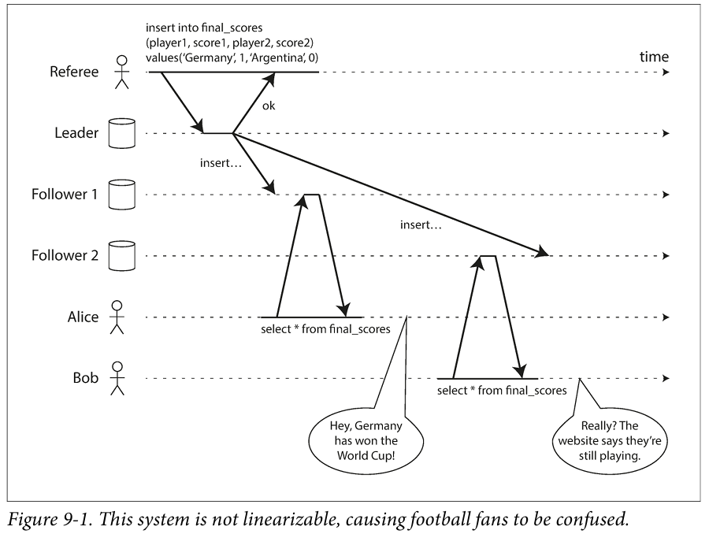

### The Cost of Linearizability
While powerful, linearizability comes at a high cost, which is highlighted by the famous CAP Theorem.

The theorem states that in the face of a network partition, a distributed system must choose between:

- **Consistency (C)**: Linearizability, which means the system cannot process requests if it can't guarantee a consistent view, making it unavailable.
- **Availability (A)**: The ability to process requests, which means the system must give up linearizability and become eventually consistent.

Kleppmann is critical of the CAP theorem, describing it as "unhelpful" because it's narrow and often misunderstood, but it effectively illustrates this fundamental trade-off. The choice is between a system that is safe but might be unavailable, and one that is available but might be inconsistent.

### Ordering and Causality
The book then explores the relationship between consistency and ordering. Linearizability imposes a total order on operations, meaning there is a single, globally agreed timeline for all events.

However, for many applications, a **partial order** is sufficient, which is where **causality** comes in. If event A causes event B (e.g., I post a photo, then my friend comments on it), the system must show A before B. This is **causal consistency**, which is weaker and more performant than linearizability.

To implement this, systems often use tools like **version vectors** to track causal dependencies.

### Distributed Transactions and Consensus
A distributed transaction is a transaction that involves multiple independent nodes (databases, partitions, or services). You need this when a single operation spans multiple systems.

On a single node, atomicity is achieved via the Write-Ahead Log (WAL). If the node crashes mid-transaction, it reads the WAL on restart and either commits or rolls back.

In a distributed system, the problem is coordination:
- Node A has successfully written its part of the transaction.
- Node B has successfully written its part.
- Node C crashes before writing.

The Question: How do all nodes agree on whether to commit or abort, especially when one node is down?

This is the Atomic Commit Problem. You cannot simply rely on a single node's WAL because the crash might happen after some nodes have already committed, leaving the system in an inconsistent state.

Two-Phase Commit (2PC) is the classic algorithm for atomic commit in a distributed system. It uses a single coordinator node to orchestrate the process across multiple participants.

1. The Voting Phase (Prepare)
   - **Prepare Request**: The coordinator sends a `PREPARE` request to all participants.
   - **Participants Vote**: Each participant checks if it can commit the transaction (e.g., does it have the data, is it valid, are there conflicts?). If yes, it writes the "prepared" state to its WAL (guaranteeing it can commit later) and responds `YES`. If no, it responds `NO`.
2. The Decision Phase (Commit/Abort)
   - **Coordinator Decides**: The coordinator collects all votes.
     - **If all votes are YES**: The coordinator writes `COMMIT` to its own WAL and sends a `COMMIT` request to all participants.
     - **If any vote is NO, or if a vote times out**: The coordinator writes `ABORT` to its WAL and sends an `ABORT` request to all participants.
   - **Participants Execute**: Participants wait for the coordinator's decision.
     - On `COMMIT`: They apply the transaction and release locks.
     - On `ABORT`: They roll back and release locks.

```
Coordinator               Participant A               Participant B
    │                           │                           │
    │─── PREPARE ──────────────▶│                           │
    │─────────────────────────────── PREPARE ──────────────▶│
    │                           │                           │
    │                           │ (Votes YES)               │
    │◀─── YES ──────────────────│                           │
    │                           │                           │
    │                           │                           │ (Votes YES)
    │◀───────────────────────────────────── YES ────────────│
    │                           │                           │
    │ (All YES → COMMIT)        │                           │
    │                           │                           │
    │─── COMMIT ───────────────▶│                           │
    │────────────────────────────────── COMMIT ────────────▶│
    │                           │                           │
    │                           │ (Commits)                 │
    │◀─── ACK ──────────────────│                           │
    │                           │                           │
    │                           │                           │ (Commits)
    │◀────────────────────────────────── ACK ───────────────│
    │                           │                           │
    ▼                           ▼                           ▼
  Complete                   Complete                   Complete
```

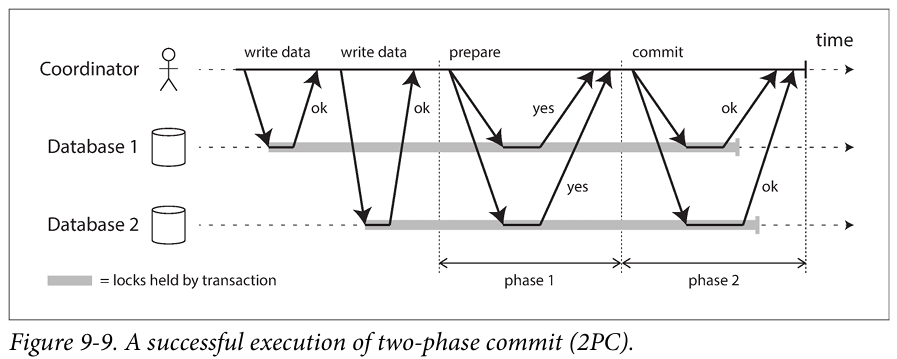

The major flaw is that **2PC is a blocking protocol**. Once a participant has voted `YES` in Phase 1, it enters a prepared state. In this state, the participant holds all locks on the data (pessimistic locks) and waits for the coordinator's decision in Phase 2.

**The Nightmare Scenario**: What if the coordinator crashes after everyone has voted `YES` but before sending the final `COMMIT` or `ABORT`?

- The participants are stuck in the prepared state.
- They cannot commit (because they haven't received the order).
- They cannot abort (because they promised they could commit).
- They hold locks indefinitely, blocking all other transactions.
- The system is deadlocked.

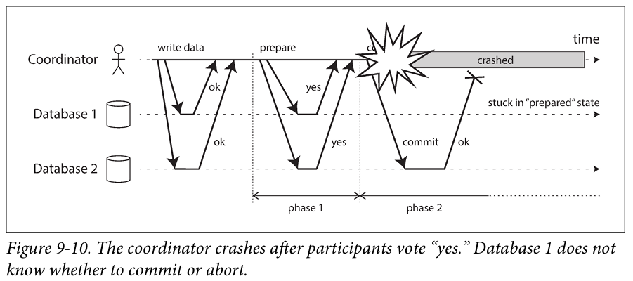

Why This Is Worse Than a Single-Node Crash:
In a single-node system, you restart the node and read the WAL to recover. In a distributed system, the coordinator might be permanently dead. Without the coordinator's decision, the participants have no way to resolve the transaction.

The Only Fix (Manual Intervention): A human must step in, check the logs, and manually decide to force a commit or rollback. This can take hours.

Because 2PC is blocking and depends on a single coordinator (a single point of failure), modern distributed systems use Consensus Algorithms like Raft, Paxos, or ZooKeeper's Zab.

Consensus is the problem of getting multiple nodes to agree on a single value, even if some nodes fail.

A consensus algorithm must guarantee:
1. **Uniform Agreement**: All nodes decide on the same value.
2. **Integrity**: No node decides twice (or on a value that wasn't proposed).
3. **Validity**: If a node decides on a value, it must have been proposed by some node.
4. **Termination**: Every non-faulty node eventually decides (no infinite waiting).

**Key Insight**: Consensus algorithms are **non-blocking**. If a leader fails, the system holds an election and the remaining nodes agree on a new leader. Transactions can proceed without manual intervention.

How it works:
1. **Leader Election**
   - **Terms**: Raft divides time into terms (like election periods). Each term starts with an election.
   - **Nodes have states**:
     - **Follower**: All nodes start as followers. They just accept log entries from the leader.
     - **Candidate**: If a follower doesn't hear from the leader within a random timeout, it becomes a candidate and starts an election.
     - **Leader**: The candidate that gets a majority of votes becomes the leader.
   - **Randomized Timeouts**: Raft uses random election timeouts to minimize the chance of split votes. This is crucial—it avoids the "split brain" problem we saw with 2PC's single coordinator.
2. **Log Replication (The Consensus Mechanism)**
   - The leader accepts client requests and appends them to its own log as an entry.
   - The leader then sends `AppendEntries` RPCs to all followers, sending the new entry.
   - The Critical Rule: A follower writes the entry to its log but does not apply it yet. It only acknowledges it.
   - Commit: The leader waits until a majority of followers have acknowledged the entry.
     - Once a majority acknowledges, the leader marks the entry as committed.
     - The leader then applies the committed entry to its state machine and notifies the client of success.
     - In the next `AppendEntries` heartbeat, the leader tells the followers that the entry is committed, and the followers apply it.

Why This Is Non-Blocking:
- If the leader fails after a majority has acknowledged but before applying, the new leader (elected by the majority) will have that log entry. The new leader makes sure it is committed.
- **No 2PC-style "prepared" waiting**: If a node crashes, the rest of the cluster forms a majority and continues.

```
Client Request → Leader
                   │
                   ├── Appends entry to local log (uncommitted)
                   │
                   ├── AppendEntries RPC (entry) → Follower 1 (ack)
                   ├── AppendEntries RPC (entry) → Follower 2 (ack)
                   ├── AppendEntries RPC (entry) → Follower 3 (no response/crash)
                   │
                   │ (Majority achieved: Leader + Follower 1 = 2/3)
                   │
                   ▼
                Leader commits entry
                   │
                   ├── Applies to state machine (writes to DB)
                   ├── Responds to Client: "Success"
                   │
                   │ (Next heartbeat)
                   │
                   ├── AppendEntries (committed index) → Follower 1
                   ├── AppendEntries (committed index) → Follower 2 (ack)
                   └── Follower 3 (recovered) catches up
```                   

Consensus vs. 2PC: The Decisive Differences
| Aspect              | Two-Phase Commit (2PC)                                     | Raft / Paxos (Consensus)                                      |
| ------------------- | ---------------------------------------------------------- | ------------------------------------------------------------- |
| Fault Tolerance     | Blocking: If coordinator fails, participants wait forever. | Non-blocking: If leader fails, a new leader is elected.       |
| Decision Process    | Single coordinator decides.                                | Majority of nodes decide.                                     |
| Locks               | Holds locks in "prepared" state.                           | Minimal locking; writes are replicated before application.    |
| Failure Handling    | Requires manual intervention (human).                      | Automatic failover via leader election.                       |
| Complexity          | Simpler to implement, but fragile in production.           | Complex, but robust.                                          |
| Network Requirement | Assumes reliable, predictable network (Synchronous model). | Works under partial synchrony (handles timeouts and retries). |

**Total Order**: Every operation has a single, globally agreed position in time. (Linearizability). Requires consensus (Raft/Paxos).

**Partial Order**: Some operations are concurrent (incomparable). The system only enforces order where there's a causal link. (Causal Consistency). Requires version vectors but not consensus.

The "Game" Analogy:
- **Total Order**: Every move in a chess game is timestamped globally. Everyone sees move 1, then move 2, then move 3.
- **Partial Order**: Like a collaborative document. If you edit paragraph 1 and I edit paragraph 2 simultaneously, those edits are concurrent (no order needed). But if I reply to your specific sentence, that edit must come after yours.

In distributed systems, we can't trust physical clocks.

**Lamport timestamps** are simple counters that order events causally (if A causes B, A has a smaller number).
But they cannot detect concurrent events.

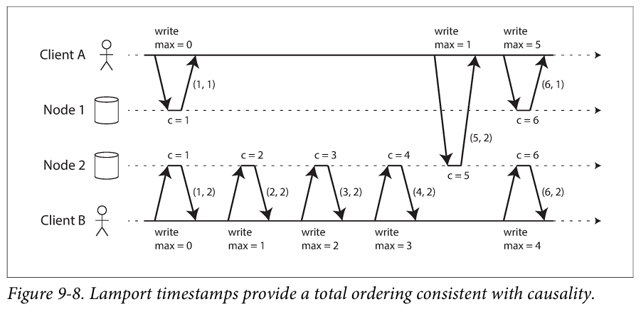

**Vector Clocks** (arrays of counters) solve this—they tell you if two events are truly independent (concurrent) or causally related.

This is critical for databases to detect write conflicts in multi-leader or leaderless replication. Without them, you can't reliably merge concurrent updates.

# Part 3: Derived Data
While Parts 1 and 2 focus on how a single database works and handles distribution, Part 3 looks at how multiple different data systems are integrated into a real-world, large-scale application architecture

Part 3 is built on a crucial distinction between two types of data systems:
- **Systems of Record (Source of Truth)**: These hold the authoritative, original version of your data. When new data is created, it is first written here. This is the primary, normalized source of truth.
- **Derived Data Systems**: These contain data that is created by transforming or processing data from a System of Record. If you lose this data, you can recreate it from the original source.

Common examples of derived data include caches, indexes, and materialized views. This data is technically redundant, but it is essential for achieving good read performance in complex applications. e.g. Redis

## Chapter 10: Batch Processing
The chapter marks a significant shift. After spending the first half of the book on online systems (where we wait for a response), we dive into the world of offline, high-volume data processing. It explores the philosophy, history, and evolution of the systems that turn raw data into valuable insights.

### Batch Processing vs. Online Systems
The chapter starts by distinguishing batch processing from the online systems discussed earlier. It introduces a spectrum of three different system types:

1. **Services (Online)**: These are your standard request/response systems. You send a request, and a response is generated, typically in milliseconds. The key metric is response time and availability. Examples are web servers and databases.
2. **Batch Processing (Offline)**: Batch systems take a large, fixed dataset as input, run a job, and produce an output. Jobs can run for minutes to days, and no user is waiting for an immediate response. The primary metric is throughput—how much data can be processed in a given time.
3. **Stream Processing (Near-real-time)**: This sits between online and batch. Stream jobs consume events and produce outputs shortly after the events happen, giving them lower latency than batch jobs. This is such an important topic it gets its own chapter (Chapter 11).

| System Type           | Also Known As          | Key Characteristic                                                                      | Primary Metric                                                   | Example                                 |
| :-------------------- | :--------------------- | :-------------------------------------------------------------------------------------- | :--------------------------------------------------------------- | :-------------------------------------- |
| **Services**          | Online systems         | Waits for a request and sends a response back as quickly as possible.                   | **Response time** and availability.                              | A web server or database.               |
| **Batch Processing**  | Offline systems        | Takes a large amount of input data, runs a job to process it, and produces output data. | **Throughput** (how much data can be processed in a given time). | A daily ETL job or an analytics report. |
| **Stream Processing** | Near-real-time systems | Operates on events shortly after they happen.                                           | Low latency, lower than batch processing.                        | A real-time fraud detection system.     |

### The Unix Philosophy: An Analog for Batch
Before diving into complex distributed systems, the chapter pays homage to the elegant simplicity of Unix tools. It uses a classic example of analyzing web server logs:

`cat /var/log/nginx/access.log | awk '{print $7}' | sort | uniq -c | sort -r -n | head -n 5`

This command chain illustrates a powerful philosophy for batch processing:
- **Uniform Interface**: Every program uses the same interface (stdin/stdout), making it easy to pipe data between them
- **Separation of Logic and Wiring**: Small tools each do one thing well, and you combine them by connecting input and output streams
- **Transparency**: Because input files are generally immutable, you can experiment, try different options, and debug easily by examining the output at any stage of the pipeline

This Unix approach is a microcosm of what we aim for with distributed systems: simple, composable, reliable tools.

### MapReduce and Distributed Filesystems
The chapter then introduces the MapReduce programming model, which applied the Unix philosophy of simplicity and composability to massive datasets distributed across thousands of machines. Its elegance lies in abstracting away the complexities of parallelization, network communication, and failure handling.

A MapReduce job resembles a Unix pipeline but runs on a distributed file system like HDFS (Hadoop Distributed File System).
- HDFS is a shared-nothing filesystem where data is stored on local disks and replicated across machines for fault tolerance.
- The framework's design is deeply tied to the principle of "moving computation to the data" to minimize expensive network transfers.

A MapReduce job is defined by two primary functions:
1. **Mapper**: This function is called on each input record. It is a pure function that extracts a key-value pair from the record. It produces a collection of intermediate key-value pairs.
2. **Reducer**: The MapReduce framework automatically groups all values associated with the same key and passes them to the reducer. The reducer's job is to process this list of values for a key (e.g., summing them) and output the final result.

Key Optimizations:
- **Combiner** (*Optional*): A "mini-reducer" that runs on the map side *before* the shuffle phase. It performs a local aggregation (e.g., summing local counts), significantly reducing the amount of data that needs to be transferred over the network. *Note: Combiners are only safe for associative and commutative operations like `sum` or `max`.*
- **Partitioner**: Determines which reducer receives each key. The default is a hash partitioner (`hash(key) mod R`). You can implement a custom partitioner (e.g., for range-based partitioning or to handle data skew).

This whole process relies on a **Shuffle and Sort** step, where the framework moves and organizes the data from the mappers to the reducers so that all the values for a given key are processed together.

The sort phase ensures that all values for a given key are grouped together and ordered. This allows the reducer to process the data in a single pass, without needing to store all values in memory—a crucial property for handling massive datasets.

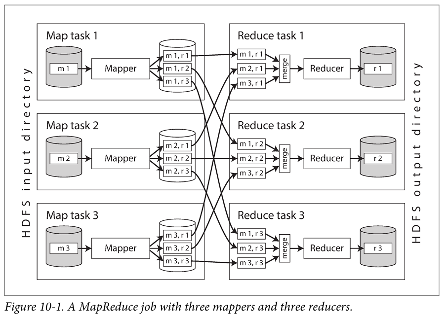

MapReduce is designed to be highly fault-tolerant. If a task (map or reduce) fails, the framework simply re-executes it on another node. This is possible because MapReduce relies on immutable input data and deterministic operations. If a mapper re-runs, it will produce the same output. The framework's master node, however, is assumed not to fail.

A key strength of MapReduce is its ability to perform joins and groupings on massive datasets. The primary method is the reduce-side join, which is often implemented as a sort-merge join.

1. **Reduce-Side Join (Sort-Merge Join)**
   - This is a flexible join strategy that can handle any type of join (inner, outer, etc.) without assumptions about the data's organization.
   - The mapper reads records from different datasets. For each record, it extracts the join key and emits it along with the record's value, tagging the value to indicate its source (e.g., "user" or "order").
   - The framework groups all records with the same key and sorts them. This brings together all related data for a key in a single reducer.
   - The reducer receives the key and a sorted list of all values from the different datasets. It performs a merge on these sorted lists to produce the final joined records.

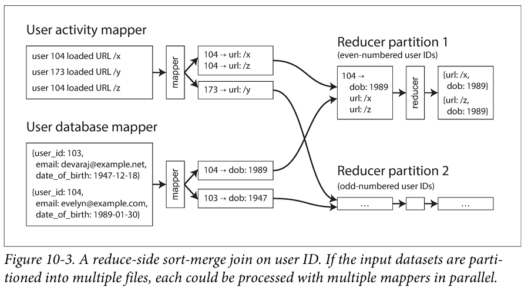

**Secondary Sort**: A common optimization is to use a secondary sort, where the values are also sorted. For example, you could ensure that for a given user ID, the reducer always sees the user's profile record before their activity events.

2. **Map-Side Joins**
   - If certain assumptions can be made about the input data, you can perform joins on the map side, which is faster as it avoids the shuffle and sort phases. The chapter discusses three types:
     - **Broadcast Hash Join**: Used when one dataset is small enough to fit in memory. Each mapper loads the small dataset into a hash table and then scans the large dataset, performing lookups for each record.
     - **Partitioned Hash Join**: If both datasets are partitioned in the same way (e.g., by the same key range), the hash join can be applied independently to each partition.
     - **Map-Side Merge Join**: If the datasets are both partitioned and sorted by the join key, a mapper can read both sorted files and merge them sequentially, which is extremely efficient.

A major challenge in grouping operations is skew, where one key (like a celebrity's user ID) has a huge amount of data, causing one reducer to be overloaded. To compensate, frameworks use techniques like:
   - **Skewed Joins**: A sampling job first identifies "hot keys". The join then sends records for the hot key to multiple reducers at random, replicating the other side of the join to all those reducers for that key.
   - **Sharded Joins**: Hot keys are specified explicitly, and the join handles them similarly by splitting them across multiple reducers.

**The Materialization Problem**: MapReduce writes the output of every stage to HDFS before the next stage can start. This ensures fault tolerance but makes multi-stage jobs slow. Dataflow engines avoid this by pipelining stages and storing intermediate results in memory, reducing disk I/O.

### Beyond MapReduce: Dataflow Engines
While MapReduce was revolutionary, it has significant limitations. For complex, multi-stage jobs, it forces intermediate results to be written to disk between every stage, making it slow and inflexible.

To address this, dataflow engines like Apache Spark, Apache Flink, and Apache Tez emerged. Their key improvements include:
- **Memory-Centric Processing**: They can store intermediate results in memory, dramatically speeding up multi-stage jobs.
- **Flexible Operator Graphs**: Instead of a rigid map-reduce structure, they allow any directed acyclic graph (DAG) of operators (map, filter, join, group-by, etc.).
- **Eliminating Unnecessary Sorts**: Dataflow engines can skip sorting if it's not needed for a particular operation, saving time.

### Graph and Iterative Processing with Pregel
For graph algorithms like PageRank, which require iterative processing, MapReduce is inefficient because it requires passing the entire graph state between stages.

The Pregel model (popularized by Google) addresses this with a "think like a vertex" approach. Computation happens in a series of supersteps. In each superstep, a user-defined function is invoked for every vertex, which can:
- Process messages sent to it in the previous superstep.
- Modify the vertex's state.
- Send messages to other vertices to be received in the next superstep.
At the end of each superstep, a barrier synchronizes all workers. This model is efficient for iterative graph processing as it keeps the graph and computation on the same machine and only passes messages between iterations.

### High-Level APIs and Languages
To make these powerful but complex systems more accessible, high-level APIs and languages like Hive, Pig, and Spark SQL were developed. These tools allow developers to express data processing logic in a more declarative way (similar to SQL), and the system automatically optimizes the execution plan, choosing efficient join algorithms and execution strategies. This represents a shift toward making batch processing more interactive and user-friendly.

### Summary 
Chapter 10 shows that the journey from Unix tools to MapReduce to modern dataflow engines is a story of scaling up the principles of simplicity, composability, and fault tolerance to the realm of massive datasets. Understanding this evolution is key to grasping how modern data infrastructure enables large-scale analytics, ETL, and machine learning feature generation.

## Chapter 11: Stream Processing
The core idea is to move away from processing data in fixed time chunks (like daily batch jobs) and instead process events as they happen, dramatically reducing the delay between input and output.

The chapter is structured around three main areas: how to transmit event streams, the relationship between streams and databases, and how to process streams

### Transmitting Event Streams
In stream processing, a record is called an event. It is a small, self-contained, immutable object containing details of an occurrence, often with a timestamp. An event is generated once by a producer (or publisher) and can be processed by multiple consumers (or subscribers). Related events are usually grouped into a topic or stream.

#### The Problem with Polling

A simple approach to connecting producers and consumers is to have producers write events to a datastore and consumers periodically poll for new events. However, for low-latency, continual processing, polling becomes expensive: the more often you poll, the higher the overhead, as most requests return no new data. It's better for consumers to be notified when new events appear.

#### Messaging Systems

Specialized tools called message brokers (or message queues) have been developed to deliver event notifications. They act as intermediaries: producers write messages to the broker, and consumers read from it.

Message brokers come in two main flavors:

| Feature         | Direct/AMQP-style Brokers (e.g., RabbitMQ, ActiveMQ)             | Log-based Brokers (e.g., Apache Kafka, Amazon Kinesis)                    |
| --------------- | ---------------------------------------------------------------- | ------------------------------------------------------------------------- |
| Message Storage | Messages are consumed and deleted.                               | Events are stored in an append-only log for a period of time.             |
| Ordering        | Not guaranteed across the system.                                | Guaranteed ordering within each partition.                                |
| Consumer State  | Consumers acknowledge messages.                                  | Consumers track their offset (position in the log).                       |
| Fault Tolerance | Requires application code to handle failures.                    | Replication ensures fault tolerance.                                      |
| Use Case        | When messages are expensive to process and order isn't critical. | High-throughput scenarios where ordering and replayability are important. |

Log-based brokers like Kafka are built for high throughput and allow consumers to "rewind" and replay messages, which is powerful for debugging and recovery.

When multiple consumers read messages in the same topic, two main patterns of
messaging are used:
1. **Load Balancing**: Each message is delivered to one of the consumers, so the consumers can share the work of processing the messages in the topic.
2. **Fan-out**: Each message is delivered to all of the consumers.

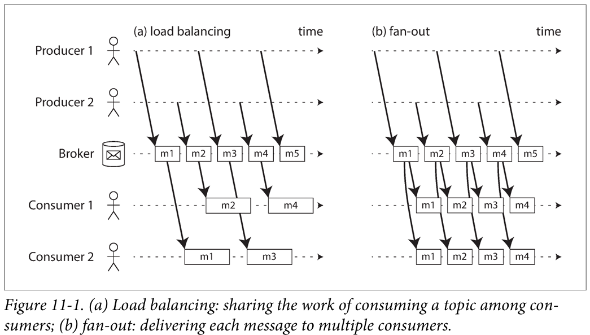

In order to ensure that the message is not lost, message brokers use acknowledgments: a client must explicitly tell the broker when it has finished processing a message so that the broker can remove it from the queue.

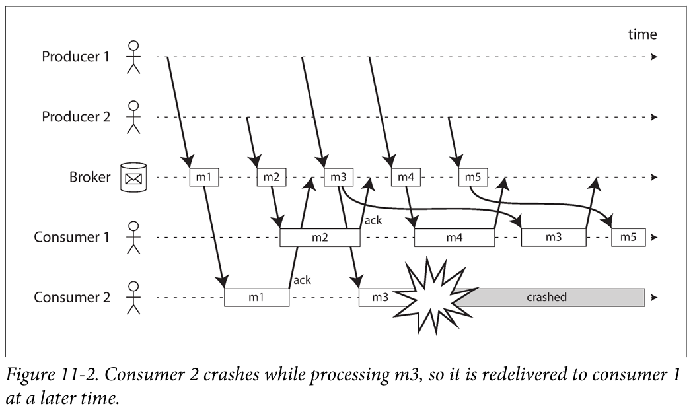

### Databases and Streams
This section explores the powerful bidirectional relationship between databases (which maintain a persistent state) and event streams.

#### The Problem of Dual Writes
When an application updates multiple systems—like a database, a search index, and a cache—it often performs dual writes. This is error-prone; race conditions can lead to inconsistent states if one write fails.

The better approach is to designate one system as the leader (e.g., the database) and make others followers that derive their state from it.

#### Change Data Capture (CDC)
Problem with **dual writes** (in which is the application code explicitly writes to each of the systems when data changes: for example, first writing to the database, then updating the search index, then invalidating the cache entries or even performing those writes concurrently)
is that derived data systems can be out of sync

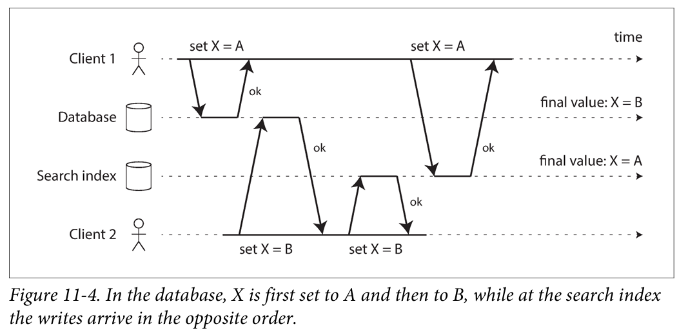

Change Data Capture (CDC) is the process of observing all data changes written to a database and extracting them as a stream of events. By capturing changes from the database's commit log, CDC turns a passive database into an event stream that can be used to update derived data systems like caches, search indexes, or analytics systems.

- **Implementation**: Log-based message brokers like Kafka are ideal for delivering CDC events as they maintain the original order of changes. Tools like Debezium (for MySQL/PostgreSQL) automate this process.
- **Snapshots**: To manage disk space and bootstrap new followers, CDC uses a snapshot of the database at a specific log position. Changes after that snapshot are then applied from the log.

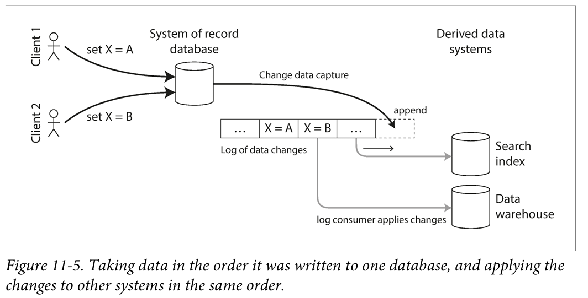

#### Event Sourcing
Event Sourcing is a related but distinct concept where the application state itself is stored as an append-only log of all events. The current state is derived by replaying this event log. This is similar to accounting, where transactions are never altered but corrected with new entries.
- **Benefits**: Immutable logs provide a powerful audit trail, make it easy to recover from bugs, and preserve historical data for analytics. For example, a customer adding and removing an item from a cart generates two events. Even though the cart's final state is empty, the log records the customer's interest.
- **Concurrency Control**: Event sourcing simplifies concurrency control. Instead of complex multi-object transactions, a single event encapsulates a user action, requiring only an atomic append to the log. If the log and application state are partitioned in the same way (e.g., by customer), single-threaded processing per partition eliminates concurrency issues.

### Processing Streams
Stream processing is used in many domains:
1. **Monitoring**: Fraud detection, trading systems, and manufacturing alerts
2. **Real-Time Analytics**: Metrics aggregation for dashboards, detecting trends, and computing rolling averages
3. **Complex Event Processing (CEP)**: Detecting patterns in streams, e.g., "user clicked 3 ads in 10 seconds" for ad fraud detection

A central challenge in stream processing is dealing with time:
- **Event Time**: When the event actually occurred (embedded in the data as a timestamp).
- **Processing Time**: When the event is processed by the system.

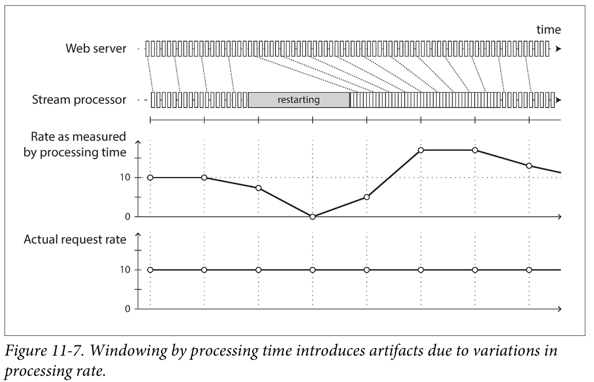

Events can arrive out of order due to network delays, making processing based on event time difficult. To manage this, systems use:
1. **Windowing**: Breaking the stream into finite chunks for aggregation. Types include:
   - **Tumbling Windows**: Fixed, non-overlapping intervals (e.g., 1-minute aggregates).
      ```
        Event time    User
        10:00:05      Ali
        10:01:20      Sara
        10:04:55      Omar
        10:05:10      Ali
      ```
      ```
        Window 1: 10:00:00 - 10:05:00
        Window 2: 10:05:00 - 10:10:00
      ```
      The first three events go into Window 1:
      ```
        10:00:05
        10:01:20
        10:04:55
      ```
   - **Sliding Windows**: Overlapping intervals for smoother trends.
   - **Session Windows**: Activity-based windows that close after a period of inactivity.
2. **Watermarks**: Heuristic markers indicating when all events for a time window are expected to have arrived. They trigger computations despite possible late arrivals.
     ```
        Window size = 5 minutes
        Allowed lateness = 2 minutes

        If the latest event time seen is: 10:07
        Then the watermark is roughply: 10:05
        Because: 10:07 - 2 minutes = 10:05
     ```

Joins are a core building block for creating enriched event streams. They can be of several types:
- **Stream-Stream Joins (window)**: Combining two streams using windowing (e.g., clickstream and purchase events).
- **Stream-Table Joins (stream enrichments)**: Enriching a stream with static data from a database (e.g., user profiles).
- **Table-Table Joins (materialized view maintenance)**: Maintaining dynamic tables updated by streams (e.g., real-time inventory).

Use stream joining when you need real-time correlation, such as:
- matching orders with payments
- matching ad impressions with clicks
- matching login attempts with fraud alerts
- matching ride requests with available drivers
- building customer profiles from multiple real-time streams
- optimizing supply chain management with related live events

Stream processors often need to maintain state (e.g., counters, aggregates, or join data). This state must be fault-tolerant to survive crashes.
- **Local State**: Stored in processing nodes (e.g., in-memory hash tables) for fast access.
- **Fault Tolerance**: Achieved through periodic checkpointing (also called distributed snapshots), which save the state to durable storage. If a node fails, it can recover its state from the latest checkpoint.
- **Exactly-Once Semantics**: The goal is to process each event exactly once, avoiding duplicates or missed events. This is achieved through a combination of checkpointing, idempotent operations, and transactional protocols. At-Least-Once processing (where events may be processed more than once) is easier but can lead to duplicates.

**Microbatching**: break the continuous, infinite stream into small, discrete blocks of data and process each block like a miniature batch job

**Checkpointing**: Periodically save a snapshot of the entire state of a stream processor to durable storage

### Summary
In this chapter we have discussed event streams, what purposes they serve, and how to process them. In some ways, stream processing is very much like the batch processing we discussed in Chapter 10, but done continuously on unbounded (never ending) streams rather than on a fixed-size input. From this perspective, message brokers and event logs serve as the streaming equivalent of a filesystem.

We spent some time comparing two types of message brokers:
1. **AMQP/JMS-style message broker**
   - The broker assigns individual messages to consumers, and consumers acknowledge individual messages when they have been successfully processed. Messages are deleted from the broker once they have been acknowledged.
2. **Log-based message broker**
   - The broker assigns all messages in a partition to the same consumer node, and always delivers messages in the same order. Parallelism is achieved through partitioning, and consumers track their progress by checkpointing the offset of the last message they have processed. The broker retains messages on disk, so it is possible to jump back and reread old messages if necessary.

We distinguished three types of joins that may appear in stream processes:
- **Stream-stream joins**
- **Stream-table joins**
- **Table-table joins**

Finally, we discussed techniques for achieving fault tolerance and exactly-once semantics in a stream processor. As with batch processing, we need to discard the partial output of any failed tasks. However, since a stream process is long-running and produces output continuously, we can’t simply discard all output. Instead, a finer-grained recovery mechanism can be used, based on microbatching, checkpointing, transactions, or idempotent writes. 

## Chapter 12: The Future of Data Systems
it synthesizes the book's core themes into a forward-looking vision. It argues that the future lies in building systems by composing specialized, loosely-coupled tools, designing around explicit dataflows, and prioritizing correctness and ethical responsibility

### Data Integration: Composing Specialized Tools
The modern approach to data systems involves combining multiple specialized tools, rather than relying on a single monolithic database. This creates a data integration challenge: how do you keep all these disparate systems synchronized and consistent?
1. **Derived Data**: The solution is to view data from secondary systems (like search indexes, caches, or machine learning models) as derived data. This data is created by processing the raw, authoritative data from a system of record.
2. **Immutable Event Logs**: The most reliable way to manage this is to use an immutable, append-only event log (e.g., Apache Kafka) as the central source of truth. All changes to the system of record are captured as events in this log (using Change Data Capture (CDC)). Batch and stream processing jobs then consume this log to generate and update derived datasets.
3. **Batch vs. Stream Unification**: This model allows for a unification of batch and stream processing. Modern systems, like Apache Flink and Google Dataflow, can use the same engine with the same logic for both historical reprocessing (batch) and real-time updates (stream). This is a direct improvement over the overly complex Lambda Architecture, which required maintaining two separate processing pipelines. The modern approach is known as the Kappa Architecture, where "stream = infinite batch".

### Unbundling Databases: From Monolith to Components
This section expands on the idea of composability by proposing that we "unbundle" the monolithic database into its constituent parts.
1. **Disaggregated Components**: Instead of a single system handling storage, processing, and indexing, each function is performed by a specialized tool.
  - Storage: Distributed filesystems like S3 or HDFS.
  - Processing: Engines like Spark or Flink.
  - Indexing: Search tools like Elasticsearch.
2. **Dataflow as the Glue**: This "unbundled" system works by having data flow between these components via the immutable event log.
3. **The Trade-off**: This approach offers significant benefits like fault isolation and the ability to upgrade components independently. However, it introduces new operational complexity and the challenge of maintaining consistency across components without built-in transactions.

### Designing Around Dataflow: A New Paradigm
This section advocates for a fundamental shift in how applications are designed: from a request/response model to an event-driven, dataflow-centric model.
1. **Explicit Dataflow**: The system is built around explicit, observable paths that data takes as it is transformed from one state to another.
2. **Immutable Logs as Foundation**: An immutable, append-only log of all events is the bedrock of this approach. The state of the application is derived by consuming this log.
3. **Benefits of this Model**:
     - **Evolvability**: If you need to change how a derived dataset (like a cache) is built, you can simply run the new transformation code on the entire log to reprocess the data.
     - **Recovery**: If a bug is found in the processing logic, you can fix the code and reprocess the data from the log to recover.
     - **Auditing and Compliance**: The log provides a complete and immutable history of all changes.
     - **Offline-First UIs**: This dataflow can be extended all the way to the end-user device, enabling user interfaces that update dynamically and continue to work offline.

### Correctness and Integrity: Beyond Traditional Transactions
This section addresses the critical question of how to ensure correctness in these loosely-coupled, asynchronous systems.
1. **The End-to-End Argument**: The principle that correctness checks must be implemented at the application level, not just assumed from infrastructure components. For example, TCP may guarantee a packet was delivered, but it cannot guarantee the application processed it only once. To prevent double-processing, the application must use mechanisms like unique request identifiers (idempotency).
2. **Alternatives to Distributed Transactions**: Traditional distributed transactions (like Two-Phase Commit) are complex, slow, and don't scale well. The chapter suggests more scalable alternatives:
      - **Idempotent Operations**: Designing operations so they can be performed multiple times with the same effect as performing them once.
      - **Asynchronous Constraint Checking**: Instead of enforcing all constraints immediately within a transaction, checking them asynchronously and handling violations after the fact (e.g., by apologizing or compensating).
      - **Conflict Resolution**: Using techniques like CRDTs or Operational Transforms to resolve conflicts in eventually consistent systems.
3. **Auditing and Lineage**: For integrity, it's crucial to track data provenance (lineage) to verify correctness and detect corruption.

### Ethical Considerations: The Human Impact of Data
The chapter concludes with an important, non-technical discussion: the ethical responsibilities of those who build data systems.
- **Privacy and Anonymization**: Simply removing personally identifiable information (PII) is often insufficient to protect privacy. More robust techniques like differential privacy are needed. Systems must also comply with regulations like GDPR and CCPA.
- **Bias in Machine Learning**: Machine learning models are only as good as their training data. Biased data leads to biased models, which can have serious consequences (e.g., in facial recognition or credit scoring). Engineers must actively audit datasets and models for fairness.
- **Transparency and Explainability**: Users have a right to understand the decisions made by automated systems that affect their lives.
- **Power and Harm**: Data systems can be used to entrench unfair power structures or undermine human rights, and it is the responsibility of engineers to be aware of and mitigate these risks.

# Key outcomes from the book
## There Is No "Perfect" Database—Only Trade-offs
Every database makes a choice:
- B-trees (PostgreSQL, MySQL) give fast point lookups but write amplification.
- LSM-trees (Cassandra, RocksDB) give fast writes but slower reads.
- Single-leader gives strong consistency but limited write throughput.
- Leaderless (Dynamo, Cassandra) gives high availability but weak consistency.
- OLTP vs. OLAP: Transactional systems optimize for many small writes; analytical systems optimize for massive scans.

👉 Stop asking "Which is best?" Ask "Which trade-off fits my workload?"

## The Log is the Heart of the System
The Write-Ahead Log (WAL), replication logs, and commit logs are not just implementation details—they are the **source of truth**.
- Replication works by shipping logs.
- Atomicity works by writing to the WAL first.
- Change Data Capture (CDC) works by reading the commit log.
- Event Sourcing stores the log as the primary state.

👉 The log is the single source of truth; everything else (tables, indexes, caches) is derived from it.

## Schema Evolution is Inevitable—Plan for It
Your data model will change. If you don't plan for it, you'll have painful, downtime-filled migrations.
- Backward Compatibility: New code reads old data (add fields with defaults).
- Forward Compatibility: Old code reads new data (ignore unknown fields).
- Avro uses schema resolution by name (no tags) making it perfect for Kafka.
- Protobuf/Thrift use numeric tags (must reserve deleted fields forever).

👉 Never rely on language-specific serialization (Java Serializable, Python Pickle) for long-term storage.

## The Network is a Chaotic Demon—Design for Chaos
In a distributed system, anything can happen:
- Packets can be lost, delayed, duplicated, or reordered.
- Nodes can pause (GC, VM migration) causing leadership leases to expire.
- Clocks are unreliable—never use wall-clock time for ordering.

👉 Assume the network will fail. Design with timeouts, retries, idempotency, and quorums. Never trust a node's local view of the world.

## Weak Isolation Will Break Your Data (Unless You Understand It)
The default isolation level in most databases (Read Committed) is not safe for business logic.
- Lost Updates: Two increments overwrite each other.
- Write Skew: Two doctors go off call, leaving none on shift.
- Phantoms: Double-booking a room because the SELECT found no rows.

👉 If your data has critical invariants (e.g., "at least one doctor on call"), you need Serializable isolation (2PL or SSI). If you use Snapshot Isolation, you must handle write skew in your application.

## Consensus is Hard, But It's the Only Way to Get Strong Consistency
- Two-Phase Commit (2PC) is blocking—if the coordinator dies, participants are stuck waiting forever.
- Raft/Paxos are non-blocking—they use majority voting and leader election to survive failures.
- ZooKeeper, etcd, and Consul provide consensus-based coordination for leader election, service discovery, and distributed locks.

👉 For systems that need linearizability and fault tolerance, use consensus (Raft). For systems that can tolerate inconsistency, use CRDTs or eventual consistency.

## The Future is "Unbundled" and Dataflow-Centric
Monolithic databases are giving way to composable systems:
- Systems of Record (source of truth) → e.g., PostgreSQL, MySQL.
- Derived Data Systems (caches, search indexes, analytics, ML models) are built by processing the log.
- Kappa Architecture: Instead of separate batch and stream pipelines, use a single stream engine (like Flink or Kafka Streams) that can replay history and process real-time events with the same logic.

👉 Don't treat your secondary systems as fragile attachments. Treat them as derived data that can be rebuilt from the immutable event log.

## Correctness is an Application Concern, Not Just Infrastructure
Infrastructure (TCP, databases, brokers) provides best-effort guarantees. The application must handle the edge cases:
- Idempotency: Use unique request IDs so duplicate operations are harmless.
- Idempotent Writes: Use UPSERT instead of INSERT to avoid duplicates.
- Unique Constraints: Enforce them at the database level; don't assume the application will be bug-free.
- Auditability: Keep immutable logs so you can prove what happened.

👉 Don't rely on exactly-once delivery from your message broker. Implement idempotent consumers.

## Time is a First-Class Problem in Stream Processing
In stream processing, you must distinguish between:
- Event Time: When the event actually happened (timestamp in the data).
- Processing Time: When your system processes it.

Events arrive late and out of order. To handle this:
- Use windowing (tumbling, sliding, session) to aggregate by event time.
- Use watermarks to decide when to finalize a window.
- Use idempotent writes to handle duplicate events.

👉 Always use event time for aggregation. Processing time is meaningless in a distributed system.

## Ethics and Transparency are Non-Negotiable
The chapter on the future ends with a powerful reminder: Systems are built by humans and affect humans.
- Privacy: Removing PII is not enough—use differential privacy and comply with GDPR/CCPA.
- Bias: ML models reflect bias in their training data. Audit your data and your models.
- Transparency: Users have a right to understand decisions made about them.

👉 Engineering is not just technical—it's ethical. Build systems that are fair, explainable, and respectful of human dignity.

# One-Sentence Summary
> There is no perfect system—only trade-offs. The best engineers are those who deeply understand these trade-offs and can compose reliable, scalable, and maintainable systems from unreliable components while being accountable for their impact on people.