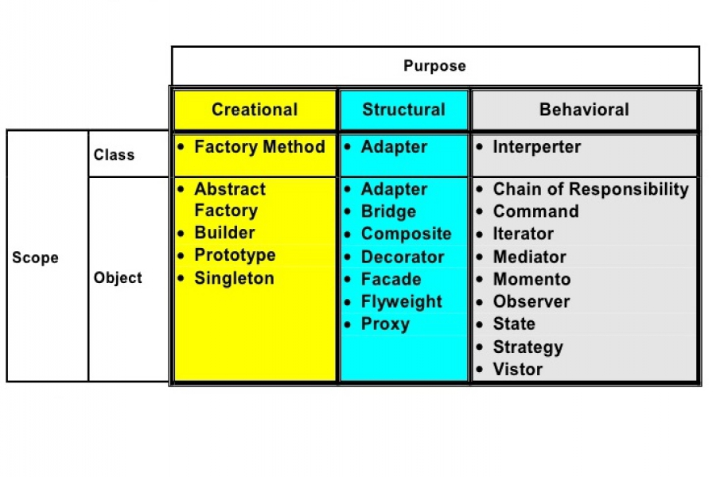

# Table of Contents

- [Table of Contents](#table-of-contents)
- [ChatGPT Q\&A](#chatgpt-qa)
- [Self reflection on the book](#self-reflection-on-the-book)
  - [intro](#intro)
- [Notes from the book](#notes-from-the-book)
  - [OO Basics](#oo-basics)
  - [OO principles](#oo-principles)
  - [OO Patterns](#oo-patterns)
  - [Bullet points](#bullet-points)
- [Design Patterns](#design-patterns)
  - [Types of patterns](#types-of-patterns)
    - [1. Creational](#1-creational)
    - [2. Structural](#2-structural)
    - [3. Behavioral](#3-behavioral)

# ChatGPT Q&A
1. **Do you suggest reading "Head first design patterns" book for a web developer in 2023 that uses dotnet and angular as a fullstack technologies?**

    "Head First Design Patterns" is a well-regarded book for learning design patterns, and it can be valuable for web developers working with .NET and Angular or any other technology stack. Design patterns are not tied to specific programming languages or frameworks; they are general principles that can be applied across various contexts. Here are some reasons why you might consider reading this book:
    
    Foundation of Software Design: Understanding design patterns is essential for writing clean, maintainable, and scalable code. These principles can be applied to any technology stack, including .NET and Angular.
    
    Common Language: The book presents design patterns in a beginner-friendly and engaging way, making it accessible even if you are new to the concept.
    
    Applicability: While the book doesn't focus specifically on .NET or Angular, the patterns it covers are applicable to these technologies. You can apply the principles learned to improve your code quality and architecture in your full-stack development projects.
    
    Transferable Skills: Gaining a strong understanding of design patterns can make you a better developer, regardless of the specific technologies you work with. It's a skill set that can benefit you throughout your career.
    
    Problem-Solving: Design patterns are often solutions to common software development problems. Learning these patterns can help you identify and solve similar problems in your own projects.
    
    Interview Preparation: Knowledge of design patterns is often tested in technical interviews, so reading this book can be beneficial if you're considering job interviews in the future.

2. **When should I read it?**
    
    Deciding when to read "Head First Design Patterns" or any book on design patterns largely depends on your current level of expertise and your immediate needs as a web developer working with .NET and Angular. Here are some considerations to help you determine the right time to read it:

   1. Foundational Knowledge: If you are relatively new to software development or haven't had exposure to design patterns, reading the book early in your development journey can provide a solid foundation in software design principles.
    
   2. Intermediate Developer: If you have some experience as a web developer but haven't delved deeply into design patterns, it's a good time to pick up the book. Design patterns can significantly enhance your coding skills and the quality of your projects.
    
   3. Project Complexity: If you are working on increasingly complex projects or find that your codebase is becoming harder to maintain, it may be an indication that you should start learning design patterns. They can help you manage complexity effectively.
    
   4. Interview Preparation: If you plan to interview for new positions in the near future, it's a good idea to read the book before interviews. Design patterns are often discussed in technical interviews, and having a solid understanding can be advantageous.
    
   5. Continuous Learning: If you are committed to ongoing professional development, consider reading the book as part of your continuous learning process. Even experienced developers can benefit from revisiting design patterns to refresh their knowledge.
    
   6. Project Needs: If you encounter specific challenges in your current projects that design patterns can address, it might be a good time to learn about those patterns relevant to your immediate needs.
    
   7. Learning Style: Consider your personal learning style. If you find the book's approach engaging and effective for your learning style, it can be a valuable resource at any stage of your development career.
    
    Remember that learning design patterns is not an all-or-nothing endeavor. You can start with the basics and gradually explore more advanced patterns as you gain experience. Additionally, it's crucial to apply what you learn in real-world projects to solidify your understanding.
    
    In summary, there's no one-size-fits-all answer to when you should read "Head First Design Patterns." Assess your current knowledge, experience, and goals as a web developer, and use that information to determine the best time to dive into the book. Ultimately, the earlier you start learning about design patterns, the more they can benefit your career and the quality of your software projects.

# Self reflection on the book
## intro
Intro is really amazing! one of the best intro I've ever read in a book.
It litterly explains everything that a reader would need e.g. who this book for, how to best learn, how to stimulate your brain to do its best (meta-cognition, adding pictures, conversational style).
they even talked about their method of writing the book and, how can you best grasp on the information

# Notes from the book

## OO Basics
* Composition describes a class that refrences one or more objects of other classes in instance variables.
* Abstraction is a general idea rather than one relating to a particular object, person, or situation.
* Encapsulation is the restricting of direct access to some of an object's components.
* Polymorphism is the ability of a variable, function or object to take on multiple forms.
* Inheritance is the mechanism of basing an object or class upon another object or class.
* Loose-coupling in which components are weakly associated (have breakable relationship) with each other, and so, changes in one component least affect existence or performance of another component. Loose coupling is the opposite of tight coupling, Loosely coupled designs allow us to build flexible OO systems that can handle change because they minimize the interdependency between objects.
* Delegation refers generally to one entity passing something to another entity
  
----
## OO principles
1. Identify the aspects of your application that vary and seperate them from what stays the same
2. Program to an interface, not an implementation.
3. Favor composition over inheritance
4. Strive for loosely coupled designs between objects that interact.
5. Classes should be open for extension, but closed for modifications (as the design pattern guru said: code should be closed to change like the lotus flower in the evening, yet open to extension like the lotus flower in the morning)

----
## OO Patterns
* The Strategy Pattern: defines a family of algorithms, encapsulates each one, and makes them interchangeable. Strategy lets the algorithm vary independently from clients that use it. [ We used it in Testing Duck behaviors application in chapter 1]
* The Observer Pattern: defines a one-to-many dependency between objects so that when one object changes state, all of its dependents are notified and updated automatically.
* The Decorator Pattern: attaches additional responsibilities to an object dynamically. Decorators provide a flexible alternative to subclassing for extending functionality.

## Bullet points
1. * Knowing the OO basics does not make you a good OO designer.
   * Good OO designs are reusable, extensible and maintainable.
   * Patterns show you how to build systems with good OO design qualities.
   * Patterns are proven object-oriented experience.
   * Patterns don't give you code, they give you general solutions to design problems. You apply them to your specific application.
   * Patterns aren't invented, they are discovered.
   * Most patterns and principles address issues of change in software.
   * Most patterns allow some part of a system to vary independently of all other parts.
   * We often try to take what varies in a system and encapsulate it.
   * Patterns provide a shared language that can maximize the value of your communication with other developer.
2. * The Observer Pattern defines a one-to-many relationship   between objects.
   * Subjects, or as we also know them, Observables, update Observers using a common interface.
   * Observers are loosely coupled in that the Observable knows nothing about them, Other than that they implement the Observer interface.
   * You can push or pull data from the Observable when using the pattern (pull is considered more "correct").
   * Don't depend on a specific order of notification for your Observers.
   * Java has several implementations of the Observer Pattern, including the general purpose java.util.Observable.
   * Watch out for issues with the java.util.Observable implementation.
   * Don't be afraid to create your own Observable implementation if needed.
   * Swing makes heavy use of the Observer Pattern, as do many GUI frameworks does.
   * You'll also find the pattern in many other places, including JavaBeans and RMI.
3. * Inheritance is one form of extension, but not necessarily the best way to achieve flexibility in our designs.
   * In our designs we should allow behavior to be extended without the need to modify existing code.
   * Composition and delegation can often be used to add new behaviors at runtime.
   * The Decorator Pattern provides an alternative to subclassing for extending behavior.
   * The Decorator Pattern involves a set of decorator classes that are used to wrap concrete components.
   * Decorator classes mirror the type of the components they decorate. (in fact, they are the same type as the components they decorate, either through inheritance or interface implementation.)
   * Decorators change the behavior of their components by adding new functionality before and/or after (or even in place of) method calls to the component.
   * You can wrap a component with any number of decorators.
   * Decorators are typically transparent to the client of the component; that is, unless the client is relying on the component's concrete type.
   * Decorators can result in many small objects in our design, and overuse can be complex.

# Design Patterns
There are alot of design patterns out there in the world
1. [Original foundational patterns (GoF patterns)](http://cmoulliard.github.io/gof%20patterns/design-patterns-quick-reference)
2. Sun's J2EE patterns
3. JSP patterns
4. [Architectural patterns](http://www.tellmehow.co/top-10-programming-architectural-patterns/)
5. Game design patterns

## Types of patterns
### 1. Creational

   **Purpose**: Creational design patterns focus on the process of object creation. They provide mechanisms for creating objects in a way that is flexible, efficient, and independent of the system's architecture.

   **Examples**: Some common creational design patterns include the Singleton, Factory Method, Abstract Factory, Builder, and Prototype patterns.

   **Use Cases**:

   1. Singleton: Ensures that a class has only one instance and provides a global point of access to that instance.

   2. Factory Method: Defines an interface for creating an object but allows subclasses to alter the type of objects that will be created.

   3. Abstract Factory: Provides an interface for creating families of related or dependent objects without specifying their concrete classes.

   4. Builder: Separates the construction of a complex object from its representation, allowing the same construction process to create different representations.

   5. Prototype: Creates new objects by copying an existing object, known as the prototype, and customizing it.

### 2. Structural

   **Purpose**: Structural design patterns deal with the composition of classes or objects. They help define how objects and classes can be structured to form larger, more complex structures while keeping the system flexible and efficient.

   **Examples**: Some common structural design patterns include the Adapter, Bridge, Composite, Decorator, Facade, Flyweight, and Proxy patterns.
    
   **Use Cases**:
   1. Adapter: Allows incompatible interfaces to work together by providing a wrapper around one of the interfaces.
   
   2. Bridge: Separates an object's abstraction from its implementation, allowing both to vary independently.
   
   3. Composite: Composes objects into tree structures to represent part-whole hierarchies. Clients can treat individual objects and compositions of objects uniformly.

   4. Decorator: Attaches additional responsibilities to objects dynamically, providing a flexible alternative to subclassing for extending functionality.
   
   5. Facade: Provides a simplified, high-level interface to a complex subsystem, making it easier to use.
   
   6. Flyweight: Minimizes memory usage or computational expenses by sharing as much as possible with similar objects.
   
   7. Proxy: Provides a surrogate or placeholder for another object to control access to it.
   
### 3. Behavioral

**Purpose**: Behavioral design patterns focus on how objects interact and communicate with each other. They define the patterns of communication and collaboration between objects to manage responsibilities and behaviors effectively.

**Examples**: Some common behavioral design patterns include the Observer, Strategy, Command, Chain of Responsibility, Interpreter, State, and Visitor patterns.

**Use Cases**:

1. Observer: Defines a one-to-many dependency between objects so that when one object changes state, all its dependents are notified and updated automatically.
   
2. Strategy: Defines a family of algorithms, encapsulates each one, and makes them interchangeable. Clients can choose the appropriate algorithm to use.
   
3. Command: Encapsulates a request as an object, thereby allowing for parameterization of clients with queues, requests, and operations.
   
4. Chain of Responsibility: Passes a request along a chain of handlers. Each handler decides whether to process the request or pass it to the next handler in the chain.
   
5. Interpreter: Defines a grammar for interpreting a language and provides an interpreter for evaluating expressions in that language.
   
6. State: Allows an object to alter its behavior when its internal state changes. The object will appear to change its class.
   
7. Visitor: Represents an operation to be performed on elements of an object structure. It lets you define a new operation without changing the classes of the elements.

---

In summary, creational design patterns deal with object creation, structural design patterns deal with class and object composition, and behavioral design patterns focus on object interactions and responsibilities. These patterns serve different purposes in software design and can be combined as needed to solve complex problems and create maintainable and scalable software.

----
> Reached page: 109