# Table of Contents

- [Table of Contents](#table-of-contents)
- [ChatGPT Q\&A](#chatgpt-qa)
- [Good References along with this Book](#good-references-along-with-this-book)
- [Notes from the book](#notes-from-the-book)
  - [OO Basics](#oo-basics)
  - [OO principles](#oo-principles)
  - [OO Patterns](#oo-patterns)
  - [Bullet points](#bullet-points)
- [Design Patterns](#design-patterns)
  - [Types of patterns](#types-of-patterns)
    - [1. Creational](#1-creational)
    - [2. Structural](#2-structural)
    - [3. Behavioral](#3-behavioral)
- [Patterns in details](#patterns-in-details)
  - [Strategy Pattern](#strategy-pattern)
    - [Picture from Refactoring Guru](#picture-from-refactoring-guru)
    - [Quick introduction:](#quick-introduction)
    - [Detailed introduction:](#detailed-introduction)
    - [Real world examples](#real-world-examples)
    - [Architecture from Chapter 1](#architecture-from-chapter-1)
  - [Observer Pattern](#observer-pattern)
    - [Picture from Refactoring Guru](#picture-from-refactoring-guru-1)
    - [Quick Introduction](#quick-introduction-1)
    - [Detailed Introduction](#detailed-introduction-1)
    - [Real world examples](#real-world-examples-1)
    - [Architecture from Chapter 2](#architecture-from-chapter-2)
  - [Decorator Pattern](#decorator-pattern)
    - [Picture from Refactoring Guru](#picture-from-refactoring-guru-2)
    - [Quick Introduction](#quick-introduction-2)
    - [Detailed Introduction](#detailed-introduction-2)
    - [Real world examples](#real-world-examples-2)
    - [Architecture from Chapter 3](#architecture-from-chapter-3)
  - [Factory Pattern](#factory-pattern)
    - [Picture from Refactoring Guru](#picture-from-refactoring-guru-3)
    - [Quick Introduction](#quick-introduction-3)
    - [Detailed Introduction](#detailed-introduction-3)
    - [Real world examples](#real-world-examples-3)
    - [Architecture from Chapter 4](#architecture-from-chapter-4)
  - [Singleton Pattern](#singleton-pattern)
    - [Picture from Refactoring Guru](#picture-from-refactoring-guru-4)
    - [Quick Introduction](#quick-introduction-4)
    - [Detailed Introduction](#detailed-introduction-4)
    - [Real world examples](#real-world-examples-4)
  - [Command Pattern](#command-pattern)
    - [Picture from Refactoring Guru](#picture-from-refactoring-guru-5)
    - [Quick Introduction](#quick-introduction-5)
    - [Detailed Introduction](#detailed-introduction-5)
    - [Real world examples](#real-world-examples-5)
    - [Architecture from Chapter 6](#architecture-from-chapter-6)
  - [The Adapter Pattern](#the-adapter-pattern)
    - [Picture from Refactoring Guru](#picture-from-refactoring-guru-6)
    - [Quick Introduction](#quick-introduction-6)
    - [Detailed Introduction](#detailed-introduction-6)
    - [Real world examples](#real-world-examples-6)
    - [Architecture from Chapter 7](#architecture-from-chapter-7)
  - [The Facade Pattern](#the-facade-pattern)
    - [Picture from Refactoring Guru](#picture-from-refactoring-guru-7)
    - [Quick Introduction](#quick-introduction-7)
    - [Detailed Introduction](#detailed-introduction-7)
    - [Real world examples](#real-world-examples-7)
    - [Architecture from Chapter 7](#architecture-from-chapter-7-1)
  - [The Template Method Pattern](#the-template-method-pattern)
    - [Picture from Refactoring Guru](#picture-from-refactoring-guru-8)
    - [Quick Introduction](#quick-introduction-8)
    - [Detailed Introduction](#detailed-introduction-8)
    - [Real world examples](#real-world-examples-8)
    - [Architecture from Chapter 8](#architecture-from-chapter-8)
  - [The Iterator Pattern](#the-iterator-pattern)
    - [Picture from Refactoring Guru](#picture-from-refactoring-guru-9)
    - [Quick Introduction](#quick-introduction-9)
    - [Detailed Introduction](#detailed-introduction-9)
    - [Real world examples](#real-world-examples-9)
    - [Architecture from Chapter 9](#architecture-from-chapter-9)
  - [The Composite Pattern](#the-composite-pattern)
    - [Picture from Refactoring Guru](#picture-from-refactoring-guru-10)
    - [Quick Introduction](#quick-introduction-10)
    - [Detailed Introduction](#detailed-introduction-10)
    - [Real world examples](#real-world-examples-10)
    - [Architecture from Chapter 9](#architecture-from-chapter-9-1)
  - [The State Pattern](#the-state-pattern)
    - [Picture from Refactoring Guru](#picture-from-refactoring-guru-11)
    - [Quick Introduction](#quick-introduction-11)
    - [Detailed Introduction](#detailed-introduction-11)
    - [Real world examples](#real-world-examples-11)
    - [Architecture from Chapter 10](#architecture-from-chapter-10)
  - [The Proxy Pattern](#the-proxy-pattern)
    - [Picture from Refactoring Guru](#picture-from-refactoring-guru-12)
    - [Quick Introduction](#quick-introduction-12)
    - [Detailed Introduction](#detailed-introduction-12)
    - [Real world examples](#real-world-examples-12)
    - [Architecture from Chapter 11](#architecture-from-chapter-11)
  - [The Bridge Pattern](#the-bridge-pattern)
    - [Picture from Refactoring Guru](#picture-from-refactoring-guru-13)
    - [Quick Introduction](#quick-introduction-13)
    - [Detailed Introduction](#detailed-introduction-13)
    - [Real world examples](#real-world-examples-13)
    - [Architecture from Chapter 14](#architecture-from-chapter-14)
  - [The Chain Of Responsibility Pattern](#the-chain-of-responsibility-pattern)
    - [Picture from Refactoring Guru](#picture-from-refactoring-guru-14)
    - [Quick Introduction](#quick-introduction-14)
    - [Detailed Introduction](#detailed-introduction-14)
    - [Real world examples](#real-world-examples-14)
    - [Architecture from Chapter 14](#architecture-from-chapter-14-1)
  - [The Mediator Pattern](#the-mediator-pattern)
    - [Picture from Refactoring Guru](#picture-from-refactoring-guru-15)
    - [Quick Introduction](#quick-introduction-15)
    - [Detailed Introduction](#detailed-introduction-15)
    - [Real world examples](#real-world-examples-15)
    - [Architecture from Chapter 14](#architecture-from-chapter-14-2)
- [Interesting Articles to makes](#interesting-articles-to-makes)
- [Pattern of creating "patterns in details" sections](#pattern-of-creating-patterns-in-details-sections)
  - [{{Name of the pattern}} Pattern](#name-of-the-pattern-pattern)
    - [Picture from Refactoring Guru](#picture-from-refactoring-guru-16)
    - [Quick Introduction](#quick-introduction-16)
    - [Detailed Introduction](#detailed-introduction-16)
    - [Real world examples](#real-world-examples-16)
    - [Architecture from Chapter NO.](#architecture-from-chapter-no)

# ChatGPT Q&A
1. **Do you suggest reading "Head first design patterns" book for a web developer in 2023 that uses dotnet and angular as a fullstack technologies?**

    "Head First Design Patterns" is a well-regarded book for learning design patterns, and it can be valuable for web developers working with .NET and Angular or any other technology stack. Design patterns are not tied to specific programming languages or frameworks; they are general principles that can be applied across various contexts. Here are some reasons why you might consider reading this book:
    
    Foundation of Software Design: Understanding design patterns is essential for writing clean, maintainable, and scalable code. These principles can be applied to any technology stack, including .NET and Angular.
    
    Common Language: The book presents design patterns in a beginner-friendly and engaging way, making it accessible even if you are new to the concept.
    
    Applicability: While the book doesn't focus specifically on .NET or Angular, the patterns it covers are applicable to these technologies. You can apply the principles learned to improve your code quality and architecture in your full-stack development projects.
    
    Transferable Skills: Gaining a strong understanding of design patterns can make you a better developer, regardless of the specific technologies you work with. It's a skill set that can benefit you throughout your career.
    
    Problem-Solving: Design patterns are often solutions to common software development problems. Learning these patterns can help you identify and solve similar problems in your own projects.
    
    Interview Preparation: Knowledge of design patterns is often tested in technical interviews, so reading this book can be beneficial if you're considering job interviews in the future.

2. **When should I read it?**
    
    Deciding when to read "Head First Design Patterns" or any book on design patterns largely depends on your current level of expertise and your immediate needs as a web developer working with .NET and Angular. Here are some considerations to help you determine the right time to read it:

   1. Foundational Knowledge: If you are relatively new to software development or haven't had exposure to design patterns, reading the book early in your development journey can provide a solid foundation in software design principles.
    
   2. Intermediate Developer: If you have some experience as a web developer but haven't delved deeply into design patterns, it's a good time to pick up the book. Design patterns can significantly enhance your coding skills and the quality of your projects.
    
   3. Project Complexity: If you are working on increasingly complex projects or find that your codebase is becoming harder to maintain, it may be an indication that you should start learning design patterns. They can help you manage complexity effectively.
    
   4. Interview Preparation: If you plan to interview for new positions in the near future, it's a good idea to read the book before interviews. Design patterns are often discussed in technical interviews, and having a solid understanding can be advantageous.
    
   5. Continuous Learning: If you are committed to ongoing professional development, consider reading the book as part of your continuous learning process. Even experienced developers can benefit from revisiting design patterns to refresh their knowledge.
    
   6. Project Needs: If you encounter specific challenges in your current projects that design patterns can address, it might be a good time to learn about those patterns relevant to your immediate needs.
    
   7. Learning Style: Consider your personal learning style. If you find the book's approach engaging and effective for your learning style, it can be a valuable resource at any stage of your development career.
    
    Remember that learning design patterns is not an all-or-nothing endeavor. You can start with the basics and gradually explore more advanced patterns as you gain experience. Additionally, it's crucial to apply what you learn in real-world projects to solidify your understanding.
    
    In summary, there's no one-size-fits-all answer to when you should read "Head First Design Patterns." Assess your current knowledge, experience, and goals as a web developer, and use that information to determine the best time to dive into the book. Ultimately, the earlier you start learning about design patterns, the more they can benefit your career and the quality of your software projects.
3. is there any language that allows for multiple parents in a class
   
   Yes, there are programming languages that support multiple inheritance, allowing a class to inherit from more than one base class. Some languages that provide this feature include:

    C++: C++ supports multiple inheritance. A class in C++ can inherit from multiple base classes, and this feature is often used to create complex class hierarchies. However, multiple inheritance in C++ can lead to issues like the "diamond problem," which occurs when a class inherits from two classes that have a common base class. C++ provides mechanisms like virtual inheritance to address such issues.
    
    Python: Python also supports multiple inheritance. A class in Python can inherit from multiple base classes, and it uses a method resolution order (MRO) algorithm to determine the order in which base classes' methods are called when there are conflicts. Python's multiple inheritance is flexible but requires careful design to avoid ambiguity.

    But, generally no (only 7 of them do from thousands)

---
# Good References along with this Book
1. Watching this series on youtube discussing each pattern in this book. see: [Design Patterns in Object Oriented Programming](https://www.youtube.com/playlist?list=PLrhzvIcii6GNjpARdnO4ueTUAVR9eMBpc)
2. Reading from [Refactoring Guru's Design Patterns](https://refactoring.guru/design-patterns)
3. Interesting read about design patterns and anti-patterns (things that breaks a code), refactoring, uml. see: [Source Making](https://sourcemaking.com/)
4. Understand how design patterns is used in games, see: [Game Patterns YouTube channel](https://www.youtube.com/@GamePatterns)

---
# Notes from the book

## OO Basics
* Composition describes a class that references one or more objects of other classes in instance variables.
* Abstraction is a general idea rather than one relating to a particular object, person, or situation.
* Encapsulation is the restricting of direct access to some of an object's components.
* Polymorphism is the ability of a variable, function or object to take on multiple forms.
* Inheritance is the mechanism of basing an object or class upon another object or class.
* Loose-coupling in which components are weakly associated (have breakable relationship) with each other, and so, changes in one component least affect existence or performance of another component. Loose coupling is the opposite of tight coupling, Loosely coupled designs allow us to build flexible OO systems that can handle change because they minimize the interdependency between objects.
* Delegation refers generally to one entity passing something to another entity
  
## OO principles
1. Identify the aspects of your application that vary and separate them from what stays the same
2. Program to an interface, not an implementation.
3. Favor composition over inheritance
4. Strive for loosely coupled designs between objects that interact.
5. Classes should be open for extension, but closed for modifications (as the design pattern guru said: code should be closed to change like the lotus flower in the evening, yet open to extension like the lotus flower in the morning)
6. Depend on abstractions. Do not depend on concrete classes.
7. Only talk to your friends.
8. Don't call us, we'll call you.
9. A class should have only one reason to change.

## OO Patterns
* The Strategy Pattern: defines a family of algorithms, encapsulates each one, and makes them interchangeable. Strategy lets the algorithm vary independently from clients that use it. [ We used it in Testing Duck behaviors application in chapter 1]
* The Observer Pattern: defines a one-to-many dependency between objects so that when one object changes state, all of its dependents are notified and updated automatically.
* The Decorator Pattern: attaches additional responsibilities to an object dynamically. Decorators provide a flexible alternative to sub-classing for extending functionality.
* The Factory Method: Define an interface for creating an object, but let subclasses decide which class to instantiate. Factory Method lets a class defer instantiation to the subclasses. 
* The Singleton Pattern: Ensure a class has one instance and provide a global point of access to it.
* The Command Pattern: Encapsulates a request as an object, thereby letting you parameterize clients with different requests, queue or log requests, and support undoable operations.
* The Adapter Pattern: Converts the interface of a class into another interface clients expect. Lets classes work together that couldn't otherwise because of incompatible interfaces.
* The Facade Pattern: Provides a unified interface to a set of interfaces in a subsystem. Facade defines a higher-level interface that makes the subsystem easier to use.
* The Template Method Pattern: Define the skeleton of an algorithm in an operation, deferring some steps to subclasses. Template Method lets subclasses redefine certain steps of an algorithm without changing the algorithm's structure.
* The Iterator Pattern: Provide a way to access the elements of an aggregate object sequentially without exposing its underlying representation.
* The Composite Pattern: Compose objects into tree structures to represent part-whole hierarchies. Composite lets clients treat individual objects and compositions of objects uniformly.
* The State Pattern: Allow an object to alter its behavior when its internal state changes. The object will appear to change its class.
* The Proxy Pattern: Provide a surrogate or placeholder for another object to control access to it.
* The Compound Patterns: Combines two or more patterns into a solution that solves a recurring or general problem.

## Bullet points
1. * Knowing the OO basics does not make you a good OO designer.
   * Good OO designs are reusable, extensible and maintainable.
   * Patterns show you how to build systems with good OO design qualities.
   * Patterns are proven object-oriented experience.
   * Patterns don't give you code, they give you general solutions to design problems. You apply them to your specific application.
   * Patterns aren't invented, they are discovered.
   * Most patterns and principles address issues of change in software.
   * Most patterns allow some part of a system to vary independently of all other parts.
   * We often try to take what varies in a system and encapsulate it.
   * Patterns provide a shared language that can maximize the value of your communication with other developer.
2. * The Observer Pattern defines a one-to-many relationship   between objects.
   * Subjects, or as we also know them, Observables, update Observers using a common interface.
   * Observers are loosely coupled in that the Observable knows nothing about them, Other than that they implement the Observer interface.
   * You can push or pull data from the Observable when using the pattern (pull is considered more "correct").
   * Don't depend on a specific order of notification for your Observers.
   * Java has several implementations of the Observer Pattern, including the general purpose java.util.Observable.
   * Watch out for issues with the java.util.Observable implementation.
   * Don't be afraid to create your own Observable implementation if needed.
   * Swing makes heavy use of the Observer Pattern, as do many GUI frameworks does.
   * You'll also find the pattern in many other places, including JavaBeans and RMI.
3. * Inheritance is one form of extension, but not necessarily the best way to achieve flexibility in our designs.
   * In our designs we should allow behavior to be extended without the need to modify existing code.
   * Composition and delegation can often be used to add new behaviors at runtime.
   * The Decorator Pattern provides an alternative to sub-classing for extending behavior.
   * The Decorator Pattern involves a set of decorator classes that are used to wrap concrete components.
   * Decorator classes mirror the type of the components they decorate. (in fact, they are the same type as the components they decorate, either through inheritance or interface implementation.)
   * Decorators change the behavior of their components by adding new functionality before and/or after (or even in place of) method calls to the component.
   * You can wrap a component with any number of decorators.
   * Decorators are typically transparent to the client of the component; that is, unless the client is relying on the component's concrete type.
   * Decorators can result in many small objects in our design, and overuse can be complex.
4. * All factories encapsulate object creation.
   * Simple Factory, while not a bonafide design pattern, is a simple way to decouple your clients from concrete classes.
   * Factory Method relies on inheritance: object creation is delegated to subclasses which implement the factory method to create objects.
   * Abstract Factory relies on object composition: object creation is implemented in methods exposed in the factory interface.
   * All factory patterns promote loose coupling by reducing the dependency of your application on concrete classes.
   * The intent of Factory Method is to allow a class to defer instantiation to its subclasses
   * The intent of Abstract Factory is to create families of related objects without having to depend on their concrete classes
   * The Dependency Inversion Principle guides us to avoid dependencies on concrete types and to strive for abstraction
   * Factories are a powerful technique for coding to abstractions, not concrete classes.
5. * The Singleton Pattern ensures you have at most one instance of a class in your application.
   * The Singleton Pattern also provides a global access point to that instance.
   * Java's implementation of the Singleton Pattern makes use of a private constructor, a static method combined with a static variable.
   * Examine your performance and resource constraints and carefully choose an appropriate Singleton implementation for multithreaded applications (and we should consider all applications multithreaded!)
   * Beware of the double-checked locking implementation; it is not thread-safe in versions before Java2, version 5.
   * Be careful if you are using multiple class loaders; this could defeat the Singleton implementation and result in multiple instances.
   * If you are using a JVM earlier than 1.2, you'll need to create a registry of Singletons to defeat the garbage collector.
6. * The Command Pattern decouples an object, making a request from the one that knows how to perform it.
   * A command object is at the center of this decoupling and encapsulates a receiver with an action (or set of actions).
   * An invoker makes a request of a Command object by calling its execute() method, which invokes those actions on the receiver.
   * Invokers can be parameterized with Commands, even dynamically at runtime.
   * Commands may support undo by implementing an undo method that restores the object to its previous state before the execute() method was last called.
   * Macro Commands are a simple extension of Command that allow multiple commands to be invoked. Likewise, Macro Commands can easily support undo().
   * In practice, it is not uncommon for "smart" Command objects to implement the request themselves rather than delegating to a receiver.
   * Commands may also be used to implement logging and transactional systems.
7. * When you need to use an existing class and its interface is not the one you need, use an adapter.
   * When you need to simplify and unify a large interface or complex set of interfaces, use a facade.
   * An adapter changes an interface into one a client expects.
   * A facade decouples a client from a complex subsystem.
   * Implementing a facade requires that we compose the facade with its subsystem and use delegation to perform the work of the facade.
   * There are two forms of the Adapter pattern: object and class adapters. Class adapters require multiple inheritance.
   * You can implement more than one facade for a subsystem.
   * An adapter wraps an object to change its interface, a decorator wraps an object to add new behaviors and responsibilities, and a facade "wraps" a set of objects to simplify
     * **Facade** => Simplify
     * **Adapter** => Change interface
     * **Decorator** => New responsibility
8. * A "template method" defines the steps of an algorithm, deferring to subclasses for the implementation of those steps.
   * The Template Method Pattern gives us an important technique for code reuse.
   * The template method's abstract class may define concrete methods, abstract methods and hooks.
   * Abstract methods are implemented by subclasses.
   * Hooks are methods that do nothing or default behavior in the abstract class, but may be overridden in the subclass.
   * To prevent subclasses from changing the algorithm in the template method, declare the template method as final.
   * The Hollywood Principle guides us to put decision-making in high-level modules that can decide how and when to call low level modules.
   * You'll see lots of uses of the Template Method Pattern in real world code, but don't expect it all (like any pattern) to be designed "by this book".
   * The Strategy and Template Method Patterns both encapsulate algorithms, one by inheritance and one by composition.
   * The Factory Method is a a specialization of Template Method
9. * An Iterator allows access to an aggregate's elements without exposing its internal structure.
   * An Iterator takes the job of iterating over an aggregate and encapsulates it in another object.
   * When using an Iterator, we relieve the aggregate of the responsibility of supporting operations for traversing its data.
   * An Iterator provides a common interface for traversing the items of an aggregate, allowing you to use polymorphism when writing code that makes use of the items of the aggregate.
   * We should strive to assign only one responsibility to each class.
   * The Composite Pattern provides a structure to hold both individual objects and composites.
   * The Composite Pattern allows clients to treat composites and individual objects uniformly.
   * A Component is any object in a Composite structure. Components maybe be other composites or leaf nodes.
   * There are many design tradeoffs in implementing Composite. You need to balance transparency and safety with your needs.
10. * The State Pattern allows an object to have many different behaviors that are based on its internal state.
    * Unlike a procedural state machine, the State Pattern represents state as a full-blown class.
    * The Context gets its behavior by delegating to the current state object it is composed with.
    * By encapsulating each state into a class, we localize any changes that will need to be made.
    * The State and Strategy Patterns have the same class diagram, but they differ in intent.
    * Strategy Pattern typically configures context classes with a behavior or algorithm.
    * State Pattern allows a Context to change its behavior as the state of the Context changes.
    * State transitions can be controlled by the state classes or by the context classes.
    * Using the state pattern will typically result in a greater number of classes in your design.
    * State classes may be shared among Context instances.
11. * The Proxy pattern provides a representative for another object in order to control the client's access to it. there are a number of ways it can manage that access.
    * A Remote Proxy manages interaction between a client and a remote object.
    * A Virtual Proxy controls access to an object that is expensive to instantiate.
    * A  Protection Proxy controls access to the methods of an object based on the caller.
    * Many other variants of the Proxy Pattern exist including caching proxies, synchronization proxies, firewall proxies, copy-on-write proxies, and so on.
    * Proxy is structurally similar to Decorator, but the two differ in their purpose.
    * The Decorator Pattern adds behavior to an object, while a proxy controls access.
    * Java's built-in support for Proxy can build a dynamic proxy class on demand and dispatch all calls on it to a handler of your choosing.
    * Like any wrapper, proxies will increase the number of classes and objects in your designs.
12. * The Model View Controller Pattern (MVC) is a compound pattern consisting of the Observer, Strategy and Composite Patterns.
    * The model makes use of the Observer Pattern so that it can keep observers updated yet stay decoupled from them.
    * The controller is the strategy for the view. The view can use different implementations of the controller to get different behavior.
    * The view uses the Composite Pattern to implement the user interface, which usually consists of nested components like panels, frames and buttons.
    * These patterns work together to decouple the three players in the MVC model, which keeps designs clear and flexible.
    * The Adapter Pattern can be used to adapt a new model to an existing view and controller.
    * Model 2 is an adaptation of MVC for web applications.
    * In Model 2, the controller is implemented as a servlet and JSP & HTML implement the view.
13. * Let Design Patterns emerge in your designs, don't force them in just for the sake of using a pattern.
    * Design Patterns aren't set in stone; adapt and tweak them to meet your needs.
    * Always use the simplest solution that meets your needs, even if it doesn't include a pattern.
    * Study Design Pattern catalogs to familiarize yourself with patterns and the relationships among them.
    * Pattern classifications (or categories) provide groupings for patterns. When they help, use them.
    * You need to be committed to be a patterns writer: it takes time and patience, and you have to be willing to do lots of refinement.
    * Remember, most patterns you encounter will be adaptations of existing patterns, not new patterns.
    * Build your team's shared vocabulary. This is one of the most powerful benefits of using patterns.
    * Like any community, the patterns community has its own lingo. Don't let that hold you back. Having read this book, you now know most of it.

---
# Design Patterns
There are a lot of design patterns out there in the world
1. [Original foundational patterns (GoF patterns)](http://cmoulliard.github.io/gof%20patterns/design-patterns-quick-reference)
2. Sun's J2EE patterns
3. JSP patterns
4. [Architectural patterns](http://www.tellmehow.co/top-10-programming-architectural-patterns/)
5. Game design patterns

## Types of patterns
### 1. Creational

   **Purpose**: Creational design patterns focus on the process of object creation. They provide mechanisms for creating objects in a way that is flexible, efficient, and independent of the system's architecture.

   **Examples**: Some common creational design patterns include the Singleton, Factory Method, Abstract Factory, Builder, and Prototype patterns.

   **Use Cases**:

   1. Singleton: Ensures that a class has only one instance and provides a global point of access to that instance.

   2. Factory Method: Defines an interface for creating an object but allows subclasses to alter the type of objects that will be created.

   3. Abstract Factory: Provides an interface for creating families of related or dependent objects without specifying their concrete classes.

   4. Builder: Separates the construction of a complex object from its representation, allowing the same construction process to create different representations.

   5. Prototype: Creates new objects by copying an existing object, known as the prototype, and customizing it.

### 2. Structural

   **Purpose**: Structural design patterns deal with the composition of classes or objects. They help define how objects and classes can be structured to form larger, more complex structures while keeping the system flexible and efficient.

   **Examples**: Some common structural design patterns include the Adapter, Bridge, Composite, Decorator, Facade, Flyweight, and Proxy patterns.
    
   **Use Cases**:
   1. Adapter: Allows incompatible interfaces to work together by providing a wrapper around one of the interfaces.
   
   2. Bridge: Separates an object's abstraction from its implementation, allowing both to vary independently.
   
   3. Composite: Composes objects into tree structures to represent part-whole hierarchies. Clients can treat individual objects and compositions of objects uniformly.

   4. Decorator: Attaches additional responsibilities to objects dynamically, providing a flexible alternative to sub-classing for extending functionality.
   
   5. Facade: Provides a simplified, high-level interface to a complex subsystem, making it easier to use.
   
   6. Flyweight: Minimizes memory usage or computational expenses by sharing as much as possible with similar objects.
   
   7. Proxy: Provides a surrogate or placeholder for another object to control access to it.
   
### 3. Behavioral

**Purpose**: Behavioral design patterns focus on how objects interact and communicate with each other. They define the patterns of communication and collaboration between objects to manage responsibilities and behaviors effectively.

**Examples**: Some common behavioral design patterns include the Observer, Strategy, Command, Chain of Responsibility, Interpreter, State, and Visitor patterns.

**Use Cases**:

1. Observer: Defines a one-to-many dependency between objects so that when one object changes state, all its dependents are notified and updated automatically.
   
2. Strategy: Defines a family of algorithms, encapsulates each one, and makes them interchangeable. Clients can choose the appropriate algorithm to use.
   
3. Command: Encapsulates a request as an object, thereby allowing for parameterization of clients with queues, requests, and operations.
   
4. Chain of Responsibility: Passes a request along a chain of handlers. Each handler decides whether to process the request or pass it to the next handler in the chain.
   
5. Interpreter: Defines a grammar for interpreting a language and provides an interpreter for evaluating expressions in that language.
   
6. State: Allows an object to alter its behavior when its internal state changes. The object will appear to change its class.
   
7. Visitor: Represents an operation to be performed on elements of an object structure. It lets you define a new operation without changing the classes of the elements.

---

In summary, creational design patterns deal with object creation, structural design patterns deal with class and object composition, and behavioral design patterns focus on object interactions and responsibilities. These patterns serve different purposes in software design and can be combined as needed to solve complex problems and create maintainable and scalable software.

---
# Patterns in details

This section discusses the deep details of a pattern

## Strategy Pattern

### Picture from [Refactoring Guru](https://refactoring.guru/)

### Quick introduction: 
Strategy is behavioral design pattern. It is used to switch between family of algorithms.
Refer to [Chapter 1](./Chapter%201-%20Intro%20to%20design%20patterns/) for an example.

### Detailed introduction:

The Strategy Pattern is a behavioral design pattern in C# (and other object-oriented programming languages) that allows you to define a family of interchangeable algorithms, encapsulate each of them, and make them interchangeable. This pattern is particularly useful when you have multiple ways to perform a specific task, and you want to select the appropriate strategy at runtime.

The Strategy Pattern allows you to decouple the client code from the specific implementations of algorithms. It promotes flexibility and makes it easy to add new strategies without modifying existing code. It's commonly used in scenarios where you have multiple ways to accomplish a task, such as sorting algorithms, payment processing, or validation methods, and you want to choose the appropriate one dynamically.

### Real world examples
1. This guy created a system for a drinks store in which pricing is different depending on holidays and happy hours. see: [BillingStrategy](https://github.com/hamzaak/designpatterns/blob/master/strategy/Program.cs)
2. [Sorting Strategies](http://www.cs.sjsu.edu/~pearce/modules/patterns/behavioral/strategy/lists.htm)
3. Also, see Chapter 1 - intro to design patterns

### Architecture from Chapter 1

## Observer Pattern

### Picture from [Refactoring Guru](https://refactoring.guru/)

### Quick Introduction
Observer is behavioral design patterns. It is used to share state.
Refer to [Chapter 2](./Chapter%202-%20The%20observer%20pattern/) for an example.

### Detailed Introduction
The Observer Pattern is a behavioral design pattern. It defines a one-to-many dependency between objects so that when one object changes state, all its dependents are notified and updated automatically.

### Real world examples
1. Event handling mechanisms in graphical user interfaces (DOM Elements)
2. Stock market data updates
3. Sharing state between the front end application
4. Any monitoring system
5. Also, see Chapter 2 - The observer pattern

### Architecture from Chapter 2

## Decorator Pattern

### Picture from [Refactoring Guru](https://refactoring.guru/)

### Quick Introduction
Decorator is a structural design pattern. It is used to add responsibilities to objects dynamically without altering their class or extending it.
Refer to [Chapter 3](./Chapter%203-%20The%20decorator%20pattern/) for an example.

### Detailed Introduction
The Decorator Pattern is a structural design pattern in software development that allows you to add behavior or responsibilities to objects dynamically without altering their class. This pattern is part of the Gang of Four (GoF) design patterns and is particularly useful when you need to extend the functionality of classes in a flexible and maintainable way.

The main idea behind the Decorator Pattern is to create a set of decorator classes that are used to wrap concrete components (objects). These decorators implement the same interface as the components they decorate, and they can add new behavior or modify the behavior of the wrapped component without changing its code.

Here's a basic structure of the Decorator Pattern:

1. Component: This is an interface or abstract class that defines the common interface for both concrete components and decorators. It typically includes the methods that the decorators and concrete components will share.

2. Concrete Component: This is the base class that implements the Component interface. It represents the core functionality that you want to enhance or extend.

3. Decorator: This is an abstract class that also implements the Component interface. Decorators have a reference to a Component and can add additional behavior or modify the behavior of the component. They serve as a base for concrete decorators.

4. Concrete Decorator: These are the actual decorator classes that extend the Decorator class. They provide specific behavior modifications or additions.

The Decorator Pattern allows you to create a chain of decorators, each adding its functionality to the component. This provides a flexible and incremental way to assemble objects with varying sets of features.

### Real world examples
1. Java I/O packages
2. Clothes on a human body
3. Toppings on ice-cream
4. Coffee with condiments

### Architecture from Chapter 3

## Factory Pattern

### Picture from [Refactoring Guru](https://refactoring.guru/)

### Quick Introduction
Factory is a creational design pattern. It is used to let subclasses alter the methods with inheritance.
Refer to [Chapter 4](./Chapter%204-%20The%20factory%20pattern/) for an example.

### Detailed Introduction
The Factory Pattern is a creational design pattern in software development that provides an interface for creating objects but allows subclasses to alter the type of objects that will be created. It falls under the Gang of Four (GoF) design patterns and is commonly used to abstract the process of object creation. The Factory Pattern promotes loose coupling and adheres to the "Dependency Inversion Principle" by ensuring that client code depends on abstractions rather than concrete implementations.

The Factory Pattern typically involves the following components:

1. Factory Interface (or Abstract Factory): This is an interface (or abstract class) that declares a method for creating objects. This method is often called a "factory method." Subclasses of the Factory Interface provide concrete implementations of the factory method.

2. Concrete Factories: These are classes that implement the Factory Interface. Each concrete factory is responsible for creating objects of a specific type or family of related types.

3. Product: This represents the object being created. It's the abstract class or interface that defines the common interface for all products created by the factories.

4. Concrete Products: These are the actual implementations of the Product interface. Each concrete factory produces objects of a specific Concrete Product type.

The Factory Pattern allows client code to create objects without needing to know the specific class of objects being created. Instead, the client code interacts with the Factory Interface, which provides a level of abstraction. This makes it easier to change or extend the system because you can introduce new Concrete Factories and Products without modifying the client code.

### Real world examples
1. Any factory (car, pizza, etc..)
2. Bank accounts (personal, business etc..)

### Architecture from Chapter 4

## Singleton Pattern

### Picture from [Refactoring Guru](https://refactoring.guru/)

### Quick Introduction
Singleton pattern is a creational pattern. It is used to provide one and only one instance of the object.
Refer to [Chapter 5](./Chapter%205-%20The%20singleton%20pattern/) for an example.

### Detailed Introduction
The Singleton Pattern is a design pattern in software engineering that ensures a class has only one instance and provides a global point of access to that instance. It is one of the creational design patterns and is commonly used when exactly one object needs to coordinate actions across the system, such as a configuration manager, a database connection pool, or a logging service.

The key characteristics of the Singleton Pattern include:

1. Single Instance: It ensures that there is only one instance of the class.

2. Global Access: It provides a way to access the single instance globally, typically through a well-defined method or property.

3. Lazy Initialization: The instance is created only when it's first requested, rather than being created at the time the class is loaded or initialized.

### Real world examples
1. Logging services
2. Device drivers
3. Caching mechanism

## Command Pattern

### Picture from [Refactoring Guru](https://refactoring.guru/)

### Quick Introduction
Command is a behavioral pattern. It is used to decouple the sender and receiver of a request.
Refer to [Chapter 6](./Chapter%206-%20The%20Command%20Pattern/) for an example.

### Detailed Introduction
The Command Pattern is a behavioral design pattern used in software engineering. It falls under the Gang of Four (GoF) design patterns and is used to encapsulate a request as an object, thereby allowing for parameterization of clients with queues, requests, and operations. This pattern decouples the sender of a request from the receiver, allowing for greater flexibility and extensibility in how requests are handled.

Here are the main components of the Command Pattern:

1. Command: This is an interface or abstract class that defines the common methods that concrete command classes must implement. Typically, this interface includes an execute() method, which encapsulates the action to be taken when the command is executed.

2. Concrete Command: These are the concrete implementations of the Command interface. Each concrete command class represents a specific action or operation and contains the logic for executing that action. These commands store information about the receiver (the object that will perform the action) and the parameters needed to carry out the action.

3. Invoker: The invoker is responsible for executing commands. It does not know the specifics of how each command works but simply triggers the execution of a command when needed. The invoker may maintain a queue of commands, undo/redo functionality, or other mechanisms for managing commands.

4. Receiver: The receiver is the object that performs the actual work associated with a command. It has knowledge of how to carry out the requested action. The receiver is specified when creating a concrete command.

5. Client: The client is responsible for creating and configuring commands, associating them with receivers, and setting up the invoker. It can build complex sequences of commands and pass them to the invoker for execution.

The Command Pattern is useful in scenarios where you want to decouple the sender and receiver of a request, support undo/redo functionality, create composite commands, or implement features like queuing and logging of commands. It promotes the separation of concerns and makes it easier to extend and maintain the codebase by encapsulating actions and their parameters into objects.

### Real world examples
1. Any Controller
2. API request
3. Queue
4. Database transactions
5. Text editor (Excel, Notepad++, VSCode)
   
### Architecture from Chapter 6

## The Adapter Pattern

### Picture from [Refactoring Guru](https://refactoring.guru/)
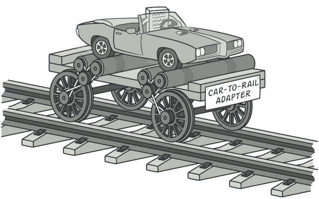

### Quick Introduction
Adapter is a structural design pattern. It is used to convert an interface an interface to another.
Refer to [Chapter 7](./Chapter%207-%20The%20Adapter%20and%20Facade%20Patterns/) for an example.

### Detailed Introduction
The Adapter Pattern is a structural design pattern in software engineering that allows two incompatible interfaces to work together. It is used when you have an existing class with a certain interface (or method signature), and you want to use it in a context where another interface is expected. The Adapter Pattern acts as a bridge between these interfaces, allowing them to collaborate without modifying the existing code.

Here's how the Adapter Pattern typically works:

1. Target Interface: This is the interface that the client code expects or relies on. The client code is designed to work with objects that implement this interface.

2. Adaptee: This is the existing class or component that you want to use in your application, but it has an interface that is incompatible with the client's interface.

3. Adapter: The adapter is a class that implements the target interface while internally delegating the actual work to an instance of the adaptee. It acts as a translator between the target interface and the adaptee's interface.

By using the Adapter Pattern, you can make the client code work seamlessly with the adaptee, even though their interfaces are different. This is particularly useful when you have third-party libraries or legacy code that you can't or don't want to modify but need to integrate into your system.

There are two common variations of the Adapter Pattern:

1. Class Adapter: In this version, the adapter class inherits from both the target interface and the adaptee class. It can override methods from the target interface and delegate calls to the adaptee's methods.

2. Object Adapter: In this version, the adapter class contains an instance of the adaptee class. It implements the target interface by forwarding calls to the adaptee's methods.

### Real world examples
1. Electric Adapter types
2. File Format Convertors
3. Legacy System Integration

### Architecture from Chapter 7

## The Facade Pattern

### Picture from [Refactoring Guru](https://refactoring.guru/)
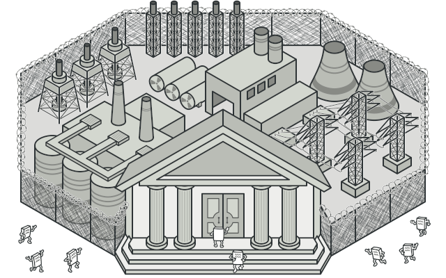

### Quick Introduction
Facade is a structural design pattern. It is used to simplify systems.
Refer to [Chapter 7](./Chapter%207-%20The%20Adapter%20and%20Facade%20Patterns/) for an example.

### Detailed Introduction
The Facade pattern is a design pattern in software engineering that falls under the category of structural patterns. It is used to provide a simplified and unified interface to a complex subsystem, making it easier for clients to interact with that subsystem.

In essence, the Facade pattern acts as a "facade" or a simplified front-end for a set of more complex classes or components. It hides the complexity of the underlying system and provides a single entry point through which clients can access its functionality. This can improve code readability, maintainability, and ease of use.

Key characteristics of the Facade pattern:

1. Simplified interface: The facade provides a simplified, high-level interface that abstracts away the details of the underlying subsystem. Clients interact with the facade instead of directly with the complex components.

2. Encapsulation: The internal workings of the subsystem are encapsulated within the facade, reducing the need for clients to know about or deal with the intricacies of individual components.

3. Decoupling: By introducing a facade, you can reduce the coupling between clients and the subsystem, making it easier to modify or extend the subsystem without affecting client code.

4. Single point of entry: Clients interact with the facade to access the functionality of the subsystem, which provides a single point of entry for all operations. This simplifies client code and reduces the complexity of managing dependencies.

5. Improved maintainability: Facades can help improve code maintainability by centralizing complex operations and changes within the subsystem, minimizing the impact on the rest of the codebase.

Overall, the Facade pattern is valuable for promoting separation of concerns, reducing code complexity, and enhancing the overall structure and readability of software systems.

### Real world examples
1. A graphics library that provides a high-level interface for drawing shapes and images, hiding the complexity of rendering and device-specific details.
2. An API for a complex system, such as an operating system, that simplifies access to system functionality for application developers.
3. A banking system that exposes a simple interface for account management, hiding the complexities of transactions, balances, and security.

### Architecture from Chapter 7

## The Template Method Pattern

### Picture from [Refactoring Guru](https://refactoring.guru/)
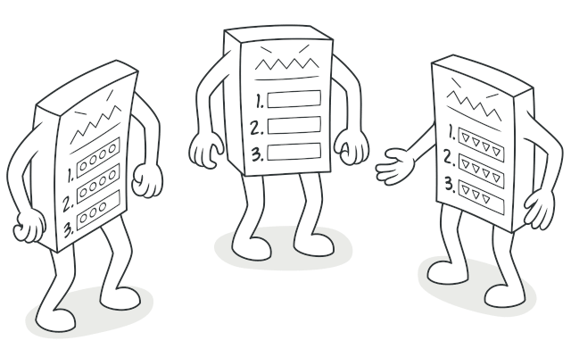

### Quick Introduction
Template Method is a behavioral design pattern. It is used to let subclass define a step in an algorithm.
Refer to [Chapter 8](./Chapter%208-%20The%20Template%20Method%20Pattern/) for an example.

### Detailed Introduction
The Template Method pattern is a behavioral design pattern used in software engineering. It is a way to define the skeleton or structure of an algorithm in a superclass (or base class), while allowing subclasses to provide specific implementations of certain steps of that algorithm without changing its overall structure. In other words, it defines the "template" for an algorithm, and the specific details can be customized in subclasses.

Key components and characteristics of the Template Method pattern:

1. Abstract Base Class: The Template Method pattern starts with an abstract base class that defines the overall algorithm structure. This base class contains one or more methods (referred to as "template methods") that outline the steps of the algorithm. These template methods can be declared as abstract or concrete with default implementations.

2. Concrete Subclasses: Subclasses (concrete classes) inherit from the abstract base class. They provide concrete implementations for the specific steps of the algorithm defined in the template methods. These implementations customize or extend the behavior of the algorithm.

3. Inversion of Control: The Template Method pattern follows the principle of inversion of control, where the control over the algorithm's flow is shifted from the client code to the base class. The base class defines the sequence of steps and delegates the implementation of certain steps to its subclasses.

4. Hooks: In addition to the template methods, the base class may include "hook" methods, which are methods that have default (often empty) implementations. Subclasses can choose to override these hook methods to customize behavior if needed, but they are not required to do so.

5. Consistent Algorithm: The Template Method pattern ensures that the overall algorithm's structure remains consistent across subclasses while allowing for variations in specific steps. This can lead to code reuse and easier maintenance.

### Real world examples
1. Implementing different types of sorting algorithms where the comparison and swapping steps vary.
2. Building user interfaces with a consistent layout but allowing different widgets or controls in specific sections (Components/Applets).
3. Implementing data import/export processes where the data parsing and transformation steps may differ for different data formats.
  
By using the Template Method pattern, you can promote code reusability and maintainability while ensuring a consistent overall algorithm structure.

### Architecture from Chapter 8

## The Iterator Pattern

### Picture from [Refactoring Guru](https://refactoring.guru/)
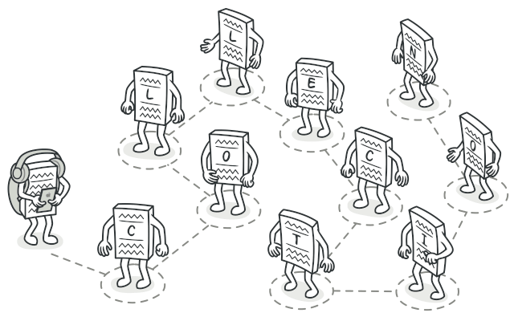

### Quick Introduction
Iterator is a behavioral design pattern. It is ued to generalize iterating over a list of things without knowing the used data structure.
Refer to [Chapter 9](./Chapter%209-%20The%20Iterator%20and%20Composite%20Patterns/) for an example.

### Detailed Introduction
The Iterator Pattern is a behavioral design pattern that is used to provide a standardized way to traverse through a collection of objects, such as a list, array, tree, or any other data structure, without exposing the underlying implementation details of that collection. It allows you to access the elements of a collection sequentially without needing to know how the collection is structured or how it stores its elements.

The key idea behind the Iterator Pattern is to separate the responsibility of iterating over a collection from the collection itself. This separation promotes a more modular and flexible design, as it allows you to change the internal structure of the collection (e.g., switching from an array to a linked list) without affecting the code that relies on the iterator.

The Iterator Pattern typically consists of the following components:

1. Iterator: This is an interface or an abstract class that defines methods for traversing the collection. It typically includes methods like next(), hasNext(), and sometimes remove(). Each concrete collection class (e.g., a list or tree) will have its own iterator implementation.

2. Concrete Iterator: These are the actual implementations of the Iterator interface for specific types of collections. They maintain the current position within the collection and provide the logic for moving to the next element and checking for the presence of more elements.

3. Aggregate: This is an interface or abstract class that defines a method for creating an iterator. It represents the collection of objects and can also include methods for adding, removing, or accessing elements in the collection.

4. Concrete Aggregate: These are the classes that implement the Aggregate interface. They provide the concrete implementation of the iterator creation method and manage the collection of objects.

### Real world examples
1. IEnumerator in csharp
2. Any code that wants to generalize the iterator
3. It is used mostly used with the composite pattern (best friends)

### Architecture from Chapter 9

## The Composite Pattern

### Picture from [Refactoring Guru](https://refactoring.guru/)
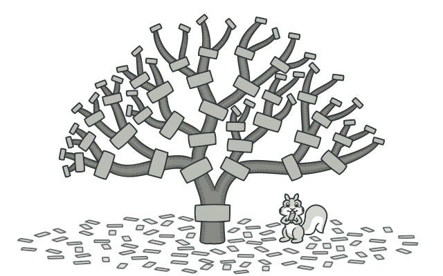

### Quick Introduction
Composite is a structural design pattern. It is used to represent part-whole hierarchies.
Refer to [Chapter 9](./Chapter%209-%20The%20Iterator%20and%20Composite%20Patterns/) for an example.

### Detailed Introduction
The Composite Pattern is a structural design pattern that is used to compose objects into tree structures to represent part-whole hierarchies. It allows clients to treat individual objects and compositions of objects uniformly. In other words, the pattern lets you build complex structures by combining simpler objects and treat both the composite and individual objects in a consistent manner.

Key components of the Composite Pattern include:

1. Component: This is an abstract class or interface that defines the common interface for all concrete objects in the composition, whether they are leaf nodes (individual objects) or composite nodes (collections of objects). This interface typically includes operations like add, remove, getChild, and any other relevant methods.

2. Leaf: This is a concrete class that implements the Component interface. Leaf objects are the individual, non-composite objects that do not have children. They provide the actual functionality.

3. Composite: This is a concrete class that also implements the Component interface. Composite objects can have child components, which can be either leaves or other composites. The Composite class defines operations to manage its child components, such as adding, removing, and iterating over them.

The Composite Pattern allows you to create hierarchies of objects that can represent complex structures. Clients of these structures can work with individual objects (leaf nodes) or with compositions of objects (composite nodes) without needing to know the specific type of each element. This promotes a "uniform" interface for both single objects and collections of objects.

### Real world examples
1. HTML DOM
2. File/Folder Systems
3. a lot and a lot of things
4. Its best friend is obviously the iterator pattern

### Architecture from Chapter 9

## The State Pattern

### Picture from [Refactoring Guru](https://refactoring.guru/)
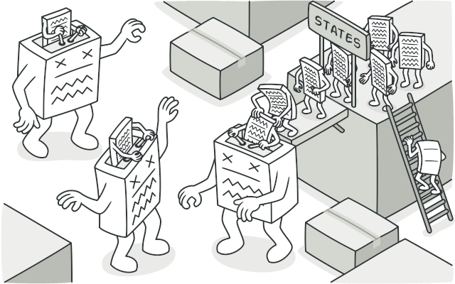

### Quick Introduction
State is a behavioral design pattern. It is similar to strategy pattern but it changes its behavior internally without the user defining it.
Refer to [Chapter 10](./Chapter%2010-%20The%20State%20Pattern/) for an example.

### Detailed Introduction
The State pattern is a behavioral design pattern that is used in software engineering to allow an object to alter its behavior when its internal state changes. This pattern is part of the Gang of Four (GoF) design patterns and is particularly useful in scenarios where an object needs to exhibit different behaviors in response to changes in its state without using a multitude of conditional statements.

Key components of the State pattern include:

Context: This is the object that maintains a reference to the current state object and delegates requests to it. The context is the object whose behavior changes based on its internal state.

State: State objects represent the various states that the context can be in. Each state object typically defines the behavior and actions that the context can perform when it is in that state. State objects share a common interface, allowing the context to interact with them in a consistent way.

The State pattern provides several benefits:

1. Clean Code: It helps in organizing code by separating state-specific behavior into different state classes. This makes the code cleaner and more maintainable.

2. Flexibility: It allows for the easy addition of new states and the modification of existing ones without changing the context or other state classes. This promotes flexibility and extensibility.

3. Reduces Conditional Statements: It eliminates or reduces large, complex conditional statements in the context object. Instead of using a series of if-else or switch-case statements to determine behavior based on the state, the context simply delegates the request to its current state object.

4. Promotes Encapsulation: Each state class encapsulates its behavior and rules, making it easier to reason about and test.

### Real world examples
1. Finite State Machine
2. Game character behavior
3. Auth system

### Architecture from Chapter 10

## The Proxy Pattern

### Picture from [Refactoring Guru](https://refactoring.guru/)
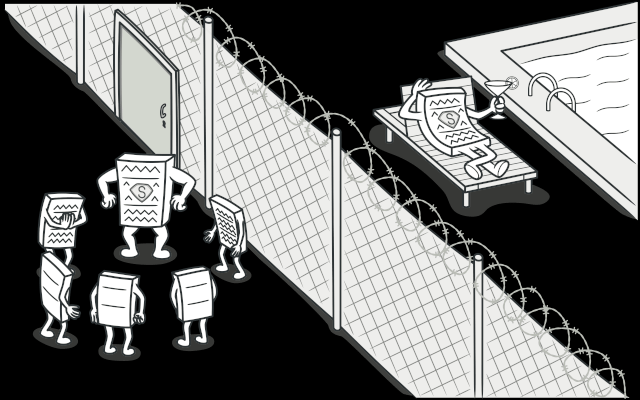

### Quick Introduction
Proxy is a structural design pattern. It is used as a placeholder between the client and the server.

### Detailed Introduction
The Proxy Pattern is a structural design pattern in software engineering. It provides a surrogate or placeholder for another object to control access to it. In other words, the Proxy Pattern allows you to create an intermediary or wrapper around an object to add additional functionality or control access to the real object.

Key characteristics and purposes of the Proxy Pattern include:

1. Controlled Access: The Proxy controls access to the real object, allowing you to manage and restrict how clients interact with it.

2. Lazy Initialization: The Proxy can postpone the creation or initialization of the real object until it's actually needed. This is known as lazy loading.

3. Security: Proxies can enforce security policies, authentication, and authorization checks to ensure that clients have the appropriate permissions to access the real object.

4. Logging and Monitoring: Proxies can log and monitor the interactions between clients and the real object for debugging or auditing purposes.

5. Caching: Proxies can implement caching mechanisms to store and reuse previously fetched data or results, improving performance.

6. Remote Proxy: In distributed systems, a Proxy can represent a remote object, making it appear as if it's a local object. This is commonly used in Remote Procedure Call (RPC) systems.

7. Virtual Proxy: A Virtual Proxy provides a placeholder for an expensive-to-create object. The real object is created only when needed, optimizing resource usage.

8. Smart Proxy: A Smart Proxy adds additional functionality to the real object, such as reference counting, to manage its lifecycle.

Common examples of the Proxy Pattern include:

1. Image Proxy: In a multimedia application, an image proxy may load and display a high-resolution image only when it's needed. Until then, a lower-resolution placeholder image is shown.

2. Remote Database Proxy: In distributed systems, a remote database proxy may represent a remote database server, allowing clients to interact with it as if it were a local database.

3. Access Control Proxy: Access control proxies can enforce authentication and authorization checks to restrict access to sensitive resources.

4. Logging Proxy: A logging proxy can log the interactions between a client and a real object, providing debugging and auditing capabilities.

5. Caching Proxy: Caching proxies can store and retrieve previously fetched data to improve performance.

The Proxy Pattern is a versatile pattern that can be used to add various types of functionality to objects, including controlling access, optimizing resource usage, and enhancing security. It's particularly useful in scenarios where you want to provide a simplified or controlled interface to a complex or resource-intensive object.

### Real world examples
1. Angular's guard
2. APIs
3. Caching proxies
4. Authentication Middleware

### Architecture from Chapter 11
No Repo was created for this chapter, and the following image was taken from the internet:

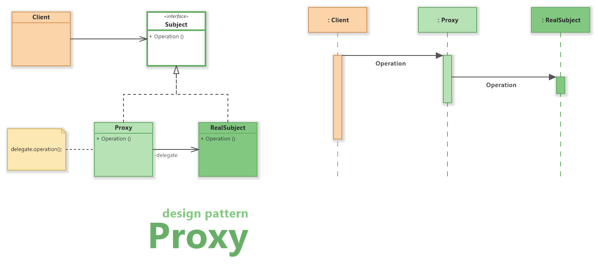

## The Bridge Pattern

### Picture from [Refactoring Guru](https://refactoring.guru/)
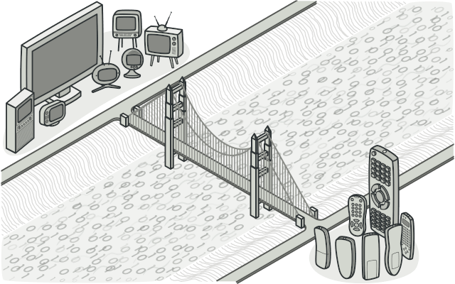

### Quick Introduction
Bridge is a structural design pattern. It is like a mix of composite and strategy patterns.
Refer to [Chapter 14](./Chapter%2014-%20The%20Bridge%20Pattern/) for an example.

### Detailed Introduction
The Bridge Pattern is a structural design pattern that separates an object's abstraction (interface) from its implementation, allowing them to vary independently. It is used to avoid a permanent binding between an abstraction and its implementation, making the system more flexible and extensible.

Key components of the Bridge Pattern include:

1. Abstraction: This is the high-level interface that clients interact with. It defines the abstract operations and maintains a reference to an instance of the Implementor.

2. Refined Abstraction: These are extensions of the Abstraction that can add more functionality while still relying on the Implementor for the basic operations.

3. Implementor: This is the low-level interface that defines the operations that the Concrete Implementors must implement. It is independent of the Abstraction and allows different implementations to be interchangeable.

4. Concrete Implementor: These are the classes that provide specific implementations of the operations defined in the Implementor interface.

The Bridge Pattern is particularly useful when you have a system where there are multiple dimensions of variation, and you want to avoid the combinatorial explosion of classes that would result from implementing every possible combination. By separating the abstraction from its implementation, you can create a more maintainable and flexible system.

For example, if you're developing a drawing application, you might have an Abstraction that represents different shapes (e.g., circles, squares) and an Implementor that provides different rendering mechanisms (e.g., rasterization, vector graphics). By using the Bridge Pattern, you can easily add new shapes or rendering mechanisms without having to create a class for every possible combination.

In summary, the Bridge Pattern is a design pattern that promotes loose coupling between abstractions and their implementations, allowing them to vary independently and making the system more adaptable to change and extension.

### Real world examples
1. Remote controller types and receivers
2. Shapes and Colors

### Architecture from Chapter 14

Same would apply in case of Shapes and Colors.

## The Chain Of Responsibility Pattern

### Picture from [Refactoring Guru](https://refactoring.guru/)
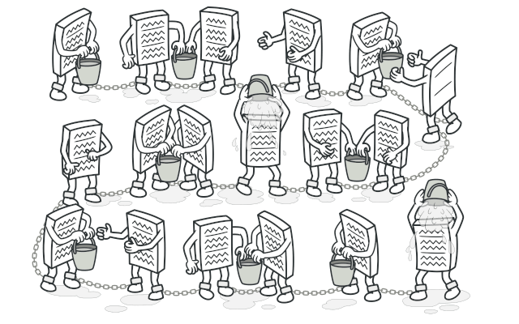

### Quick Introduction
COR is a behavioral design pattern. It is used to process a request at the right place in a chain.
Refer to [Chapter 14](./Chapter%2014-%20The%20Bridge%20Pattern/) for an example.

### Detailed Introduction
The Chain of Responsibility Pattern is a behavioral design pattern that allows you to pass a request along a chain of handlers. Each handler decides whether to process the request or pass it to the next handler in the chain. This pattern is used to achieve loose coupling between the sender of a request and its receivers.

Key components of the Chain of Responsibility pattern include:

1. Handler: An abstract class or interface that defines the common interface for handling requests. It usually contains a reference to the next handler in the chain and a method for processing requests.

2. ConcreteHandler: Concrete classes that implement the Handler interface and provide specific implementations for handling requests. Each concrete handler decides whether to handle the request or pass it to the next handler in the chain.

3. Client: Initiates a request and starts the chain. It's unaware of which handler will ultimately process the request.

The primary benefits of the Chain of Responsibility Pattern include:

Decoupling the sender and receiver of requests: The sender doesn't need to know which handler will process its request, and the receiver doesn't need to know the sender's identity.

Dynamic and flexible chaining of handlers: You can easily add, remove, or reorder handlers in the chain without affecting the client code.

Avoiding a "HUGE" class with multiple conditional statements: Instead of having a single class with complex if-else statements to handle different types of requests, you can distribute the responsibility across multiple handlers.

A common real-world analogy for the Chain of Responsibility Pattern is a customer support hotline. When a customer calls with an issue, the call may be initially handled by a general customer service representative. If the issue is beyond their scope, they may forward the call to a specialist, who, in turn, may pass it to a higher-level expert. This chain of handling the customer's issue can continue until it is resolved or until it reaches the most appropriate person to handle it.

The Chain of Responsibility Pattern is particularly useful in scenarios where you have a sequence of processing steps, and the exact sequence or combination of steps needed depends on the situation. It promotes flexibility and maintainability in your codebase.

### Real world examples
1. Call center
2. Outlook (managing spams and emails)

### Architecture from Chapter 14

## The Mediator Pattern

### Picture from [Refactoring Guru](https://refactoring.guru/)
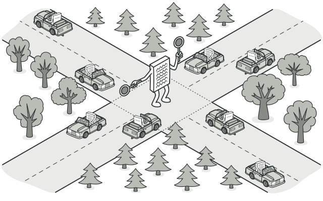

### Quick Introduction
Mediator is a behavioral design pattern. It is like the network's switch of applications.
Refer to [Chapter 14](./Chapter%2014-%20The%20Bridge%20Pattern/) for an example.

### Detailed Introduction
The Mediator Pattern is a behavioral design pattern that promotes loose coupling between objects by centralizing communication and control through a mediator object. It is used to manage complex relationships and interactions among objects. The primary goal of this pattern is to reduce the direct connections between objects, which can make a system more maintainable and extendable.

Key components of the Mediator Pattern include:

1. Mediator: This is the central component that defines the interface for communication between colleagues (participants). It encapsulates the communication and coordination logic. The mediator maintains references to all the colleagues and directs messages between them.

2. Colleague (Participant): These are the objects that interact with each other through the mediator. Colleagues are not aware of each other and communicate indirectly through the mediator. They typically hold a reference to the mediator.

The Mediator Pattern offers several benefits:

1. Reduced Coupling: It reduces the number of direct connections between objects, making the system less tightly coupled. Colleagues only need to know about the mediator, not each other.

2. Centralized Control: The mediator provides a central point of control and coordination for interactions among colleagues, making it easier to manage complex behavior.

3. Reusability: Mediators can be reused in different contexts, and the addition of new colleagues doesn't require changes to existing colleagues or the mediator.

4. Easier Maintenance: Changes or enhancements to communication and coordination logic can be made in a centralized way within the mediator without affecting the colleagues.

Common real-world analogies for the Mediator Pattern include air traffic control systems, where a central authority (mediator) coordinates the movement and communication of multiple aircraft (colleagues), and chat applications where a server (mediator) facilitates communication between users (colleagues) without direct connections between them.

The Mediator Pattern is particularly useful in scenarios where complex interactions exist, and you want to avoid the proliferation of direct relationships between objects, which can lead to increased coupling and maintenance challenges.

### Real world examples
1. Message brokers (Microservice architecture)

### Architecture from Chapter 14

---
# Interesting Articles to makes
1. Patterns specific articles
2. Software OO Design principles in Arabic language
----

# Pattern of creating "patterns in details" sections

## {{Name of the pattern}} Pattern

### Picture from [Refactoring Guru](https://refactoring.guru/)

### Quick Introduction

### Detailed Introduction

### Real world examples

### Architecture from Chapter NO.

---
> Reached page: Book is done