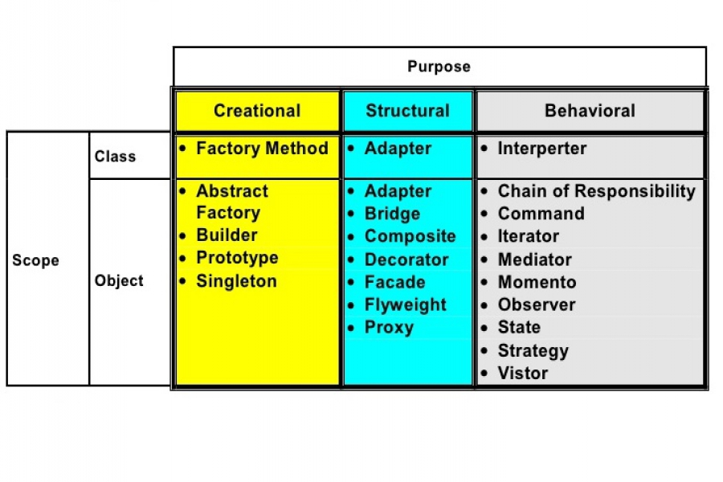
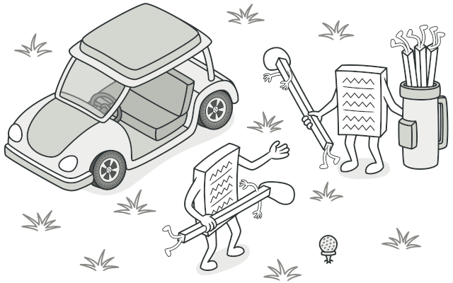
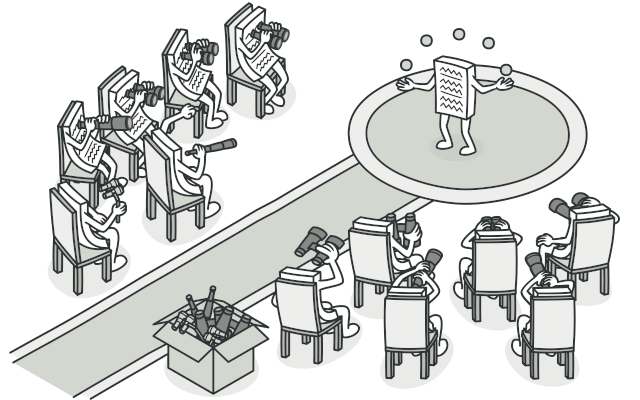
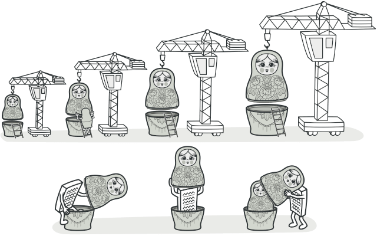
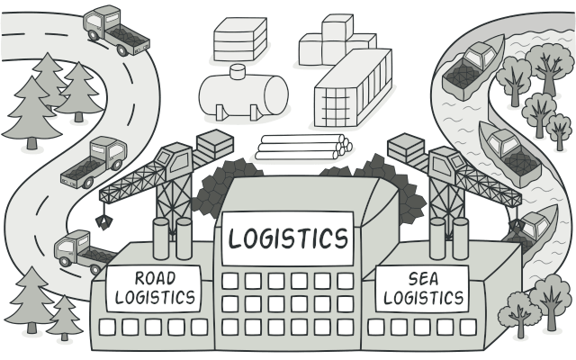
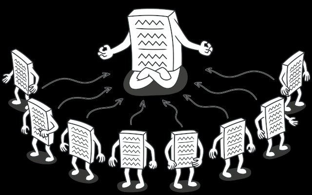
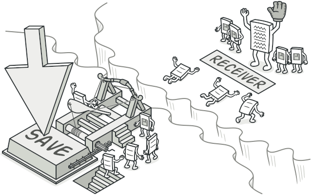

# Table of Contents

- [Table of Contents](#table-of-contents)
- [ChatGPT Q\&A](#chatgpt-qa)
- [Good References along with this Book](#good-references-along-with-this-book)
- [Self reflection on the book](#self-reflection-on-the-book)
  - [Intro](#intro)
  - [Intro To Design Patterns (chapter 1)](#intro-to-design-patterns-chapter-1)
  - [The Observer pattern (chapter 2)](#the-observer-pattern-chapter-2)
- [Notes from the book](#notes-from-the-book)
  - [OO Basics](#oo-basics)
  - [OO principles](#oo-principles)
  - [OO Patterns](#oo-patterns)
  - [Bullet points](#bullet-points)
- [Design Patterns](#design-patterns)
  - [Types of patterns](#types-of-patterns)
    - [1. Creational](#1-creational)
    - [2. Structural](#2-structural)
    - [3. Behavioral](#3-behavioral)
- [Patterns in details](#patterns-in-details)
  - [Strategy Pattern](#strategy-pattern)
    - [Picture from Refactoring Guru](#picture-from-refactoring-guru)
    - [Quick introduction:](#quick-introduction)
    - [Detailed introduction:](#detailed-introduction)
    - [Real world examples](#real-world-examples)
    - [Architecture from Chapter 1](#architecture-from-chapter-1)
  - [Observer Pattern](#observer-pattern)
    - [Picture from Refactoring Guru](#picture-from-refactoring-guru-1)
    - [Quick Introduction](#quick-introduction-1)
    - [Detailed Introduction](#detailed-introduction-1)
    - [Real world examples](#real-world-examples-1)
    - [Architecture from Chapter 2](#architecture-from-chapter-2)
  - [Decorator Pattern](#decorator-pattern)
    - [Picture from Refactoring Guru](#picture-from-refactoring-guru-2)
    - [Quick Introduction](#quick-introduction-2)
    - [Detailed Introduction](#detailed-introduction-2)
    - [Real world examples](#real-world-examples-2)
    - [Architecture from Chapter 3](#architecture-from-chapter-3)
  - [Factory Pattern](#factory-pattern)
    - [Picture from Refactoring Guru](#picture-from-refactoring-guru-3)
    - [Quick Introduction](#quick-introduction-3)
    - [Detailed Introduction](#detailed-introduction-3)
    - [Real world examples](#real-world-examples-3)
    - [Architecture from Chapter 4](#architecture-from-chapter-4)
  - [Singleton Pattern](#singleton-pattern)
    - [Picture from Refactoring Guru](#picture-from-refactoring-guru-4)
    - [Quick Introduction](#quick-introduction-4)
    - [Detailed Introduction](#detailed-introduction-4)
    - [Real world examples](#real-world-examples-4)
  - [Command Pattern](#command-pattern)
    - [Picture from Refactoring Guru](#picture-from-refactoring-guru-5)
    - [Quick Introduction](#quick-introduction-5)
    - [Detailed Introduction](#detailed-introduction-5)
    - [Real world examples](#real-world-examples-5)
    - [Architecture from Chapter 6](#architecture-from-chapter-6)
- [Interesting Articles to makes](#interesting-articles-to-makes)
- [Pattern of creating "patterns in details" sections](#pattern-of-creating-patterns-in-details-sections)
  - [{{Name of the pattern}} Pattern](#name-of-the-pattern-pattern)
    - [Picture from Refactoring Guru](#picture-from-refactoring-guru-6)
    - [Quick Introduction](#quick-introduction-6)
    - [Detailed Introduction](#detailed-introduction-6)
    - [Real world examples](#real-world-examples-6)
    - [Architecture from Chapter NO.](#architecture-from-chapter-no)

# ChatGPT Q&A
1. **Do you suggest reading "Head first design patterns" book for a web developer in 2023 that uses dotnet and angular as a fullstack technologies?**

    "Head First Design Patterns" is a well-regarded book for learning design patterns, and it can be valuable for web developers working with .NET and Angular or any other technology stack. Design patterns are not tied to specific programming languages or frameworks; they are general principles that can be applied across various contexts. Here are some reasons why you might consider reading this book:
    
    Foundation of Software Design: Understanding design patterns is essential for writing clean, maintainable, and scalable code. These principles can be applied to any technology stack, including .NET and Angular.
    
    Common Language: The book presents design patterns in a beginner-friendly and engaging way, making it accessible even if you are new to the concept.
    
    Applicability: While the book doesn't focus specifically on .NET or Angular, the patterns it covers are applicable to these technologies. You can apply the principles learned to improve your code quality and architecture in your full-stack development projects.
    
    Transferable Skills: Gaining a strong understanding of design patterns can make you a better developer, regardless of the specific technologies you work with. It's a skill set that can benefit you throughout your career.
    
    Problem-Solving: Design patterns are often solutions to common software development problems. Learning these patterns can help you identify and solve similar problems in your own projects.
    
    Interview Preparation: Knowledge of design patterns is often tested in technical interviews, so reading this book can be beneficial if you're considering job interviews in the future.

2. **When should I read it?**
    
    Deciding when to read "Head First Design Patterns" or any book on design patterns largely depends on your current level of expertise and your immediate needs as a web developer working with .NET and Angular. Here are some considerations to help you determine the right time to read it:

   1. Foundational Knowledge: If you are relatively new to software development or haven't had exposure to design patterns, reading the book early in your development journey can provide a solid foundation in software design principles.
    
   2. Intermediate Developer: If you have some experience as a web developer but haven't delved deeply into design patterns, it's a good time to pick up the book. Design patterns can significantly enhance your coding skills and the quality of your projects.
    
   3. Project Complexity: If you are working on increasingly complex projects or find that your codebase is becoming harder to maintain, it may be an indication that you should start learning design patterns. They can help you manage complexity effectively.
    
   4. Interview Preparation: If you plan to interview for new positions in the near future, it's a good idea to read the book before interviews. Design patterns are often discussed in technical interviews, and having a solid understanding can be advantageous.
    
   5. Continuous Learning: If you are committed to ongoing professional development, consider reading the book as part of your continuous learning process. Even experienced developers can benefit from revisiting design patterns to refresh their knowledge.
    
   6. Project Needs: If you encounter specific challenges in your current projects that design patterns can address, it might be a good time to learn about those patterns relevant to your immediate needs.
    
   7. Learning Style: Consider your personal learning style. If you find the book's approach engaging and effective for your learning style, it can be a valuable resource at any stage of your development career.
    
    Remember that learning design patterns is not an all-or-nothing endeavor. You can start with the basics and gradually explore more advanced patterns as you gain experience. Additionally, it's crucial to apply what you learn in real-world projects to solidify your understanding.
    
    In summary, there's no one-size-fits-all answer to when you should read "Head First Design Patterns." Assess your current knowledge, experience, and goals as a web developer, and use that information to determine the best time to dive into the book. Ultimately, the earlier you start learning about design patterns, the more they can benefit your career and the quality of your software projects.
3. is there any language that allows for multiple parents in a class
   
   Yes, there are programming languages that support multiple inheritance, allowing a class to inherit from more than one base class. Some languages that provide this feature include:

    C++: C++ supports multiple inheritance. A class in C++ can inherit from multiple base classes, and this feature is often used to create complex class hierarchies. However, multiple inheritance in C++ can lead to issues like the "diamond problem," which occurs when a class inherits from two classes that have a common base class. C++ provides mechanisms like virtual inheritance to address such issues.
    
    Python: Python also supports multiple inheritance. A class in Python can inherit from multiple base classes, and it uses a method resolution order (MRO) algorithm to determine the order in which base classes' methods are called when there are conflicts. Python's multiple inheritance is flexible but requires careful design to avoid ambiguity.

    But, generally no (only 7 of them do from thousands)

---
# Good References along with this Book
1. Watching this series on youtube discussing each pattern in this book. see: [Design Patterns in Object Oriented Programming](https://www.youtube.com/playlist?list=PLrhzvIcii6GNjpARdnO4ueTUAVR9eMBpc)
2. Reading from [Refactoring Guru's Design Patterns](https://refactoring.guru/design-patterns)
3. Interesting read about design patterns and anti-patterns (things that breaks a code), refactoring, uml. see: [Source Making](https://sourcemaking.com/)

---
# Self reflection on the book
My thoughts along with reading this book
## Intro
Intro is really amazing! one of the best intro I've ever read in a book.
It litterly explains everything that a reader would need e.g. who this book for, how to best learn, how to stimulate your brain to do its best (meta-cognition, adding pictures, conversational style).
they even talked about their method of writing the book and, how can you best grasp on the information

## Intro To Design Patterns (chapter 1)
- The implementation could be better with programming languages getting better e.g. in the old days we couldn't define couple of constructors but nowadays we could. but, the point here is to understand the concept and the mindset of a software architect.
- **What is the difference between Strategy pattern and dependency injection?**
  - The Strategy pattern is focused on encapsulating algorithms and allowing dynamic selection of different strategies at runtime, primarily to solve algorithmic problems.

    Dependency Injection, on the other hand, is focused on managing and decoupling dependencies by providing them from external sources, promoting modular and testable code.

    In some cases, Dependency Injection **can be used** to implement the Strategy pattern by injecting different strategies as dependencies into a client object, allowing it to switch between them dynamically.

## The Observer pattern (chapter 2)
- Observer pattern is a behavioral pattern too
- I have a feeling that all behavioral patterns are about composition and they all are flexible at run time
- Inheritance is "is-a" relationship and composition is "has-a" relationship. Always favor "has-a" over "is-a" (composition over inheritance)

---
# Notes from the book

## OO Basics
* Composition describes a class that refrences one or more objects of other classes in instance variables.
* Abstraction is a general idea rather than one relating to a particular object, person, or situation.
* Encapsulation is the restricting of direct access to some of an object's components.
* Polymorphism is the ability of a variable, function or object to take on multiple forms.
* Inheritance is the mechanism of basing an object or class upon another object or class.
* Loose-coupling in which components are weakly associated (have breakable relationship) with each other, and so, changes in one component least affect existence or performance of another component. Loose coupling is the opposite of tight coupling, Loosely coupled designs allow us to build flexible OO systems that can handle change because they minimize the interdependency between objects.
* Delegation refers generally to one entity passing something to another entity
  
## OO principles
1. Identify the aspects of your application that vary and seperate them from what stays the same
2. Program to an interface, not an implementation.
3. Favor composition over inheritance
4. Strive for loosely coupled designs between objects that interact.
5. Classes should be open for extension, but closed for modifications (as the design pattern guru said: code should be closed to change like the lotus flower in the evening, yet open to extension like the lotus flower in the morning)
6. Depend on abstractions. Do not depend on concrete classes.

## OO Patterns
* The Strategy Pattern: defines a family of algorithms, encapsulates each one, and makes them interchangeable. Strategy lets the algorithm vary independently from clients that use it. [ We used it in Testing Duck behaviors application in chapter 1]
* The Observer Pattern: defines a one-to-many dependency between objects so that when one object changes state, all of its dependents are notified and updated automatically.
* The Decorator Pattern: attaches additional responsibilities to an object dynamically. Decorators provide a flexible alternative to subclassing for extending functionality.
* The Factory Method: Define an interface for creating an object, but let subclasses decide which class to instantiate. Factory Method lets a class defer instantiation to the subclasses. 
* The Singleton Pattern: Ensure a class has one instance and provide a global point of access to it.
* The Command Pattern: Encapsulates a request as an object, thereby letting you parameterize clients with different requests, queue or log requests, and support undoable operations.

## Bullet points
1. * Knowing the OO basics does not make you a good OO designer.
   * Good OO designs are reusable, extensible and maintainable.
   * Patterns show you how to build systems with good OO design qualities.
   * Patterns are proven object-oriented experience.
   * Patterns don't give you code, they give you general solutions to design problems. You apply them to your specific application.
   * Patterns aren't invented, they are discovered.
   * Most patterns and principles address issues of change in software.
   * Most patterns allow some part of a system to vary independently of all other parts.
   * We often try to take what varies in a system and encapsulate it.
   * Patterns provide a shared language that can maximize the value of your communication with other developer.
2. * The Observer Pattern defines a one-to-many relationship   between objects.
   * Subjects, or as we also know them, Observables, update Observers using a common interface.
   * Observers are loosely coupled in that the Observable knows nothing about them, Other than that they implement the Observer interface.
   * You can push or pull data from the Observable when using the pattern (pull is considered more "correct").
   * Don't depend on a specific order of notification for your Observers.
   * Java has several implementations of the Observer Pattern, including the general purpose java.util.Observable.
   * Watch out for issues with the java.util.Observable implementation.
   * Don't be afraid to create your own Observable implementation if needed.
   * Swing makes heavy use of the Observer Pattern, as do many GUI frameworks does.
   * You'll also find the pattern in many other places, including JavaBeans and RMI.
3. * Inheritance is one form of extension, but not necessarily the best way to achieve flexibility in our designs.
   * In our designs we should allow behavior to be extended without the need to modify existing code.
   * Composition and delegation can often be used to add new behaviors at runtime.
   * The Decorator Pattern provides an alternative to subclassing for extending behavior.
   * The Decorator Pattern involves a set of decorator classes that are used to wrap concrete components.
   * Decorator classes mirror the type of the components they decorate. (in fact, they are the same type as the components they decorate, either through inheritance or interface implementation.)
   * Decorators change the behavior of their components by adding new functionality before and/or after (or even in place of) method calls to the component.
   * You can wrap a component with any number of decorators.
   * Decorators are typically transparent to the client of the component; that is, unless the client is relying on the component's concrete type.
   * Decorators can result in many small objects in our design, and overuse can be complex.
4. * All factories encapsulate object creation.
   * Simple Factory, while not a bonafide design pattern, is a simple way to decouple your clients from concrete classes.
   * Factory Method relies on inheritance: object creation is delegated to subclasses which implement the factory method to create objects.
   * Abstract Factory relies on object composition: object creation is implemented in methods exposed in the factory interface.
   * All factory patterns promote loose coupling by reducing the dependency of your application on concrete classes.
   * The intent of Factory Method is to allow a class to defer instantiation to its subclasses
   * The intent of Abstract Factory is to create families of related objects without having to depend on their concrete classes
   * The Dependency Inversion Principle guides us to avoid dependencies on concrete types and to strive for abstraction
   * Factories are a powerful technique for coding to abstractions, not concrete classes.
5. * The Singleton Pattern ensures you have at most one instance of a class in your application.
   * The Singleton Pattern also provides a global access point to that instance.
   * Java's implementation of the Singleton Pattern makes use of a private constructor, a static method combined with a static variable.
   * Examine your performance and resource constraints and carefully choose an appropriate Singleton implementation for multithreaded applications (and we should consider all applications multithreaded!)
   * Beware of the double-checked locking implementation; it is not thread-safe in versions before Java2, version 5.
   * Be careful if you are using multiple class loaders; this could defeat the Singleton implementation and result in multiple instances.
   * If you are using a JVM earlier than 1.2, you'll need to create a registry of Singletons to defeat the garbage collector.
6. * The Command Pattern decouples an object, making a request from the one that knows how to perform it.
   * A command object is at the center of this decoupling and encapsulates a receiver with an action (or set of actions).
   * An invoker makes a request of a Command object by calling its execute() method, which invokes those actions on the receiver.
   * Invokers can be parameterized with Commands, even dynamically at runtime.
   * Commands may support undo by implementing an undo method that restores the object to its previous state before the execute() method was last called.
   * Macro Commands are a simple extension of Command that allow multiple commands to be invoked. Likewise, Macro Commands can easily support undo().
   * In practice, it is not uncommon for "smart" Command objects to implement the request themselves rather than delegating to a receiver.
   * Commands may also be used to implement logging and transactional systems.

---
# Design Patterns
There are alot of design patterns out there in the world
1. [Original foundational patterns (GoF patterns)](http://cmoulliard.github.io/gof%20patterns/design-patterns-quick-reference)
2. Sun's J2EE patterns
3. JSP patterns
4. [Architectural patterns](http://www.tellmehow.co/top-10-programming-architectural-patterns/)
5. Game design patterns

## Types of patterns
### 1. Creational

   **Purpose**: Creational design patterns focus on the process of object creation. They provide mechanisms for creating objects in a way that is flexible, efficient, and independent of the system's architecture.

   **Examples**: Some common creational design patterns include the Singleton, Factory Method, Abstract Factory, Builder, and Prototype patterns.

   **Use Cases**:

   1. Singleton: Ensures that a class has only one instance and provides a global point of access to that instance.

   2. Factory Method: Defines an interface for creating an object but allows subclasses to alter the type of objects that will be created.

   3. Abstract Factory: Provides an interface for creating families of related or dependent objects without specifying their concrete classes.

   4. Builder: Separates the construction of a complex object from its representation, allowing the same construction process to create different representations.

   5. Prototype: Creates new objects by copying an existing object, known as the prototype, and customizing it.

### 2. Structural

   **Purpose**: Structural design patterns deal with the composition of classes or objects. They help define how objects and classes can be structured to form larger, more complex structures while keeping the system flexible and efficient.

   **Examples**: Some common structural design patterns include the Adapter, Bridge, Composite, Decorator, Facade, Flyweight, and Proxy patterns.
    
   **Use Cases**:
   1. Adapter: Allows incompatible interfaces to work together by providing a wrapper around one of the interfaces.
   
   2. Bridge: Separates an object's abstraction from its implementation, allowing both to vary independently.
   
   3. Composite: Composes objects into tree structures to represent part-whole hierarchies. Clients can treat individual objects and compositions of objects uniformly.

   4. Decorator: Attaches additional responsibilities to objects dynamically, providing a flexible alternative to subclassing for extending functionality.
   
   5. Facade: Provides a simplified, high-level interface to a complex subsystem, making it easier to use.
   
   6. Flyweight: Minimizes memory usage or computational expenses by sharing as much as possible with similar objects.
   
   7. Proxy: Provides a surrogate or placeholder for another object to control access to it.
   
### 3. Behavioral

**Purpose**: Behavioral design patterns focus on how objects interact and communicate with each other. They define the patterns of communication and collaboration between objects to manage responsibilities and behaviors effectively.

**Examples**: Some common behavioral design patterns include the Observer, Strategy, Command, Chain of Responsibility, Interpreter, State, and Visitor patterns.

**Use Cases**:

1. Observer: Defines a one-to-many dependency between objects so that when one object changes state, all its dependents are notified and updated automatically.
   
2. Strategy: Defines a family of algorithms, encapsulates each one, and makes them interchangeable. Clients can choose the appropriate algorithm to use.
   
3. Command: Encapsulates a request as an object, thereby allowing for parameterization of clients with queues, requests, and operations.
   
4. Chain of Responsibility: Passes a request along a chain of handlers. Each handler decides whether to process the request or pass it to the next handler in the chain.
   
5. Interpreter: Defines a grammar for interpreting a language and provides an interpreter for evaluating expressions in that language.
   
6. State: Allows an object to alter its behavior when its internal state changes. The object will appear to change its class.
   
7. Visitor: Represents an operation to be performed on elements of an object structure. It lets you define a new operation without changing the classes of the elements.

---

In summary, creational design patterns deal with object creation, structural design patterns deal with class and object composition, and behavioral design patterns focus on object interactions and responsibilities. These patterns serve different purposes in software design and can be combined as needed to solve complex problems and create maintainable and scalable software.

---
# Patterns in details

This section discusses the deep details of a pattern

## Strategy Pattern

### Picture from [Refactoring Guru](https://refactoring.guru/)

### Quick introduction: 
Strategy is behavioral design pattern. It is used to switch between family of algorithms.

### Detailed introduction:

The Strategy Pattern is a behavioral design pattern in C# (and other object-oriented programming languages) that allows you to define a family of interchangeable algorithms, encapsulate each of them, and make them interchangeable. This pattern is particularly useful when you have multiple ways to perform a specific task, and you want to select the appropriate strategy at runtime.

The Strategy Pattern allows you to decouple the client code from the specific implementations of algorithms. It promotes flexibility and makes it easy to add new strategies without modifying existing code. It's commonly used in scenarios where you have multiple ways to accomplish a task, such as sorting algorithms, payment processing, or validation methods, and you want to choose the appropriate one dynamically.

### Real world examples
1. This guy created a system for a drinks store in which pricing is different depending on holidays and happy hours. see: [BillingStrategy](https://github.com/hamzaak/designpatterns/blob/master/strategy/Program.cs)
2. [Sorting Strategies](http://www.cs.sjsu.edu/~pearce/modules/patterns/behavioral/strategy/lists.htm)
3. Also, see Chapter 1 - intro to design patterns

### Architecture from Chapter 1

## Observer Pattern

### Picture from [Refactoring Guru](https://refactoring.guru/)

### Quick Introduction
Observer is behavioral design patterns. It is used to share state.

### Detailed Introduction
The Observer Pattern is a behavioral design pattern. It defines a one-to-many dependency between objects so that when one object changes state, all its dependents are notified and updated automatically.

### Real world examples
1. Event handling mechanisms in graphical user interfaces (DOM Elements)
2. Stock market data updates
3. Sharing state between the front end application
4. Any monitoring system
5. Also, see Chapter 2 - The observer pattern

### Architecture from Chapter 2

## Decorator Pattern

### Picture from [Refactoring Guru](https://refactoring.guru/)

### Quick Introduction
Decorator is a structural design pattern. It is used to add responsibilities to objects dynamically without altering their class or extending it.

### Detailed Introduction
The Decorator Pattern is a structural design pattern in software development that allows you to add behavior or responsibilities to objects dynamically without altering their class. This pattern is part of the Gang of Four (GoF) design patterns and is particularly useful when you need to extend the functionality of classes in a flexible and maintainable way.

The main idea behind the Decorator Pattern is to create a set of decorator classes that are used to wrap concrete components (objects). These decorators implement the same interface as the components they decorate, and they can add new behavior or modify the behavior of the wrapped component without changing its code.

Here's a basic structure of the Decorator Pattern:

1. Component: This is an interface or abstract class that defines the common interface for both concrete components and decorators. It typically includes the methods that the decorators and concrete components will share.

2. Concrete Component: This is the base class that implements the Component interface. It represents the core functionality that you want to enhance or extend.

3. Decorator: This is an abstract class that also implements the Component interface. Decorators have a reference to a Component and can add additional behavior or modify the behavior of the component. They serve as a base for concrete decorators.

4. Concrete Decorator: These are the actual decorator classes that extend the Decorator class. They provide specific behavior modifications or additions.

The Decorator Pattern allows you to create a chain of decorators, each adding its functionality to the component. This provides a flexible and incremental way to assemble objects with varying sets of features.

### Real world examples
1. Java I/O packages
2. Clothes on a human body
3. Toppings on icecream
4. Coffee with condiments

### Architecture from Chapter 3

## Factory Pattern

### Picture from [Refactoring Guru](https://refactoring.guru/)

### Quick Introduction
Factory is a creational design pattern. It is used to let subclasses alter the methods with inheritance.

### Detailed Introduction
The Factory Pattern is a creational design pattern in software development that provides an interface for creating objects but allows subclasses to alter the type of objects that will be created. It falls under the Gang of Four (GoF) design patterns and is commonly used to abstract the process of object creation. The Factory Pattern promotes loose coupling and adheres to the "Dependency Inversion Principle" by ensuring that client code depends on abstractions rather than concrete implementations.

The Factory Pattern typically involves the following components:

1. Factory Interface (or Abstract Factory): This is an interface (or abstract class) that declares a method for creating objects. This method is often called a "factory method." Subclasses of the Factory Interface provide concrete implementations of the factory method.

2. Concrete Factories: These are classes that implement the Factory Interface. Each concrete factory is responsible for creating objects of a specific type or family of related types.

3. Product: This represents the object being created. It's the abstract class or interface that defines the common interface for all products created by the factories.

4. Concrete Products: These are the actual implementations of the Product interface. Each concrete factory produces objects of a specific Concrete Product type.

The Factory Pattern allows client code to create objects without needing to know the specific class of objects being created. Instead, the client code interacts with the Factory Interface, which provides a level of abstraction. This makes it easier to change or extend the system because you can introduce new Concrete Factories and Products without modifying the client code.

### Real world examples
1. Any factory (car, pizza, etc..)
2. Bank accounts (personal, business etc..)

### Architecture from Chapter 4

## Singleton Pattern

### Picture from [Refactoring Guru](https://refactoring.guru/)

### Quick Introduction
Singleton pattern is a creational pattern. It is used to provide one and only one instance of the object.

### Detailed Introduction
The Singleton Pattern is a design pattern in software engineering that ensures a class has only one instance and provides a global point of access to that instance. It is one of the creational design patterns and is commonly used when exactly one object needs to coordinate actions across the system, such as a configuration manager, a database connection pool, or a logging service.

The key characteristics of the Singleton Pattern include:

1. Single Instance: It ensures that there is only one instance of the class.

2. Global Access: It provides a way to access the single instance globally, typically through a well-defined method or property.

3. Lazy Initialization: The instance is created only when it's first requested, rather than being created at the time the class is loaded or initialized.

### Real world examples
1. Logging services
2. Device drivers
3. Caching mechanism

## Command Pattern

### Picture from [Refactoring Guru](https://refactoring.guru/)

### Quick Introduction
Command is a behavioral pattern. It is used to decouple the sender and receiver of a request.

### Detailed Introduction
The Command Pattern is a behavioral design pattern used in software engineering. It falls under the Gang of Four (GoF) design patterns and is used to encapsulate a request as an object, thereby allowing for parameterization of clients with queues, requests, and operations. This pattern decouples the sender of a request from the receiver, allowing for greater flexibility and extensibility in how requests are handled.

Here are the main components of the Command Pattern:

1. Command: This is an interface or abstract class that defines the common methods that concrete command classes must implement. Typically, this interface includes an execute() method, which encapsulates the action to be taken when the command is executed.

2. Concrete Command: These are the concrete implementations of the Command interface. Each concrete command class represents a specific action or operation and contains the logic for executing that action. These commands store information about the receiver (the object that will perform the action) and the parameters needed to carry out the action.

3. Invoker: The invoker is responsible for executing commands. It does not know the specifics of how each command works but simply triggers the execution of a command when needed. The invoker may maintain a queue of commands, undo/redo functionality, or other mechanisms for managing commands.

4. Receiver: The receiver is the object that performs the actual work associated with a command. It has knowledge of how to carry out the requested action. The receiver is specified when creating a concrete command.

5. Client: The client is responsible for creating and configuring commands, associating them with receivers, and setting up the invoker. It can build complex sequences of commands and pass them to the invoker for execution.

The Command Pattern is useful in scenarios where you want to decouple the sender and receiver of a request, support undo/redo functionality, create composite commands, or implement features like queuing and logging of commands. It promotes the separation of concerns and makes it easier to extend and maintain the codebase by encapsulating actions and their parameters into objects.

### Real world examples
1. Any Controller
2. API request
3. Queue
4. Database transactions
5. Text editor (Excel, Notepad++, VSCode)

### Architecture from Chapter 6

---
# Interesting Articles to makes
1. Patterns specific articles
2. Software OO Design principles in Arabic language
----

# Pattern of creating "patterns in details" sections

## {{Name of the pattern}} Pattern

### Picture from [Refactoring Guru](https://refactoring.guru/)

### Quick Introduction

### Detailed Introduction

### Real world examples

### Architecture from Chapter NO.

---
> Reached page: Keep going!