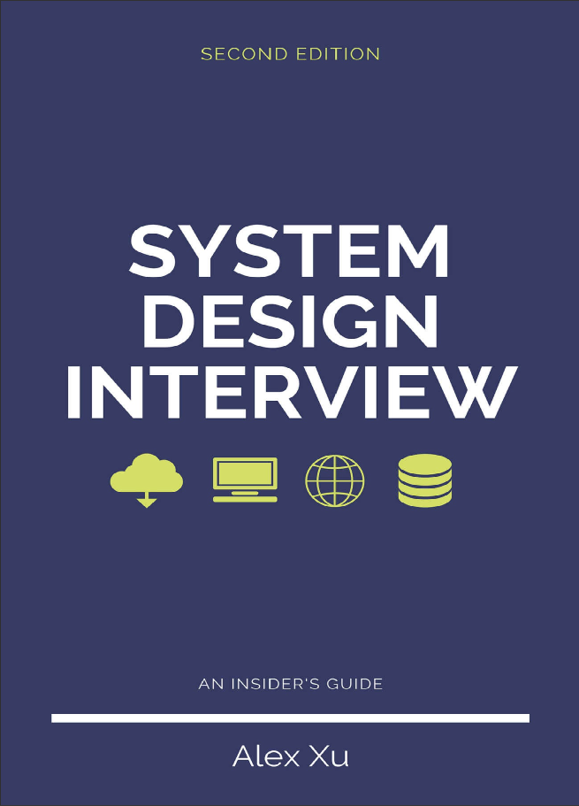
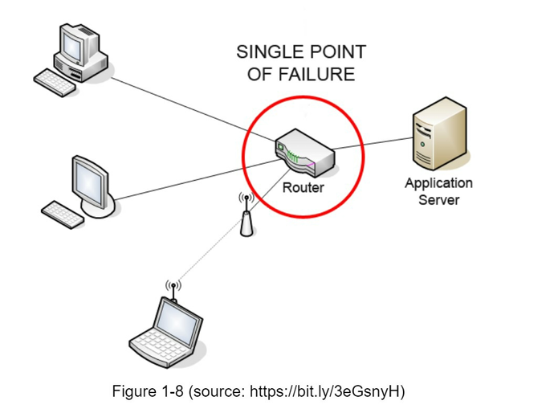
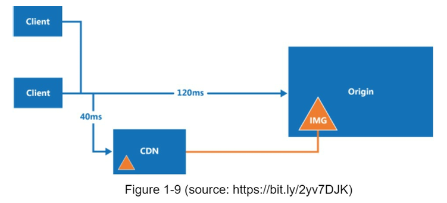
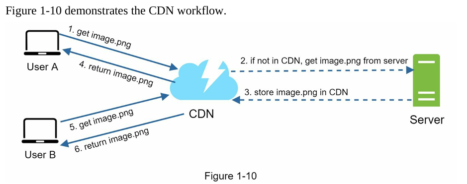

# Info
- Book: **System Design Interview**
- Started Reading: **07/09/2026**
- Book cover: 

# Table Of Contents
- [Info](#info)
- [Table Of Contents](#table-of-contents)
- [Single Point of Failure (SPOF)](#single-point-of-failure-spof)
- [Cache Eviction Policies](#cache-eviction-policies)
  - [Thundering Herd Problem](#thundering-herd-problem)
  - [Interview Practice Question](#interview-practice-question)
  - [Caching Patterns](#caching-patterns)
    - [Cache-Aside](#cache-aside)
    - [Write-Through](#write-through)
    - [Write-Behind](#write-behind)
    - [Interview Practice Question](#interview-practice-question-1)
- [Content delivery network (CDN)](#content-delivery-network-cdn)
  - [CDN Considerations](#cdn-considerations)

# Single Point of Failure (SPOF)
**Definition**: A Single Point of Failure is any component in your system that, if it fails, will cause the entire system to go down or become completely unusable.

In a distributed system, we design for redundancy. If you have only one instance of something, that's a SPOF.

Common Examples of SPOFs:
- One web server (no load balancer, no replicas).
- One database instance (no read replicas or failover).
- One cache server (e.g., a single Redis node). If it crashes, all traffic hits the DB and crashes it too.
- One load balancer (if it's not clustered).
- One network switch or power supply in a data center.

The solution to Eliminate SPOFs is redundancy and failover:

| Strategy                   | Description                                                                                                              |
| -------------------------- | ------------------------------------------------------------------------------------------------------------------------ |
| Horizontal Scaling         | Add multiple instances behind a load balancer.                                                                           |
| Active-Passive Failover    | Have a standby replica that takes over if the primary fails (e.g., database replication with failover).                  |
| Active-Active Clustering   | Have multiple nodes all handling traffic simultaneously (e.g., Cassandra, Redis Cluster).                                |
| Multi-Region/AZ Deployment | Deploy across multiple Availability Zones (AZs) within a cloud provider so a single datacenter failure doesn't kill you. |



> Interview Tip: Whenever you design a system, the interviewer will ask: "What happens if this component dies?" Your answer should always include eliminating SPOFs by making each tier (web, app, cache, DB) highly available.

# Cache Eviction Policies
**Definition**: A cache has limited memory. When it becomes full, the Eviction Policy decides which data to remove to make room for new data.

This is critical because a bad eviction policy leads to a low cache hit ratio, causing more reads to go to the database (which defeats the purpose of caching).

The Most Common Eviction Policies:

| Policy                          | How it Works                                                                                                                             | Best For                                                                            | Example                                            |
| ------------------------------- | ---------------------------------------------------------------------------------------------------------------------------------------- | ----------------------------------------------------------------------------------- | -------------------------------------------------- |
| **LRU** (Least Recently Used)   | Evicts the item that hasn't been accessed for the longest time. Assumes that recently accessed data is likely to be accessed again soon. | General-purpose workloads. The most popular default.                                | Redis (default), Memcached, database buffer pools. |
| **LFU** (Least Frequently Used) | Evicts the item with the lowest access count (least popular). Keeps the "hottest" items.                                                 | Where popularity matters more than recency (e.g., trending videos, news headlines). | Redis (with extension), Apache Kafka caching.      |
| **FIFO** (First In, First Out)  | Evicts the item that was added to the cache earliest, regardless of how often it's used.                                                 | Simplicity. Not very effective for hit ratios.                                      | Rarely used in production; mostly academic.        |
| **TTL** (Time-To-Live)          | Not exactly an eviction policy, but data is automatically removed after a set time. Used with LRU/LFU.                                   | Stale data (e.g., session tokens, price updates).                                   | Redis `EXPIRE` command.                            |
| Random                          | Evicts a randomly chosen item.                                                                                                           | When access patterns are uniform and you need minimal overhead.                     | Used as a fallback in some caches.                 |

LRU vs LFU – Which to choose?
- **LRU** is the **safest default** for most web applications (user sessions, API responses).
- **LFU** is better for **recommendation engines** or **content delivery** where a small set of items get 80% of traffic (e.g., a viral TikTok video). However, LFU can suffer from "cache pollution" if an item was popular once but now isn't.

## Thundering Herd Problem
When your cache evicts an entry, and **thousands of requests** simultaneously try to read the same key, they all miss the cache and hit the database at the same time. This can crash your DB.

**Solution**: Use **Mutex** (Locking) or **Request Coalescing** – only one request is allowed to fetch from the DB and repopulate the cache, while others wait for the result.

## Interview Practice Question
Imagine the interviewer asks:
> "You have a Redis cache with 10GB of memory. You use LRU eviction. Suddenly, your cache hit ratio drops from 90% to 40%. Why?"

Your Answer should explore:
1. **Working set changed** – the data your users need has shifted (e.g., a new campaign launched), and LRU is evicting useful items.
2. **Scanning attack** – a bot is querying random keys, polluting the cache and evicting your hot data.
3. **You might need LFU** for this specific workload, or **increase cache size**, or use **caching patterns** like Cache-Aside with longer TTLs.

## Caching Patterns
### Cache-Aside
This is the most common strategy used in the real world.

How it works:
1. **Read**: Application checks the cache first.
   - Cache Hit: Returns data.
   - Cache Miss: Fetches from DB, writes it into the cache, then returns it.
2. **Write**: Application writes directly to the database. Then, it invalidates (deletes) the old cache entry. The next read will reload the fresh data.

```
Read:  App → Cache (miss) → DB (fetch) → Cache (set) → App
Write: App → DB (update) → Cache (delete)
```

| Pros                                              | Cons                                                     |
| ------------------------------------------------- | -------------------------------------------------------- |
| Simple and easy to implement.                     | Cache stampede possible (many simultaneous misses).      |
| Fault-tolerant: If cache dies, DB still works.    | Stale data possible between the write and the next read. |
| Memory-efficient (only requested data is cached). | Higher latency on the first request for a new key.       |

> Interview Tip: This is your default answer for most systems unless the interviewer gives you a specific constraint.

### Write-Through
The cache acts as the primary source of truth, working synchronously with the database.

How it works:
1. **Write**: Application writes to the cache. The cache immediately writes (in the same request) to the database, then confirms to the app.
2. **Read**: Data is always fetched from the cache (which always has the latest data because every write goes through it).

```
Write: App → Cache (update) → DB (update) → success back to App
Read:  App → Cache (hit always) → App
```

| Pros                                                    | Cons                                                                                                 |
| ------------------------------------------------------- | ---------------------------------------------------------------------------------------------------- |
| No stale reads: Cache is always consistent with the DB. | Higher write latency: The write isn't complete until both cache and DB are written.                  |
| Simpler reads: Data is always in cache.                 | Cache churn: Many writes may fill the cache with data never read again.                              |
| Reduces the chance of DB overload.                      | Not fault-tolerant: If cache dies, you need a fallback mechanism (often combined with Write-Behind). |

> Interview Tip: Use this when you need strong consistency (e.g., banking, inventory).

### Write-Behind
The cache acknowledges the write immediately and lazily syncs to the database.

How it works:
1. **Write**: Application writes to the cache. The cache acknowledges the write, adds it to a queue/buffer, and then asynchronously writes to the DB in batches.
2. **Read**: Always from cache (similar to Write-Through).

```
Write: App → Cache (update) → "Done!" (DB update happens asynchronously later)
Read:  App → Cache → App
```

| Pros                                                    | Cons                                                                                 |
| ------------------------------------------------------- | ------------------------------------------------------------------------------------ |
| Very low write latency (fastest of all).                | Risk of data loss: If the cache server crashes before flushing to DB, you lose data. |
| High write throughput (batch writes reduce DB load).    | Complexity: Hard to implement reliably.                                              |
| Great for heavy write workloads (logs, IoT, analytics). | Stale data risk until the async write happens.                                       |

> Interview Tip: Use this when you prioritize availability and speed over durability (e.g., social media likes, view counters).

The biggest challenge in all strategies is cache invalidation. Here's a classic rule:
> "There are only two hard things in Computer Science: cache invalidation and naming things." – Phil Karlton

Common pitfalls:
- **Stale Data**: You updated the DB (Cache-Aside) but forgot to delete the cache. The old value stays.
- **Race Conditions**: Two writes happen simultaneously. The cache stores the order incorrectly.
- **Thundering Herd**: A cache expires, and thousands of requests hit the DB at once.

Solutions:
- **TTL (Time-To-Live)** – Always set an expiration time as a safety net.
- **Mutex/Coalescing** – Only one request fetches from DB, the rest wait.
- **Versioning** – Each cache entry has a version, and the app checks if the version matches.

### Interview Practice Question
**Interviewer**: "You are designing Amazon's product page. It gets 10,000 reads/second. How do you cache it?"

**Your Answer**:
- Use **Cache-Aside** because product data doesn't change often.
- Pre-warm the cache during deployment.
- Set an LRU eviction policy with TTL = 2 minutes.
- On product update, delete the cache entry.
- Use a mutex to prevent Thundering Herd when a product goes viral.

# Content delivery network (CDN)
A CDN is a network of geographically dispersed servers used to deliver static content. CDN
servers cache static content like images, videos, CSS, JavaScript files, etc.

Here is how CDN works at the high-level: when a user visits a website, a CDN server closest
to the user will deliver static content. Intuitively, the further users are from CDN servers, the
slower the website loads. For example, if CDN servers are in San Francisco, users in Los
Angeles will get content faster than users in Europe. Figure 1-9 is a great example that shows
how CDN improves load time.





## CDN Considerations
- **Cost** – CDNs charge for data transfer; avoid caching rarely used assets to save money.
- **Cache expiry (TTL)** – Choose TTL carefully: too long risks stale content; too short increases origin load.
- **CDN fallback** – Plan for outages: clients should detect CDN failure and fetch assets from the origin.
- **Invalidation** – Update content early via CDN purge APIs or, preferably, URL versioning (e.g., image.png?v=2).