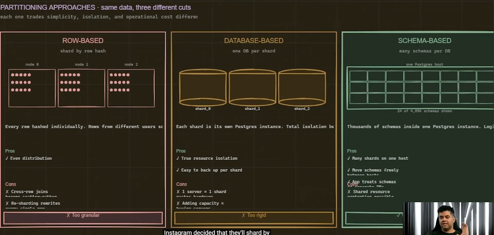

# Table of Contents
- [Table of Contents](#table-of-contents)
- [References](#references)
- [How Instagram Scaled Postgress to 2 Billion users](#how-instagram-scaled-postgress-to-2-billion-users)
  - [PgBouncer and connection pools to Postgres](#pgbouncer-and-connection-pools-to-postgres)
  - [Sharding by UserId](#sharding-by-userid)
  - [Partial and Functional Indexes](#partial-and-functional-indexes)
  - [Logical Replication](#logical-replication)
  - [Instagram in 2026](#instagram-in-2026)
  - [Takeaways](#takeaways)


# References
1. [How Instagram Scaled Postgress to 2 Billion users](https://youtu.be/YLoYcwnqVzM)

# How Instagram Scaled Postgress to 2 Billion users
Instagram stayed with postgres altho it reached 27M users before being acquired by facebook

They kept scaling vertically until problems

Presenter says that most people think about NoSQL dbs when they want to scale e.g. `casandra` `mongo` and so on.

but Instagram made tradeoffs and decided to go with PostgresSQL and sharding (which is not often used as he describes)

they sharded by `userId`

## PgBouncer and connection pools to Postgres

One of the problems were many connection pools, and for that they used `pgbouncer` to multiplex the connections

```
WITHOUT PGBOUNCER (High Overhead):
[ App Instance 1 ] ──\
[ App Instance 2 ] ───┼──> (100s of active TCP connections) ──> [ PostgreSQL ]
[ App Instance 3 ] ──/                                           (Forks 100s of backend processes)
                                                                 RAM/CPU depleted by overhead
```

```
WITH PGBOUNCER (Optimized Connection Management):
[ App Instance 1 ] ──\
[ App Instance 2 ] ───┼──> [ PgBouncer Proxy ] ── (10–20 pooled connections) ──> [ PostgreSQL ]
[ App Instance 3 ] ──/     (Handles 1000s of connections)                        (Low process count)
```

Architectural Trade-offs & Recommendations
1. **When to use**: Any PostgreSQL deployment facing >100 concurrent client connections, auto-scaling API clusters, serverless environments, or high-throughput transaction systems.
2. **When NOT to use**: Small applications with static connection requirements (<20 connections) where the added infrastructure complexity yields negligible performance gains.
3. **High Availability**: Since PgBouncer becomes a single point of failure (SPOF) if deployed as a single instance, pair it with HA tools (e.g., HAProxy in front of multiple PgBouncer instances, or running PgBouncer as a sidecar container in Kubernetes pods).

## Sharding by UserId
Instagram decided to stick with PostgresSQL and shard by `userId`



They sharded by nodes and brought up a mapping table which points `partitionId` to a specific `nodeId`

now each time one node gets nearly full by capacity, they bring up a new node, move data and update mapping table

now the problem is that UUID may collide, so they built their own ids with a postgres function on each node, pattern: "`timestamp (41bits) - shard (13bits) - seq (10bit)`"

```
┌────────────────────────────────────────────────────────────────────────┐
│                        64-BIT INSTAGRAM SNOWFLAKE ID                   │
├───────────────────────────────┬────────────────────────┬───────────────┤
│ 41 Bits: Timestamp (Epoch ms) │ 13 Bits: Logical Shard │ 10 Bits: Auto │
└───────────────────────────────┴────────────────────────┴───────────────┘
```

which the approach is now used with many applications

## Partial and Functional Indexes
In high-throughput databases, B-tree indexes face a core architectural trade-off: Index Maintenance Overhead vs. Query Performance. Standard indexes copy data pointers for every row in a table. As tables grow to hundreds of millions of records, standard B-Trees bloat memory buffers (Buffer Pool), degrade INSERT/UPDATE write throughput, and increase disk I/O.

PostgreSQL solves this with Partial Indexes and Functional (Expression-based) Indexes. Combining these yields specialized index structures that index only specific rows, derived from computed expressions.

A Partial Index includes a WHERE clause during creation. PostgreSQL only builds B-tree nodes for rows that satisfy the predicate.

```SQL
-- Standard Index: Indexes 10,000,000 rows (Large footprint, high update cost)
CREATE INDEX idx_orders_status ON orders (status);

-- Partial Index: Indexes only the 50,000 unfulfilled orders (99.5% smaller)
CREATE INDEX idx_orders_unfulfilled ON orders (created_at) 
WHERE status IN ('pending', 'processing');
```

A Functional Index indexes the result of a function or expression computed over a row, rather than raw column values.

```SQL
-- Fast case-insensitive lookup without changing database collation
CREATE INDEX idx_users_lower_email ON users (LOWER(email));
```

When combined, you index computed values for a filtered subset of rows:

```SQL
CREATE INDEX idx_active_user_domain ON users (LOWER(SUBSTRING(email FROM '@(.*)$')))
WHERE status = 'active' AND is_verified = true;
```

```
[ Full Table: 100,000,000 Rows ]
                         │
        ┌────────────────┴────────────────┐
        │  Filter: WHERE status='active'  │  <-- Partial Gate
        └────────────────┬────────────────┘
                         │ 2,000,000 Rows
                         ▼
      ┌─────────────────────────────────────┐
      │  Compute: LOWER(SUBSTRING(email..)) │  <-- Functional Transform
      └──────────────────┬──────────────────┘
                         │
                         ▼
        [ Compact B-Tree Index: ~25 MB ]
```

During Instagram's early scaling phase on PostgreSQL, they famously implemented a custom ID generation strategy (Instagram Snowflakes) to handle billions of posts, likes, and photos across horizontally sharded database instances without relying on centralized coordination.

Filtering media based on legacy metadata, embedded bitwise flags, or exact dates across hundreds of millions of media items meant PostgreSQL either had to perform costly full-table bitwise evaluations or maintain huge, bloated indexes across historical static data.

And they used partial and functional indexing

For the PostgreSQL query planner to pick up a partial index, the query's WHERE clause must mathematically imply the index's WHERE predicate.

```SQL
-- INDEX DEFINITION
CREATE INDEX idx_orders_pending ON orders (customer_id) 
WHERE status = 'pending';

-- ❌ QUERY Planner Will IGNORE Index (Missing predicate match):
SELECT * FROM orders WHERE customer_id = 45012;

-- ✅ QUERY Planner WILL USE Index:
SELECT * FROM orders WHERE customer_id = 45012 AND status = 'pending';
```

## Logical Replication
Logical replication is a method of streaming data changes from a primary PostgreSQL database to one or more replicas based on the logical representation of data modifications (DML: `INSERT`, `UPDATE`, `DELETE`), rather than relying on exact, physical block-level copies of the disk.

In PostgreSQL, logical replication operates via a Publish-Subscribe model. A Publisher defines a set of tables to stream, and a Subscriber pulls those changes and applies them downstream.

Logical replication decodes PostgreSQL’s Write-Ahead Log (WAL) into individual row-level changes without transferring physical page structures.

```
+-------------------------------------------------------------------------------+
|                               PUBLISHER DATABASE                              |
|                                                                               |
|  [ App / Writes ]                                                             |
|        |                                                                      |
|        v                                                                      |
|  [ Table: Users ] ---> [ Write-Ahead Log (WAL) ]                              |
|                                |                                              |
|                                v                                              |
|                      [ Logical Decoding Engine ] (pgoutput plugin)            |
|                                |                                              |
|                                v                                              |
|                      [ Publication Stream ]                                   |
+--------------------------------|----------------------------------------------+
                                 |
                        TCP Connection (Logical Stream)
                                 |
+--------------------------------v----------------------------------------------+
|                               SUBSCRIBER DATABASE                             |
|                                                                               |
|                      [ Subscription Worker ]                                  |
|                                |                                              |
|                                v                                              |
|                      [ Apply Process ] ---> [ Table: Analytics_Users ]        |
+-------------------------------------------------------------------------------+
```

## Instagram in 2026
Meta integrated instagram into `TAO` graph workload distributed system after acquisition 

## Takeaways
1. Instagram didn't shard until 27M
2. Don't hardcode the number of shards in your application, create mapper table
3. Snowflake-style IDs from day one
4. pgbouncer is important to be used
5. New infrastructure is only when there is a hard unsolveable problem
6. Instagram showed us that postgress and relational databases can be scaled