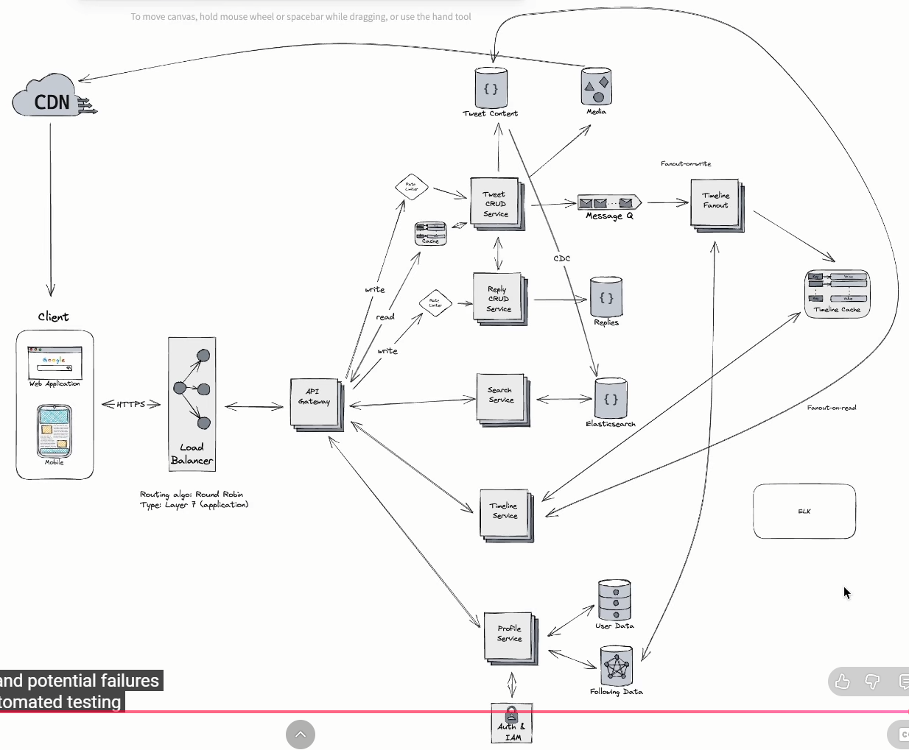

# References
1. [System Design Interview Walkthrough: Design Twitter](https://www.youtube.com/watch?v=Nfa-uUHuFHg&list=PL5q3E8eRUieWtYLmRU3z94-vGRcwKr9tM&index=6)
   
   Diagram drawn in the video:
   

# Load Balancer
## Routing Algorithm
- Round Robin: rotates requests evenly across all servers
- Least Connections: sends requests to the server with fewest connections
- IP Hash: routes based on IP, ensuring the same IP gets the same server for each requests

## Layer
- Layer 4: TCP
- Layer7: Application (HTTP/HTTPS)

# Blob Storage (S3)
Blob storage stores each uploaded file as an object made of bytes plus metadata. Internally, the blob service may split those bytes into blocks or chunks and distribute them across many disks and servers, but it presents the application with one logical file

Amazon was not the first to invent storing files as objects, but Amazon S3 was one of the first widely available, developer-friendly cloud object-storage services and helped make the model mainstream

Before S3, the question was `“Which server and disk contain this file?”`

After S3, the question is: `“Store this object under this key.”`

# Change Data Capture (CDC) - Elastic Search
It means capturing inserts, updates, and deletes from a source database and applying them to Elasticsearch so Elasticsearch can provide fast full-text search and analytics.