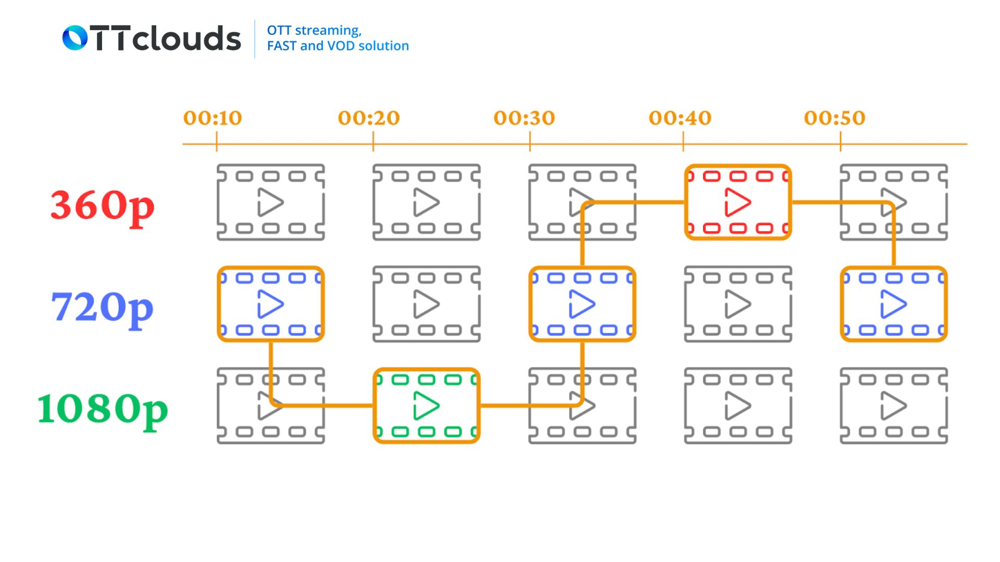

# References:
1. [📃 Geeks for geeks - YouTube System Design Article](https://www.geeksforgeeks.org/system-design/system-design-of-youtube-a-complete-architecture/)
2. [📃 DEV - Youtube System Design Article](https://dev.to/wittedtech-by-harshit/system-design-of-youtube-a-detailed-deep-dive-into-the-video-giant-5019)
3. [📃 HelloInterview - Youtube System Design Article](https://www.hellointerview.com/learn/system-design/problem-breakdowns/youtube)

# Downloading Segments vs Downloading Adaptive Bitrate Streaming

1. Downloading Segments
   - You download:
     - Piece 1
     - Piece 2
     - Piece 3
     - ......
     - Piece 100
   - Then you put them to get the full video.
2. Downloading Adaptive Bitrate Streaming
   - The website offers the video in multiple qualities:
     - 360p
     - 720p
     - 1080p
   - The downloader then:
     - Looks at the available qualities
     - Chooses the suitable one based on network and device capability
     - Downloads all the needed piece automatically and in segments as well
     - Combines them into a complete video

