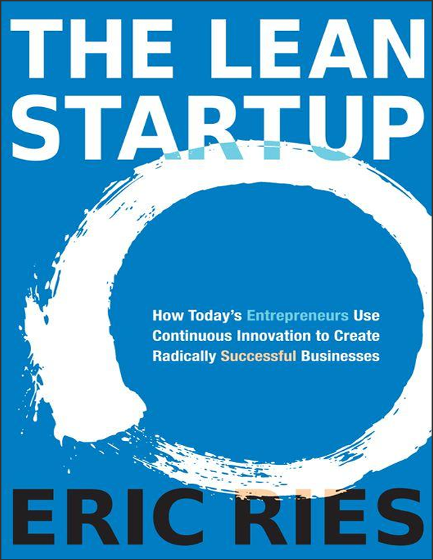
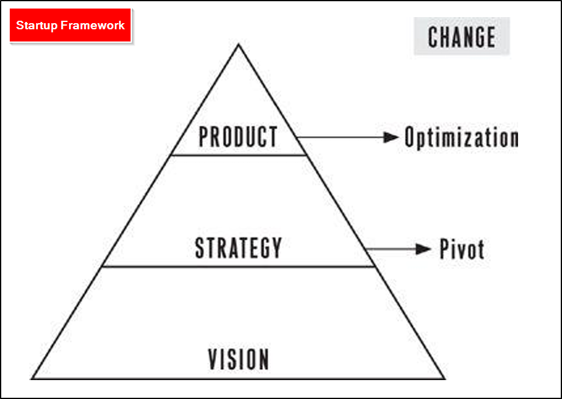
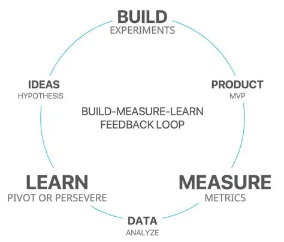
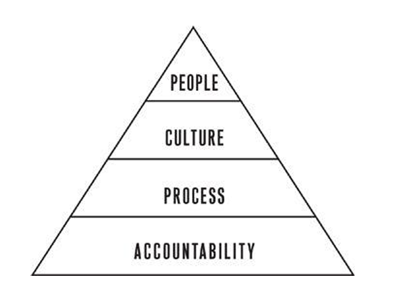

# Info
- Book: **The Lean Startup**
- Started Reading: **30/07/2026**
- Book cover: 

# Table of Contents
- [Info](#info)
- [Table of Contents](#table-of-contents)
- [Introduction: Why Lean Startup?](#introduction-why-lean-startup)
- [The lean startup and Toyota's production system](#the-lean-startup-and-toyotas-production-system)
- [1. Vision](#1-vision)
  - [Start](#start)
  - [Define](#define)
  - [Learn](#learn)
  - [Experiment](#experiment)
- [2. Steer](#2-steer)
  - [Leap](#leap)
  - [Test](#test)
  - [Measure](#measure)
  - [Pivot (or Persevere)](#pivot-or-persevere)
- [3. Accelerate](#3-accelerate)
  - [Batch](#batch)
  - [Grow](#grow)

# Introduction: Why Lean Startup?
Right from the first page, Eric Ries makes it personal. He doesn’t start with a theory; he starts with a failure—his own. As the co-founder and CTO of IMVU, an early social network and 3D avatar chat platform, he poured months of work into a product he was sure people would love. They built it in stealth, added dozens of features, and launched to... crickets. Hardly anyone signed up, and even fewer stuck around.

That painful experience led him to a simple question: “What if we were building something nobody wanted?” And that question became the seed of the entire book.

The Introduction does five crucial things:
1. **It defines the problem**
   - Traditional management tools—detailed business plans, five-year forecasts, stage-gate product development—were designed for execution in established companies, not for the extreme uncertainty of a startup. They don’t prevent the most common cause of startup death: building a product that nobody needs. The valley is littered with startups that executed their flawed plan perfectly.
2. **It introduces the Lean Startup as a new discipline**
   - Ries draws on his engineering background and his observation of lean manufacturing at Toyota. He proposes that entrepreneurship needs its own management discipline—one that is scientific, process-oriented, and yet radically different from the “just ship it and see what happens” chaos or the rigid “plan and pray” approach.
3. **It introduces the core hero: the entrepreneur within**
   - Crucially, Ries broadens the definition of a startup: “A startup is a human institution designed to create a new product or service under conditions of extreme uncertainty.” This means you don’t need a garage in Silicon Valley. You can be an intrapreneur in a Fortune 500 company, a civil servant in a government agency, or a teacher creating a new curriculum. The Lean Startup principles apply to anyone trying to create something new in an uncertain environment.
4. **It gives a high-level preview of the methodology’s five principles**
   - **Entrepreneurs are everywhere**. It’s not just a title; it’s a practice for everyone in a multi-skilled team.
   - **Entrepreneurship is management**. A startup is not just a product; it’s an institution that requires a new kind of management geared to extreme uncertainty.
   - **Validated learning**. Startups exist not just to build things, but to learn how to build a sustainable business. This learning can be validated scientifically by running frequent experiments.
   - **Build-Measure-Learn**. The fundamental feedback loop. Turn ideas into products, measure how customers respond, and then learn whether to pivot (change course) or persevere (keep improving). The goal is to go through this loop as fast as possible.
   - **Innovation accounting**. To improve entrepreneurial outcomes and hold managers accountable, we need a new kind of accounting—measuring progress against milestones of validated learning, not just features shipped or revenue projections.
5. **It sets the book’s structure and the reader’s journey**
   - Ries explains that the book is divided into three parts: 
     - **Vision**: defining the overarching goal and discipline
     - **Steer**: diving deep into the Build-Measure-Learn loop
     - **Accelerate**: techniques to speed the loop up, like small batches and growth engines. 
   - He frames the book as a practical roadmap for turning chaos and uncertainty into a structured, scientific quest for a sustainable business.

# The lean startup and Toyota's production system
To better understand The Lean Startup, it is useful to compare it with earlier production systems such as: 

1. **Ford’s mass production** (Just-In-Case)
   - Focused on producing standardized products in very large quantities through assembly lines and repetitive tasks, which made mass production highly efficient.
2. **Toyota’s lean manufacturing** (Just-In-Time)
   - Developed a different philosophy: eliminating waste, shortening lead times, and using Just-in-Time production, where only what is needed is made when it is needed.

Eric Ries applies a similar lean logic to startups. Instead of building a full product based on assumptions, entrepreneurs should test ideas quickly, learn from real customers, and decide whether to continue or change direction. In this way, The Lean Startup transforms lean manufacturing from a factory method into a business learning method.

| Aspect               | Ford (Traditional Mass Production) | Toyota (TPS)                 |
| -------------------- | ---------------------------------- | ---------------------------- |
| Inventory            | High                               | Low                          |
| Production           | Push system                        | Pull system                  |
| Variety              | Limited                            | More flexible                |
| Focus                | Volume and scale                   | Efficiency and quality       |
| Inventory philosophy | Just-in-Case                       | Just-in-Time                 |
| Problem handling     | Buffer with inventory              | Expose and solve root causes |

# 1. Vision
## Start
- The Lean Startup asks people to start measuring their productivity differently. Because startups often accidentally build something nobody wants, it doesn’t matter much if they do it on time and on budget. The goal of a startup is to figure out the right thing to build—the thing customers want and will pay for—as quickly as possible.
- The Lean Startup method, in contrast, is designed to teach you how to drive a startup. Instead of making complex plans that are based on a lot of assumptions, you can make constant adjustments with a steering wheel called the Build-Measure-Learn feedback loop. Through this process of steering, we can learn when and if it’s time to make a sharp turn called a pivot or whether we should persevere along our current path. Once we have an engine that’s revved up, the Lean Startup offers methods to scale and grow the business with maximum acceleration.
- Startups also have a true north, a destination in mind: creating a thriving and world-changing business. I call that a startup’s vision. To achieve that vision, startups employ a strategy, which includes a business model, a product road map, a point of view about partners and competitors, and ideas about who the customer will be. The product is the end result of this strategy

- The engine is running, acquiring new customers and serving existing ones; we are tuning, trying to improve our product, marketing, and operations; and we are steering, deciding if and when to pivot. The challenge of entrepreneurship is to balance all these activities. Even the smallest startup faces the challenge of supporting existing customers while trying to innovate.
- In general management, a failure to deliver
results is due to either a failure to plan adequately or a failure to execute
properly

## Define
Eric Ries gets precise about the core actors and institutions his methodology is designed for. He argues that before you can manage something effectively, you must first define it correctly.

1. **Who is an Entrepreneur?**

   Ries breaks the common stereotype of the lone genius in a garage. He gives a functional, inclusive definition:

   > An entrepreneur is anyone who works within a human institution to create new products and services under conditions of extreme uncertainty.

   This means entrepreneurship is a role, not a title. It applies to:
   - The two founders in a garage (the classic startup).
   - The intrapreneur inside a large corporation launching a new division.
   - A government employee creating a new citizen service.
   - A non-profit leader testing a new way to solve a social problem.

   If you are creating something new where the outcome is deeply uncertain, you are an entrepreneur, and you need a management discipline built for that context.

2. **What is a Startup?**

   Building on that, he defines a startup not by its size or industry, but by its context:

   > A startup is a human institution designed to create a new product or service under conditions of extreme uncertainty.

   He breaks this definition down into three critical parts:

   1. **Human Institution**: A startup is not just a product, a piece of code, or a cool idea. It's the people, the culture, the routines, and the coordination between them. You have to manage the institution, not just build the product. This is why management matters.
   2. **New Product or Service (Innovation)**: The goal is to create something genuinely new—an innovation. This distinguishes a startup from an established business that is simply executing a known, proven business model (like opening a new franchise location). The startup is searching for what to build; the established company is executing on how to build it.
   3. **Extreme Uncertainty**: This is the most crucial element. This is not just "risk," where you might know the odds. In extreme uncertainty, you don't know who the customer is, what the product should look like, or even what the right business model is. You can't calculate probabilities because you don't yet know the key variables. Traditional planning tools (five-year forecasts, detailed business plans) create a dangerous illusion of control in this environment.

Because a startup is fundamentally different from a large company executing a known model, it can't simply borrow management tools from established firms. Those tools are designed for execution, but a startup is engaged in a search—a search for a **repeatable, sustainable business model**.

## Learn
this chapter defines the most important question: **What counts as progress?** Ries’s answer is a radical break from traditional business metrics.

The Trap of "Just Learning"

After a failure, entrepreneurs often say, "At least we learned a lot." Ries calls this out as vague and often worthless unless the learning is actionable and empirically proven. **Validated learning** is not a consolation prize; it is the rigorous, scientific demonstration that you have discovered a true and valuable fact about your startup’s present and future. It’s a process of converting raw data into insight that directly guides decision-making.

The IMVU Story, Deepened

Ries returns to IMVU’s painful early days. After their launch flopped, the team resisted the temptation to just add more features or pour money into marketing. Instead, they conducted a series of extremely basic, in-person user tests. They watched individual customers struggle with the bare-bones, buggy product. Those failures weren't seen as disasters; they became empirical data. The key shift: they moved from post-hoc rationalization ("users are lazy") to a prospective, hypothesis-driven approach ("we believe adding a chat feature now will increase engagement, and if we see a 20% increase in messages sent per session, that hypothesis is validated"). This is the essence of turning learning into a disciplined practice.

Redefining Waste

In a factory, waste is inventory sitting idle. In a startup, waste is any activity that doesn’t contribute to validated learning about what customers want. This is a profound reframing:
- Writing code for a feature no one uses is waste.
- A beautifully formatted business plan filled with untested assumptions is waste.
- A "successful" product launch that generates noise but no real insight is waste.

The unit of progress is no longer "features shipped" or "lines of code written." It is **validated learning per unit of time**. The entire Build-Measure-Learn loop exists to maximize that single metric.

The Two Leap-of-Faith Assumptions

At the heart of every startup lie two untested, make-or-break assumptions that must be validated before scaling:
1. **The Value Hypothesis**: Does the product actually deliver value to customers when they use it? This is about the core utility. Does it solve a real problem, and would people be upset if it disappeared?
2. **The Growth Hypothesis**: Once customers find value, how will the product spread to many more of them? This is about the engine of adoption—word of mouth, viral loops, paid advertising, etc. You can't just acquire users; you need a sustainable mechanism for finding new ones.

The act of a startup is not to immediately build the perfect product to test these. The act is to design the simplest possible experiment that can empirically prove or disprove these two leap-of-faith assumptions. Everything else is secondary.

## Experiment
This chapter provides the engine for generating that learning: the experiment. This chapter makes the abstract concrete, showing that an experiment is not a market research survey or a theoretical exercise—it is the startup's first product.

From "Just Do It" to the Scientific Method

Ries argues that the visionary leap must be grounded immediately. Instead of building a full product based on untested assumptions, an entrepreneur should ask: What is the single most important experiment we can run right now to test our leap-of-faith assumptions? This is the Build-Measure-Learn loop in its earliest and most critical form. The experiment turns "what if" into "we observed that."

An experiment, in Ries's strict sense, has three components:
1. **A clear hypothesis** about the value or growth assumption.
2. **A prediction** of what will happen if the hypothesis is true (e.g., "we will see a 10% conversion rate").
3. **A test with real customers** that generates empirical data on their actual behavior—not their stated opinions.

The Experiment is the Product (Two Iconic Examples)

Ries illustrates this with stories that have become foundational to Lean Startup culture:
- **Zappos (Testing the Value Hypothesis)**: Nick Swinmurn didn't build a warehouse and inventory management system to test if people would buy shoes online. He went to a local shoe store, took photos of the shoes, and put them online. When someone ordered, he bought the shoes at full retail price and shipped them. This tiny, un-scalable, and arguably "inefficient" experiment validated the most critical assumption: **customers would buy shoes without trying them on first**. The experiment wasn't the future business; it was a vehicle for learning.
- **HP and Intrapreneurship (Testing a New Technology)**: Inside HP, a team wanted to explore a new printing technology. Instead of building a factory, they started by offering a concierge-like service: they manually performed the printing for a few customers to see if the output was even valued. That small, hand-built experiment saved them from potentially years of wasted R&D on a product nobody wanted.

In both cases, the "experiment" looked nothing like a finished product. It was a stripped-down, human-powered, or manual simulation designed to answer one question with real customer behavior.

Asking vs. Observing

A critical lesson woven throughout the chapter is that you cannot trust what people say they will do. Surveys and focus groups are dangerously misleading because people are polite, optimistic, and often don't understand their own future behavior. An experiment must put something tangible in front of a customer and measure what they actually do, not what they say. The click, the purchase, the sign-up, the usage time—these are the only data that count.

Connecting Vision to Experiment

Crucially, Ries does not advocate experimentation for its own sake. The experiment is in the service of the vision. The vision is the long-term destination. The experiment helps you find the path. Every experiment is a test of a specific element of your overall strategy, with the goal of either pivoting (changing the strategy) or persevering (refining the course). The experiment is how you bring the scientific method to bear on your grandest ambitions without being crushed by your own assumptions.

The experiment is the atomic unit of the Lean Startup. It takes the grand leap of faith and breaks it down into a testable piece that can be run immediately, often without building any scalable technology

# 2. Steer
With the philosophy of Part One established, Part Two begins the practical work of steering. Chapter 5 tackles the very first step of the Build-Measure-Learn loop: the leap. This is the moment when you move from a grand vision to a concrete set of assumptions that can be tested empirically.

## Leap
Every startup begins with a vision, and that vision is built on a set of beliefs about the future—beliefs about who the customer is, what they need, how they behave, and how the business will grow. Ries calls these leap-of-faith assumptions because they are taken on faith initially; they are the riskiest elements of the plan, and if they are wrong, the entire venture collapses.

The purpose of the leap is not to prove the vision right; it is to identify the most critical assumptions and then design experiments to validate or invalidate them as quickly as possible.

Ries reiterates and deepens the two fundamental leaps of faith introduced in Chapter 3:
1. **The Value Hypothesis**: Does the product or service actually deliver value to customers once they are using it? This is about retention, engagement, and solving a real problem. If customers don't find value, they won't come back.
2. **The Growth Hypothesis**: How will the product or service spread to a larger number of customers? This is about the engine of growth—word of mouth, viral loops, paid acquisition, etc. You need to know not just that some people like it, but that there is a systematic way to reach many more.

Every startup must eventually validate both hypotheses. But early on, the priority is to test the riskiest assumption first. Often that is the value hypothesis; there is no point in figuring out how to grow something nobody wants.

A common trap is to spend months or years refining the vision, writing business plans, and conducting market research before ever putting anything in front of a real customer. Ries calls this "analysis paralysis"—the illusion that more planning reduces risk. In reality, the only way to reduce uncertainty is to gather empirical data from real customers. The leap is not an academic exercise; it is a commitment to action.

Ries borrows a principle from Toyota's lean manufacturing: genchi gembutsu, which translates roughly to "go and see for yourself." In the context of a startup, this means you cannot rely on secondhand reports, surveys, or market research alone. You must get out of the building and observe real customers in their natural environment. This is a direct echo of Steve Blank's customer development methodology, which Ries integrates deeply.

The reason is simple: customers often cannot articulate what they want, and their actual behavior frequently contradicts their stated preferences. Only by observing them firsthand—watching them struggle, improvise, or ignore your product—can you truly understand their needs.

A leap-of-faith assumption is too vague to test. It must be translated into a concrete, falsifiable hypothesis. For example:
- **Vague assumption**: "Customers will want a social network for dog owners."
- **Falsifiable hypothesis**: "At least 20% of dog owners who are shown a simple landing page for a dog-owner social network will sign up for early access within one week."

This specificity forces you to make a prediction and creates a clear benchmark for success or failure. It is the foundation of the Build-Measure-Learn loop: you build something small (an MVP), measure the actual behavior against your prediction, and then learn whether to pivot or persevere.

you cannot skip the leap. Before building anything, you must articulate the assumptions behind your vision, identify which is the riskiest, and turn it into a testable hypothesis. Then—and only then—can you design the first experiment (which will lead naturally into Chapter 6's discussion of the Minimum Viable Product). The leap is the bridge from vision to action, and the rest of the Build-Measure-Learn loop exists to validate that leap as quickly and cheaply as possible.

## Test
Ries defines the MVP as:
> That version of a new product which allows a team to collect the maximum amount of validated learning about customers with the least effort.

This is not the same as "the smallest possible product." It’s not a cheap, half-baked version of the final vision. It is the fastest way to start the Build-Measure-Learn loop and test a specific hypothesis. The goal is not to build a product; the goal is to learn whether the product should be built.

An MVP can take many forms:
- A simple landing page that explains the idea and measures sign-ups.
- A video that demonstrates how a future product would work.
- A concierge service where a human manually performs the service that software would eventually automate.
- A "Wizard of Oz" prototype where the user sees a functioning front-end, but the back-end is done manually behind the scenes.

In every case, the MVP is designed to answer the riskiest question first: Does anyone actually want this?

**The Dropbox Video: A Classic Example**

Ries uses Dropbox as a perfect illustration. Drew Houston faced a massive technical challenge: building the software to sync files across devices would take a long time and require complex infrastructure. But the riskiest assumption was not whether he could build it—it was whether people wanted effortless file synchronization badly enough to use it.

So Houston created a three-minute video that demonstrated exactly how the product would work, aimed at early adopters who understood the problem. He put it online. The result: the beta waiting list exploded from 5,000 to 75,000 people overnight. That video was an MVP. It didn't sync a single file, but it validated the value hypothesis with real customer behavior (sign-ups), not just opinion.

**The Concierge MVP: Food on the Table**

Ries also highlights the "concierge" MVP through the story of Food on the Table. The founder, Manuel Rosso, wanted to build a service that helped families plan meals and find grocery deals. Instead of building software first, he started with a single customer: a busy mother. He manually collected her grocery list, found coupons, planned meals for her, and delivered the results personally. He did this for one customer, then a few more, all by hand.

This was not scalable. It was slow, labor-intensive, and messy. But it produced deep, validated learning about what customers truly valued before a single line of code was written. Once the value was proven, they could then automate the parts that mattered. The concierge MVP traded efficiency for learning—and that trade was exactly right.

A common objection to MVP is: "We can't release something that low quality; it will ruin our brand." Ries addresses this directly.

The key is to understand that an MVP is not built for everyone. It is built for early adopters—the subset of customers who are so desperate for a solution to their problem that they are willing to overlook rough edges, missing features, and even bugs. Early adopters are not just tolerant; they are actively looking for the future. They can see past the imperfection because they are hungry for the core value.

That does not mean quality doesn't matter. The MVP must still solve the customer's problem well enough to be used and evaluated honestly. The quality bar is set by the early adopters, not by the eventual mass market. Over-engineering quality before you know what customers actually want is waste.

The most common failure in early-stage ventures is not building too little, but building too much before testing. Teams spend months adding features, polishing design, and scaling infrastructure—all based on assumptions that have never been tested with real customers. The result is often a beautifully engineered product that nobody wants.

The MVP is the antidote. It forces the team to confront reality early, cheaply, and quickly. It is not about lowering standards; it is about aligning effort with validated learning. The question shifts from "Can we build it?" to "Should we build it?" and "What is the smallest thing we can build to find out?"

The MVP is the first execution of the Build-Measure-Learn loop. It is not the final product; it is the fastest vehicle for learning. By testing the riskiest assumptions with early adopters before heavy investment, startups avoid the fatal trap of building something nobody wants. The MVP honors the grand vision by taking the first small, disciplined step toward making it real.

## Measure
How do we know we are actually learning something true? Ries’s answer is that startups need a new kind of accounting—**innovation accounting**—because traditional financial metrics were designed for established businesses executing a known model, not for startups searching for one.

Most startups measure progress using what Ries calls **vanity metrics**: total registered users, cumulative downloads, raw page views, or total revenue. These numbers look impressive and can always be arranged to tell a positive story. But they hide the real question: Are we making progress toward a sustainable business? A startup can add thousands of users while its retention, conversion, and growth engine are fundamentally broken. Vanity metrics give the illusion of traction; actionable metrics reveal the truth.

Ries proposes a structured framework for measuring progress in a startup. It has three stages:
1. **Establish the Baseline**: Use your MVP to measure where you actually are right now. What is the current conversion rate, sign-up rate, retention rate, or revenue per customer? This baseline is almost always terrible. That’s normal. It exists to give you a real starting point, not to flatter you.
2. **Tune the Engine**: Once you have a baseline, run experiments designed to move the metrics from the baseline toward the ideal. This is the Build-Measure-Learn loop in overdrive. Each experiment tests a specific change—a new feature, a different message, a new pricing model—and you measure the effect on the metric that matters. The goal is to see steady, verifiable improvement.
3. **Pivot or Persevere**: After a series of tuning experiments, you look honestly at the trend. Is the engine improving fast enough to suggest you are on a path to a sustainable business? If yes, persevere and optimize. If not, it’s time to pivot—to change one of the fundamental strategic hypotheses while keeping what you’ve learned.

This framework forces you to compare actual progress against a clear goal, not against a vague feeling of "we're doing great."

The heart of the chapter is a distinction between metrics that help you make decisions and metrics that simply make you feel good.

Actionable metrics have three qualities—Ries calls them the Three A's:
- **Actionable**: The metric must demonstrate clear cause and effect. When you see a change in the number, you should know what action caused it. This is why **split-testing (A/B testing)** is so important: you show two versions of a feature to similar groups of users and measure the difference in behavior. If version B causes a higher conversion rate, you know exactly what to do next.
- **Accessible**: Metrics must be simple enough that everyone on the team understands them. If the report requires a data scientist to interpret, it cannot guide daily decision-making. Reports should be generated automatically, in plain language, and tied to the specific questions the team is asking.
- **Auditable**: The data must be credible. When a metric shows a surprising result, the team should be able to trace the data back to real customer behavior. Ries advises talking directly to customers to verify that the numbers reflect reality, not a bug in the tracking system or a quirk of the algorithm.

One of the most powerful tools Ries introduces is cohort analysis. Instead of looking at all users lumped together, you group them by the period in which they first used the product—say, "users who signed up in January" versus "users who signed up in February." Then you track each cohort’s behavior over time.

Why? Because new users can mask the failure of old users. Total user numbers can climb while every cohort actually gets worse at retention. Cohort analysis reveals whether changes are improving the experience for people over time or whether growth is just hiding churn.

Ries returns to IMVU to show how innovation accounting transformed their decisions. For a long time, they tracked total revenue and total users—both were rising, so it looked like success. But when they switched to cohort-based metrics, they discovered something alarming: the revenue from each new cohort was actually declining. The engine was not improving; it was getting worse. That honest measurement forced them to abandon flattering vanity metrics and start the painful work of tuning the real engine.

Measurement is not a neutral activity. Bad metrics actively mislead startups into wasting time and money. Good metrics—actionable, accessible, auditable, and cohort-based—turn the Build-Measure-Learn loop into a reliable instrument for steering. Innovation accounting gives you the discipline to know whether you are truly making progress or simply fooling yourself.

## Pivot (or Persevere)
After the MVP has been built and the metrics have been measured, the startup reaches a moment of truth: Should we pivot or persevere? This chapter is the culmination of everything in Part Two. It is the decision point that determines whether all that validated learning actually changes the course of the company—or is simply ignored.

A **persevere** decision means the data suggests the current strategy is working well enough. The engine of growth is improving, customers are engaging, and the leap-of-faith assumptions are being validated. In that case, the team doubles down: optimize, refine, and scale.

A **pivot** is different. It is not a random change or a desperate flail. Ries defines it as:
> A structured course correction designed to test a new fundamental hypothesis about the product, strategy, or engine of growth.

The pivot is a recognition that while the current strategy is not working, the startup has gained valuable knowledge. That knowledge can be used to make a substantive change—to one or more core assumptions—without abandoning the entire vision. The vision may remain; the strategy to reach it changes.

**Pivoting is emotionally difficult**. Founders often interpret the need to pivot as personal failure. They have publicly committed to a plan, invested months of work, and perhaps even raised money based on it. Vanity metrics can make things worse: if total users or total revenue are still rising, it is easy to convince yourself the strategy is working, even if cohort analysis shows the engine is actually deteriorating. Ries calls this "the land of the living dead"—a startup that is not growing but not dead, slowly consuming resources while achieving no real progress.

The antidote is to rely on innovation accounting. The three milestones from Chapter 7—baseline, tune, and pivot or persevere—give you a disciplined framework for the decision. If the tuning experiments are not producing meaningful improvements in the actionable metrics, the data is telling you to pivot. Listening to that data is what separates successful startups from zombies.

A powerful reframing in this chapter: the "runway" of a startup is traditionally defined as the number of months until the money runs out. Ries argues that is the wrong metric. The true measure of runway is the number of pivots you can still make. If you have enough cash to run only one more experiment, you have very little runway—even if that cash would last six months. The goal is to get through the Build-Measure-Learn loop as fast as possible so you can make more pivots before running out of resources.

Ries provides a taxonomy of common pivots, each representing a different kind of structured change:
- Zoom-in Pivot: A single feature becomes the whole product.
- Zoom-out Pivot: The current product becomes one feature of a larger product.
- Customer Segment Pivot: The product finds traction with a different set of customers than originally intended.
- Customer Need Pivot: The team discovers a more important problem for the same customers.
- Platform Pivot: Shifting from a single application to a platform that others can build on, or vice versa.
- Business Architecture Pivot: Moving between high-margin/low-volume and low-margin/high-volume models (or the reverse).
- Value Capture Pivot: Changing how the company monetizes—subscription, advertising, freemium, etc.
- Engine of Growth Pivot: Switching between the sticky, viral, and paid growth engines (which are explained later in Part Three).
- Channel Pivot: Changing the distribution channel through which the product reaches customers.
- Technology Pivot: Delivering the same solution with a radically different technology that is cheaper or faster.

Each of these is not a random guess. It is a new hypothesis to be tested through the same Build-Measure-Learn loop.

**Pivoting is not failure**. It is the disciplined application of learning. The real failure is refusing to pivot when the evidence demands it—or pivoting so chaotically that no learning accumulates. The pivot is the bridge between what you thought was true and what you now know is true. It is the mechanism by which a startup changes direction without losing its vision. By the end of this chapter, the Build-Measure-Learn loop is complete. You have leaped, tested, measured, and decided. Now the question becomes: how do you speed up that loop and grow? That is the subject of Part Three: Accelerate.

# 3. Accelerate
With the Build-Measure-Learn loop fully established in Part Two, Part Three focuses on speed and scale: how to accelerate the loop and grow sustainably. Chapter 9 begins with a counterintuitive idea borrowed from lean manufacturing: small batches are more efficient than large batches, even though they feel slower.

## Batch
Ries tells the story of a father and daughter stuffing envelopes. The father uses the traditional "large batch" approach: fold all envelopes, then insert all letters, then seal all envelopes, then stamp all. The daughter uses "small batch" or single-piece flow: complete one entire envelope at a time.

At first glance, the large batch seems faster because each step is repetitive. But small batch has hidden advantages:

- **Faster feedback**: If the daughter makes a mistake folding, she finds out immediately, not after folding 100 envelopes.
- **Less work-in-progress (WIP)**: Large batches pile up inventory; small batches keep inventory low and expose problems early.
- **Higher quality**: Defects are caught and corrected before they multiply.

Toyota perfected this with just-in-time production and andon cords that let workers stop the line to fix problems. The result was not slower production but dramatically higher quality and efficiency.

Ries applies this to startups with the story of IMVU. Instead of releasing a large batch of changes every few weeks (or months), IMVU adopted continuous deployment: every code change that passes automated tests is deployed to production immediately, often dozens of times per day.

This feels terrifying to traditional software teams—what if a bug goes live? But IMVU found that small batches actually reduce risk:

- If a bug appears, it's easy to identify which change caused it because only one small change was deployed.
- Fixing is fast because you revert or patch that one change.
- Customers see improvements constantly, not in jarring big updates.
- The team gets immediate feedback on whether a new feature actually changes user behavior.

The key enabler is automated testing and a cluster immune system that detects problems in production and rolls back automatically. This infrastructure lets small batches work safely.

The same logic applies to the entire Build-Measure-Learn loop. Instead of building a large batch of features and then measuring their impact all at once, you should:

- **Build a small batch**: one feature, one change, one hypothesis.
- Measure its effect immediately.
- Learn and decide the next small batch.

This accelerates validated learning because you are not waiting weeks to see if a large pile of changes worked; you get data on each change in near real time. The smaller the batch, the faster you can pivot or persevere.

Ries uses a metaphor from sushi: a sashimi cut slices a problem into very thin pieces, allowing you to see each layer clearly. In a startup, that means breaking down a large feature into a series of small experiments, each testing one assumption.

The classic argument for large batches is economies of scale: if you produce 1,000 units at once, the cost per unit is lower. But this ignores the cost of inventory and delayed feedback. In knowledge work, inventory is invisible—it's unfinished code, untested assumptions, unreleased features. That inventory ties up capital, hides defects, and delays learning. Small batches reduce inventory and shorten cycle time, which often more than compensates for any lost "economies of scale."

Small batches are not about moving faster in a panicked way; they are about moving smarter. By reducing batch size, you get faster feedback, lower risk, higher quality, and faster validated learning. The Build-Measure-Learn loop works best when each loop is as small and fast as possible. This is the first key to accelerating a startup: don't build big and hope; build small and learn.

Ries points toward what he calls “the startup way” — the management system required to make small-batch, validated learning work at scale. He frames it with four pillars:

1. **Accountability**:
Startups must hold people accountable for validated learning, not just for shipping features or hitting vanity metrics. You are accountable for the outcome of experiments: did we learn what we needed to learn? Did we pivot or persevere based on evidence? This replaces “we worked hard” with “we produced verifiable progress.”

2. **Process**:
The Build-Measure-Learn loop is a repeatable process, not bureaucracy. Small batches, continuous deployment, and innovation accounting are all part of the process. It gives teams a disciplined way to move fast without chaos.

3. **Culture**:
The startup way requires a culture that tolerates failure when it produces learning. It rejects the “failure is not an option” mindset that causes people to hide bad news. Instead, it celebrates fast, cheap experiments—even when they fail—because each one reduces uncertainty.

4. **People**:
It relies on empowered, cross-functional teams close to the customer. These teams are trusted to run experiments, interpret data, and make decisions without waiting for top-down approval. The system works only if people have both the responsibility and the authority to act.

## Grow