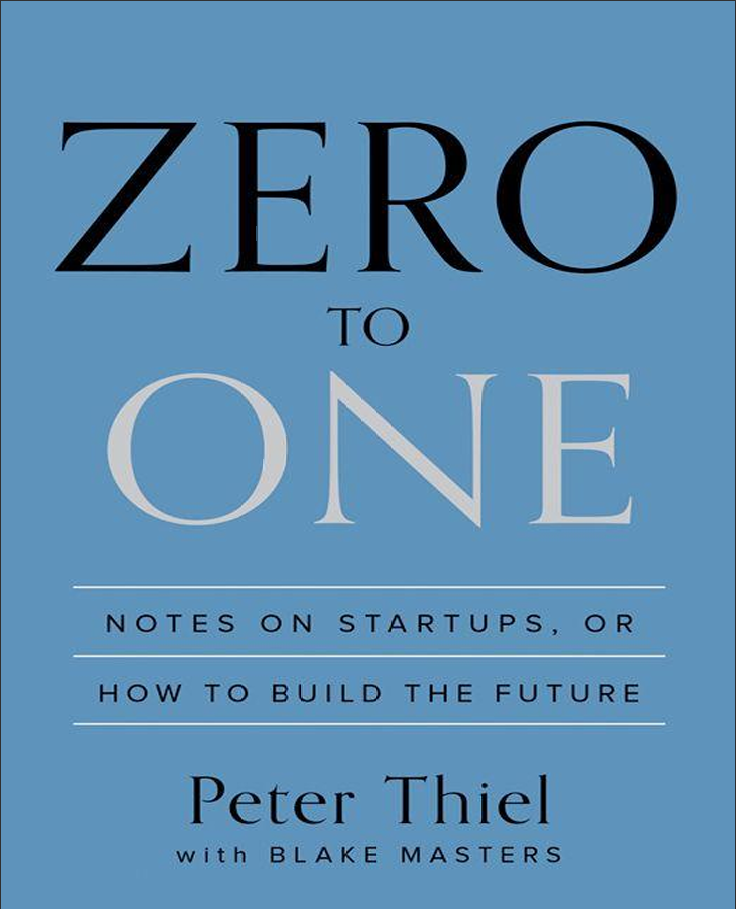

# Info
- Book: **Zero To One**
- Started Reading: 30/08/2026
- Book Cover: 

# Table Of Contents
- [Info](#info)
- [Table Of Contents](#table-of-contents)
- [Preface](#preface)
- [The Challenge of the Future](#the-challenge-of-the-future)
- [Party like it's 1999](#party-like-its-1999)
- [All Happy Companies Are Different](#all-happy-companies-are-different)
- [The Ideology of Competition](#the-ideology-of-competition)
- [Last Mover Advantage](#last-mover-advantage)

# Preface
The book’s central question: “What important truth do very few people agree with you on?”

Thiel argues that the greatest companies are not those that compete in existing markets, but those that create something entirely new—going from 0 to 1 rather than from 1 to n.
- 0 to 1: Creating something original—new technology, new category, new monopoly.
- 1 to n: Copying and scaling what already works—competition, globalization, incremental improvement.

Most of the world focuses on 1 to n because it feels safer. But true progress comes from 0 to 1.

How it completes the lean startup:
1. Zero to One gives you the direction: pick a big, contrarian problem and aim to create a new, defensible market (a “monopoly”), not just a slightly better version of something that already exists.
2. The Lean Startup gives you the process: turn that vision into testable hypotheses, run fast experiments, and iterate based on evidence so you don’t waste years building the wrong thing.

# The Challenge of the Future
Thiel contrasts two views of the future:
- Horizontal progress (1 to n): Copying things that work and scaling them globally. Example: China copying Western technology.
- Vertical progress (0 to 1): Doing something new, creating technology that did not exist before. Example: the first iPhone.

He argues that modern society has become obsessed with globalization (1 to n) at the expense of technology (0 to 1). The result is stagnation disguised as progress. Startups are the only institutions truly positioned to create vertical progress because they are small enough to take risks and independent enough to think differently.

> Key takeaway: The future requires new technology, not just more copies of old ideas.

# Party like it's 1999
> The dot‑com bubble was a speculative boom in internet and tech stocks from roughly 1995 to 2000, followed by a brutal crash that wiped out trillions in market value and killed thousands of startups.

Thiel uses the dot-com crash of the late 1990s to explain how bad lessons become dogma. After the bubble burst, entrepreneurs overcorrected and adopted a set of false beliefs:
- Make incremental improvements, not bold leaps
  - Risk boldness over triviality
- Stay lean and flexible; don't plan too much
  - A bad plan is better than no plan
- Improve on the competition; don't create new markets
  - Competitive markets destroy profits; aim to escape competition
- Focus on product, not sales
  - Sales matters just as much as product
- Don't think about monopoly; competition is healthy
  - Monopoly (in the sense of a unique, defensible market) is the goal, not a bug

Thiel argues these lessons are wrong for anyone trying to build something truly new. The crash taught people to be risk-averse, but the greatest companies—like Apple, Google, and Facebook—ignored these rules and created monopolies. The chapter ends with a call to reject dogmatic thinking and instead seek out contrarian truths.

This doesn’t contradict **The Lean Startup** because Ries explicitly anchors lean in a bold, fixed vision, treats strategy (not vision) as the thing you pivot, and uses experiments to validate the riskiest assumptions behind that vision rather than to replace planning or ambition.

> Key takeaway: The lessons from past failures are often wrong for future breakthroughs.

# All Happy Companies Are Different
This chapter introduces Thiel's famous monopoly thesis. Happy companies are different because each one solves a unique problem and dominates its market. Unhappy companies are all alike: they fail to escape competition.

Thiel argues that competition is for losers. In perfect competition, profits are driven to zero, and businesses become commodities. In a monopoly, a company can set its own prices, invest in long-term research, and treat employees well. Monopolies are not just good for the company; they are good for society because they drive progress.

The paradox: monopolies often pretend to be in competitive markets to avoid regulation, while competitive companies pretend to be unique to attract capital. A smart founder must see through this.

> Key takeaway: Build a monopoly by creating something so unique that competition becomes irrelevant.

# The Ideology of Competition

Thiel deepens his critique of competition, arguing that it is not just economically harmful but psychologically destructive. Competition traps people in a zero-sum mindset, making them fight over the same pie instead of creating a bigger one. He uses the example of law school and corporate careers: everyone competes for the same prestigious paths, even when those paths lead to unhappiness.

The alternative is to **find your own niche**—a market so specific and well-served that no one else can compete with you. This requires the courage to be contrarian and the discipline to avoid imitating others.

> Key takeaway: Competition distorts your thinking. Escape it by building something uniquely valuable.

# Last Mover Advantage